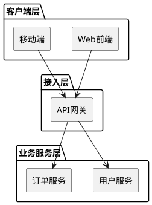
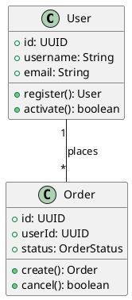
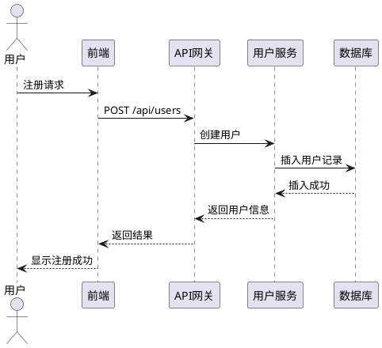

# 技术方案设计技能

## 概述

`tech-design` 技能帮助用户创建结构化、高质量的技术方案设计文档。基于用户提出的四个核心部分方法论，确保设计全面、清晰、可执行。

## 核心设计方法论

技能遵循以下四个核心部分：

1. **当前需求的关键描述** - 项目概述
2. **技术选型与架构设计** - 技术架构
3. **领域模型划分与类图设计** - 领域模型
4. **业务流转过程展示** - 业务流程

## 使用方式

### 基本用法

```bash
# 使用skill生成技术方案
skill: "tech-design"
```

### 带参数用法

```bash
# 生成特定类型的技术方案
skill: "tech-design", args: "project=微服务系统"
skill: "tech-design", args: "type=api-design"
skill: "tech-design", args: "template=full"
```

### 支持的参数

| 参数 | 说明 | 默认值 |
|------|------|--------|
| `project` | 项目名称 | "技术方案" |
| `type` | 方案类型 (api-design, microservice, system-design) | "system-design" |
| `template` | 模板类型 (full, simple, detailed) | "full" |
| `output` | 输出格式 (markdown, json, yaml) | "markdown" |

## 技能功能

### 1. 生成完整技术方案模板

技能可以生成包含所有四个核心部分的技术方案模板：

```markdown
# [项目名称] 技术方案设计

## 第一部分：项目概述
### 1.1 需求背景
### 1.2 核心需求描述
### 1.3 业务价值
### 1.4 项目目标

## 第二部分：技术架构设计
### 2.1 技术选型
### 2.2 系统架构图
### 2.3 架构分层说明
### 2.4 核心模块划分

## 第三部分：领域模型设计
### 3.1 领域模型划分
### 3.2 类图设计
### 3.3 模型关系说明
### 3.4 关键方法定义

## 第四部分：业务流程设计
### 4.1 核心业务流程时序图
### 4.2 关键业务场景说明
### 4.3 接口交互设计
### 4.4 状态流转设计
```

### 2. 生成PlantUML图表

技能可以生成各种PlantUML图表：

#### 架构图


#### 类图


#### 时序图


### 3. 技术选型建议

基于项目类型提供技术选型建议：

```markdown
## 技术选型建议

### 微服务架构
- **开发语言**: Go 1.21+ / Java 17+
- **Web框架**: Gin / Spring Boot
- **服务发现**: Consul / Nacos
- **配置中心**: Apollo / Nacos
- **消息队列**: Kafka / RabbitMQ
- **数据库**: MySQL 8.0 / PostgreSQL 14+
- **缓存**: Redis 7.0+
- **容器化**: Docker 24.0+
- **编排工具**: Kubernetes 1.28+

### API设计
- **协议**: RESTful API / GraphQL
- **认证**: JWT / OAuth 2.0
- **文档**: OpenAPI 3.0 / Swagger
- **版本管理**: URL路径版本控制
- **限流**: 令牌桶算法 / 漏桶算法
```

### 4. 设计评审检查清单

```markdown
## 设计评审要点

### 架构合理性
- [ ] 是否符合业务需求和技术趋势
- [ ] 是否支持业务增长和技术演进
- [ ] 是否有清晰的系统边界

### 可扩展性
- [ ] 是否支持水平扩展
- [ ] 是否有服务发现机制
- [ ] 是否有负载均衡策略

### 可维护性
- [ ] 代码结构是否清晰
- [ ] 文档是否完善
- [ ] 是否有监控和日志

### 性能指标
- [ ] 接口响应时间目标
- [ ] 系统吞吐量目标
- [ ] 数据库查询性能

### 安全性
- [ ] 是否有身份认证机制
- [ ] 是否有权限控制
- [ ] 是否有数据加密
- [ ] 是否有防攻击措施

### 成本效益
- [ ] 技术选型是否成本合理
- [ ] 是否有资源优化策略
- [ ] 是否有成本监控
```

## 使用示例

### 示例1：生成微服务系统技术方案

```bash
skill: "tech-design", args: "project=用户中心微服务系统 type=microservice"
```

**输出**：
- 完整的微服务架构设计
- 服务划分建议
- 服务间通信设计
- 数据一致性方案
- 部署架构设计

### 示例2：生成API设计文档

```bash
skill: "tech-design", args: "project=订单API type=api-design template=detailed"
```

**输出**：
- RESTful API设计规范
- 接口定义模板
- 错误处理方案
- 版本管理策略
- 安全设计考虑

### 示例3：生成系统设计方案

```bash
skill: "tech-design", args: "project=电商平台系统 type=system-design"
```

**输出**：
- 整体系统架构
- 模块划分设计
- 数据库设计
- 缓存策略
- 性能优化方案

## 最佳实践

### 1. 设计流程建议

1. **需求分析阶段**
   - 明确业务目标和约束条件
   - 识别关键业务场景
   - 定义非功能性需求

2. **架构设计阶段**
   - 选择合适的技术栈
   - 设计系统分层结构
   - 定义模块边界

3. **详细设计阶段**
   - 设计领域模型
   - 定义接口规范
   - 设计数据模型

4. **评审优化阶段**
   - 进行设计评审
   - 识别风险点
   - 制定优化方案

### 2. 文档编写建议

1. **保持简洁**
   - 每个章节不超过3-5个要点
   - 使用图表代替文字描述
   - 避免技术术语堆砌

2. **注重可读性**
   - 使用清晰的标题结构
   - 添加必要的示例
   - 提供上下文说明

3. **确保一致性**
   - 统一术语使用
   - 保持格式一致
   - 确保逻辑连贯

### 3. 图表设计建议

1. **架构图**
   - 展示系统整体结构
   - 明确各层职责
   - 显示组件间关系

2. **类图**
   - 展示领域模型关系
   - 明确类职责
   - 显示关键方法

3. **时序图**
   - 展示核心业务流程
   - 明确系统间交互
   - 显示异常处理

## 模板库

技能内置以下模板类型：

### 1. 完整模板 (full)
包含所有四个核心部分，适合复杂系统设计。

### 2. 简化模板 (simple)
包含核心设计部分，适合小型项目或功能模块设计。

### 3. 详细模板 (detailed)
包含扩展的详细设计部分，适合大型企业级系统设计。

## 扩展功能

### 1. 设计模式建议
基于业务场景推荐合适的设计模式：
- 创建型模式：工厂模式、建造者模式
- 结构型模式：适配器模式、装饰器模式
- 行为型模式：策略模式、观察者模式

### 2. 性能优化建议
提供性能优化策略：
- 数据库优化：索引设计、查询优化
- 缓存策略：多级缓存、缓存失效
- 异步处理：消息队列、批量处理

### 3. 安全设计建议
提供安全设计考虑：
- 身份认证：多因素认证、单点登录
- 权限控制：RBAC、ABAC
- 数据安全：加密传输、数据脱敏

## 更新日志

### v1.0.0 (2026-02-21)
- 初始版本发布
- 支持四个核心设计部分
- 提供多种模板类型
- 内置PlantUML图表生成

## 贡献指南

欢迎贡献改进建议：
1. 提交Issue报告问题
2. 提交Pull Request贡献代码
3. 分享使用经验和最佳实践

## 许可证

MIT License