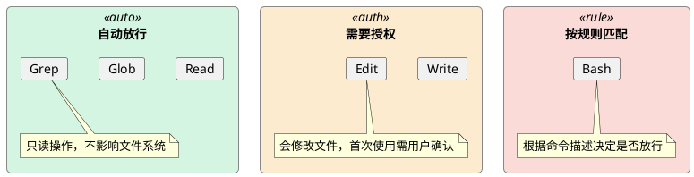
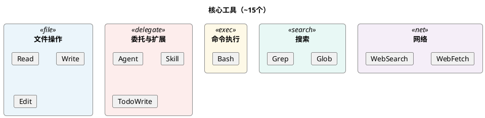
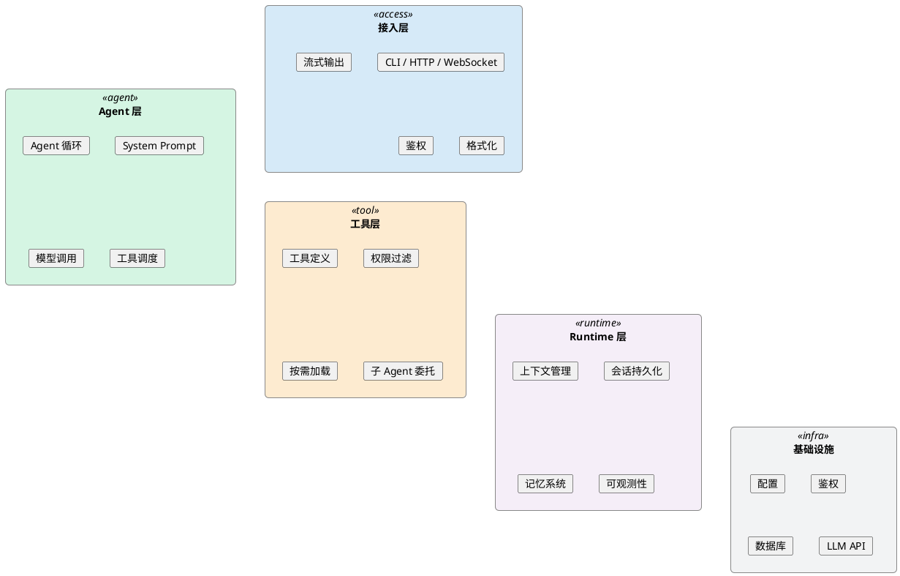

在聊 Harness Engineering 之前，先看一个现象。

2025 年底到 2026 年初，各家 AI 公司密集发布了编程 Agent 产品——Claude Code、OpenAI Codex、Google Jules、Cursor。这些产品背后的基座模型各不相同，但它们的项目结构惊人地相似：

```
any-coding-agent/
├── cli/                    ← 入口和交互
├── agent/                  ← Agent 循环 + system prompt
├── tools/                  ← 工具定义（读文件、写文件、执行命令...）
├── context/                ← 上下文管理、会话持久化
├── permissions/            ← 权限控制、沙箱
└── config/                 ← 配置、用户偏好
```

这些代码里，真正调用 LLM 的只有一行——`model.generate()`。其余 95% 的代码，都在处理一个问题：**怎么让这个 LLM 在真实环境中可靠地工作**。

这 95% 的代码，就是 **Harness**。

而围绕"怎么设计好这 95%"的工程学科，就是 **Harness Engineering**。

---

## Harness 是什么

直接看一个类比：

| 概念 | 对应 |
|------|------|
| CPU | 模型（原始推理能力）|
| RAM | 上下文窗口（有限的工作记忆）|
| **操作系统** | **Harness（管理资源、调度任务、提供驱动）** |
| 应用程序 | Agent（运行在 OS 之上的业务逻辑）|

不会有人在裸 CPU 上跑应用程序——你需要操作系统来管理内存、调度进程、提供文件系统。同样，不应该在裸模型上直接跑 Agent——你需要 Harness 来管理上下文、调度工具、处理错误。

用一句话定义：

> **Harness = 把"一个大模型 + 一堆工具"变成"一个可持续运行、可观测、可控制的系统"的那层架构。**

---

## 为什么现在需要给它起个名字

2026 年 3 月，一篇立场论文 *Harness Engineering for Language Agents* 正式提出了这个概念。同期 OpenAI、Anthropic、Martin Fowler 的博客也在密集讨论同一个词。

一个核心触发点是 LangChain 的一组数据：

> 他们的编程 Agent 在 Terminal Bench 2.0 上从 **52.8% → 66.5%**——**只改了 Harness，没换模型**。

如果不知道 Harness 变了，这个提升很容易被解读为"模型更强了"。但实际上模型完全没动。

这说明一个被长期忽视的事实：**Agent 的能力 = 模型 × Harness，不是模型本身。**

在 Agent 还只做单轮问答、调两三个工具的时候，Harness 的影响可以忽略不计。但当 Agent 开始做复杂工程任务（写一个完整项目、自主操作浏览器数小时、跨多个系统协作），Harness 的设计质量就变成了决定性因素：

- API 超时了怎么办？
- 上下文窗口满了怎么裁剪？
- Agent 执行到一半用户断开了怎么处理？
- 工具调用失败要重试还是跳过？

这些问题和模型无关，全部由 Harness 决定。

**复杂度越过了一个阈值，让原来可以忽略的变量变成了决定性变量。** 于是就需要给它一个名字，让大家能系统地讨论它。

---

## CAR 框架：Harness 的三个维度

论文把 Harness 分解为三个维度——**Control / Agency / Runtime**，简称 CAR。

单独讲概念比较抽象，下面用 **Claude Code**（Anthropic 的终端编程 Agent）作为案例来拆解。选 Claude Code 是因为它是公开产品，读者可以直接安装体验，而且它的 Harness 设计在同类产品中最有代表性。

### Control（控制）：谁说了算

Control 解决的问题是：**哪些事由代码规则决定，哪些事交给 LLM 自己判断。**

来看 Claude Code 怎么做的。

**权限沙箱**——Claude Code 把工具调用分成了三个等级：



注意，这里"能不能执行"的判断**不是 LLM 做的**，而是 Harness 的权限系统做的。LLM 只能看到"这个工具可以用"或"这个工具需要授权"——决策逻辑在 Harness 层。

这就是 Control 的核心：**不是信不信任 LLM，而是把不同类型的决策放在合适的层级。**确定性的安全规则用代码实现，模糊的语义判断交给 LLM。

**执行预算**——Agent 的 ReAct 循环不会无限跑下去，有最大步数和 token 上限。这是对"Agent 最多能跑多久"的显式约束，防止 LLM 陷入无限循环。

**停止控制**——用户可以随时中断 Agent 执行。中断信号通过 context 传递，Agent 循环检测到后立即退出。

### Agency（代理/接口）：Agent 能做什么

Agency 解决的问题是：**Agent 的行动空间怎么设计。**

一个常见的直觉是：工具越多，Agent 能力越强。但实践反复证明**恰好相反**——工具越多，LLM 越容易选错，上下文被工具描述占满后留给实际任务的空间就更少了。

Claude Code 的工具设计就体现了"少而精"的原则：



覆盖了所有编程操作，但总数控制在 15 个以内。对比一些 Agent 框架动辄注册几十个细粒度工具，这种克制是有意的设计。

更值得注意的是**工具描述的质量**。每个工具不仅写了"该怎么用"，还写了"不该怎么用"：

```
Bash 工具描述（节选）：
"避免使用 cat/head/tail 读文件，用 Read 工具代替。"
"避免使用 grep 命令搜索，用 Grep 工具代替。"
```

这种 **反向约束**（NOT for）比正向描述更重要——它大幅减少了 LLM 的选择困难。

**子 Agent 机制**也很巧妙：遇到复杂子任务时，主 Agent 不是给自己加工具，而是**委托给子 Agent**。子 Agent 有独立的上下文，完成后返回结果。主 Agent 的工具数量保持不变，复杂度通过委托而非堆工具来消化。

**Skill 系统**是 Agency 的动态扩展。用户可以编写 SKILL.md 文件注册新能力，Agent 按需加载。System Prompt 里只放 Skill 的名称和简短描述（几十个 token），完整说明在 Agent 需要时才加载到上下文（可能几千个 token）。

这就是所谓的**渐进式展示（Progressive Disclosure）**——不把所有信息一次性塞给 LLM，而是按需加载，节省上下文预算。

### Runtime（运行时）：系统怎么持续运行

Runtime 解决的问题是：**Agent 在长时间运行中怎么不"失忆"、不"跑偏"、不"崩溃"。**

**上下文管理**——随着对话推进，上下文会持续增长。Claude Code 在 token 数接近上限时自动压缩：保留最近的消息和关键信息，对早期历史做摘要。整个过程对 Agent 透明——Agent 不知道压缩发生了，只是"记忆"变成了摘要版本。

这里有一个重要概念：**context rot（上下文腐烂）**。在长对话中，随着信息累积和压缩，早期的关键细节可能被丢失或扭曲，导致 Agent 的行为逐渐偏离预期。上下文压缩策略的好坏直接影响 Agent 在长任务中的表现。

**持久记忆**——Claude Code 在每次会话启动时读取项目根目录的 `CLAUDE.md` 文件，将内容注入上下文。这个文件相当于**跨会话的长期记忆**——项目约定、代码规范、技术栈偏好写在这里，每次新对话都不用重复交代。

**任务状态追踪**——对于多步骤任务，Agent 用 TodoWrite 维护一个任务清单，标记每步的状态（pending / in_progress / completed）。这不只是给用户看进度——**也是 Agent 自身的工作记忆**，帮助它在长任务中不迷失。

**检查点机制**——Claude Code 深度集成 Git，有意义的修改后建议提交。这提供了隐式的检查点——后续操作出问题时可以回退。

这些 Runtime 机制单独看都不复杂，但它们的组合决定了系统能否持续可靠地运行。如果去掉上下文压缩让窗口溢出，或者去掉任务状态追踪让 Agent 在长任务中迷失方向——**模型完全不变，系统行为会完全不同。**

---

## CAR 三个维度的联动

CAR 不是三个独立的维度，它们之间存在联动关系。

**Agency 影响 Runtime**：精简工具集（Agency 优化）→ 工具描述占用的 token 减少 → 上下文窗口留给对话历史的空间更大（Runtime 受益）。

**Control 影响 Runtime**：增加人工确认环节（Control 优化）→ 需要跨请求保存"等待确认"状态 → 需要会话持久化支持（Runtime 需跟进）。

**Runtime 影响 Agency**：上下文压缩策略改变（Runtime 调整）→ 早期的工具调用结果可能被摘要掉 → Agent 可能在后续步骤中重复调用同一个工具（Agency 受影响）。

CAR 框架的实用价值在于：**当你要改一个维度时，可以快速检查另外两个维度是否需要联动调整，避免顾此失彼。**

---

## 常见疑问：这不就是旧概念换了个名字吗

上下文管理、工具调用、权限控制、重试策略——这些概念确实存在已久。Harness Engineering 的组成部件并不新。

但有三件事是新的。

### 1. 统一命名

这些概念过去散布在不同的技术博客和框架文档中，分别叫 scaffolding、orchestration、context management、tool calling。没有统一的名字把它们框在一起。

类比 DevOps——CI/CD、部署脚本、监控、基础设施即代码，在 DevOps 这个词出现之前就存在。DevOps 没有发明新工具，但它创造了一个概念框架，让这些实践被系统化地讨论和传授。今天没人说"DevOps 只是换了个名字的运维"。

Harness Engineering 做的是同样的事：给一组已有实践一个名字和框架，使其成为一个可以被系统讨论的学科。

### 2. 归因模型的改变

以前的思维：Agent A 比 Agent B 效果好 → A 的模型更强。

现在的思维：Agent A 比 B 好 → 可能是模型更强，也可能是 Harness 更好，也可能两者都有。

这直接影响工程决策。效果不好时，应该换模型还是改 Harness？如果归因错了，可能花三个月等新模型发布，而实际上调整一下工具数量和上下文策略就够了。

论文还提出了 **HARNESSCARD** 的概念——一个类似 Model Card 的轻量级报告模板，要求 Agent 系统在报告性能时同时披露 Harness 设计。包含三个部分：

```yaml
HARNESSCARD 示例：

Control:
  permission: 分级沙箱（读取自动/写入需授权）
  budget: 最大 50 步 / 60000 token

Agency:
  tool_count: 15 个核心工具
  loading: 按需加载（渐进式展示）
  constraints: 工具描述含反向约束（NOT for）

Runtime:
  compression: 自动摘要，阈值 60000 token
  memory: CLAUDE.md 跨会话持久
  checkpoint: Git 集成
```

### 3. 科学变量的要求

Harness Engineering 和"最佳实践合集"最不同的地方在于：论文要求 **Harness 应该像模型超参数一样被记录和对照**。

比如：把工具数量从 15 改成 30，其他不变，任务成功率怎么变？把上下文压缩阈值从 60000 降到 30000，长对话质量怎么变？

这些问题过去很少有人系统回答，因为 Harness 被默认为"实现细节"。但 LangChain 52.8% → 66.5% 的案例表明，Harness 的变化对结果的影响可能比模型本身还大。

---

## Agent 项目的通用架构

回到开头的观察——不同 Agent 产品的项目结构惊人地相似。这不是巧合，而是 Harness Engineering 实践自然收敛出的一套分层架构：



这四层各自对应 CAR 框架的不同维度：

- **接入层**偏 Control（权限、路由）
- **Agent 层**是 Control（循环控制）+ Agency（工具调度）的交汇
- **工具层**是 Agency 的主体
- **Runtime 层**是 Runtime 的主体

无论是 Claude Code、OpenAI Codex，还是企业内部的业务 Agent，基本都遵循这个分层。差异只在各层的具体实现选择上——用文件存储还是 Redis 做会话持久化，用 ReAct 还是 Plan-Execute 做 Agent 循环，用权限白名单还是分级沙箱做 Control。

如果你正在启动一个新的 Agent 项目，这四层分层可以作为起步的架构模板。

---

## 实用性判断

论文和相关工程报告提了很多建议，但不是每条都适合所有项目。

### 值得采纳的

| 建议 | 价值 |
|------|------|
| **CAR 作为思维工具** | 改架构时用三个维度过一遍，发现维度间的联动影响 |
| **工具做减法** | 精简工具集 + 清晰的 Use when / NOT for 描述 + 按需加载，ROI 极高 |
| **归因意识** | 效果不好先问"模型问题还是 Harness 问题"，避免盲目换模型 |
| **四层分层模板** | 接入层 / Agent 层 / 工具层 / Runtime 层，已是主流 Agent 项目的通用结构 |

### 视场景决定的

| 建议 | 什么时候需要 |
|------|------------|
| **人工确认门控** | 涉及不可逆操作（支付、删库、群发邮件）时必须；纯分析生成类可选 |
| **自验证循环** | Agent 输出直接写入生产环境时需要；只输出文本给人审阅则不必 |
| **跨 Agent 状态传递** | 多 Agent 系统且用户工作流涉及连续切换领域时需要 |

### 大多数项目不必要的

| 建议 | 原因 |
|------|------|
| HARNESSCARD 正式报告 | 除非发论文或跨团队对照，内部设计文档就够 |
| 消融实验 | 业务项目按需优化即可 |
| Context rot 量化监测 | 上下文压缩 + 会话 TTL 通常已足够 |

---

## 总结

Harness Engineering 不是一个需要额外去做的新东西。如果你在做 Agent 项目，你已经在做 Harness Engineering 了——接入层、工具系统、会话管理、上下文策略、可观测性，这些加起来就是 Harness。

一个 Agent 项目里 95% 的代码是 Harness，只有模型调用那一行不是。

这个概念的价值不在于发明了新技术，而在于三件事：

1. **统一命名**——让散落的工程实践有了一个系统讨论的名字
2. **归因纠偏**——Agent 能力 = 模型 × Harness，不再把所有功劳归给模型
3. **框架化**——CAR（Control / Agency / Runtime）提供了结构化视角来审视 Agent 架构

2026 年行业正在形成的共识是：**模型已经够强了，瓶颈在 Harness。** 竞争优势不在于谁有最强的模型，而在于谁能设计最有效的 Harness。

或者用论文的话说：

> Reliable agency is designed, not inferred.
> 可靠的 Agent 行为是被设计出来的，而不是从模型中涌现出来的。

而设计这个行为的工程学科，现在有了自己的名字。
