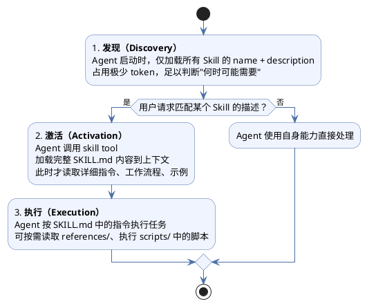
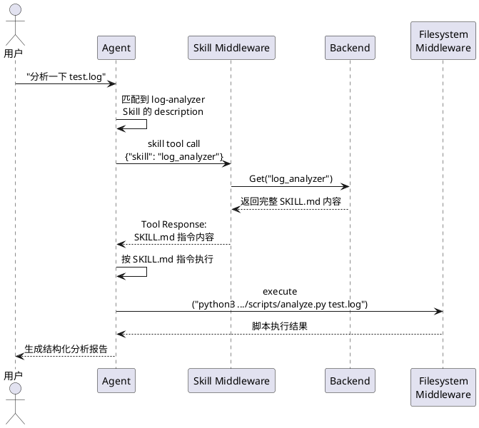

## 什么是 Skill

在 Agent 体系中，LLM 通过 **Function Call / Tool Use** 调用外部工具来弥补自身"只能处理文本"的局限。但随着系统复杂度提升，裸 Tool 暴露出一个根本问题：

> **确定性的业务编排逻辑，不应该交给概率模型去推理。**

裸 Tool 模式下，"查订单 → 查物流 → 匹配退款政策 → 计算金额"这样的确定性流程，全靠 LLM 自己编排——它可能漏步骤、搞错顺序、SQL 写错、甚至不知道要查退款政策。Tool 越多，LLM 选错的概率越高，token 消耗也越大。

Skill 就是为了解决这个问题而产生的中间抽象层——**把"怎么做"固化在代码和指令中，只让 LLM 决定"做不做"**：

```
── 裸 Tool：LLM 自己编排 4 步 ──────────────────────
用户："订单 X123 能退款吗？"
LLM → query_database(orders)
    → query_database(logistics)       ← 可能忘记这步
    → http_request(refund-policy)     ← 可能不知道要查
    → 自己综合判断                     ← 可能算错

── Skill：LLM 只做一次决策 ─────────────────────────
用户："订单 X123 能退款吗？"
LLM → skill("check_refund")
      Skill 内部指令引导 Agent：查订单 → 查物流 → 匹配政策 → 返回结构化结果
```

### Skill 带来的架构优势

| 优势             | 说明                                    | 举例                               |
| -------------- | ------------------------------------- | -------------------------------- |
| **可复用**        | 一个 Skill 注册一次，多个 Agent 共享             | 订单查询 Skill 同时服务客服 Agent、退款 Agent |
| **可插拔**        | Agent 按需声明所需 Skill，运行时动态组合            | 灰度上线"智能推荐"Skill，只挂载到部分 Agent     |
| **收敛 Tool 数量** | 几十个原子 Tool 聚合为少量 Skill，LLM 选择更准       | 10 个数据库/API 操作 → 1 个退款检查 Skill   |
| **开发效率**       | 业务开发者写一个 SKILL.md + 脚本即可被 Agent 调用    | 不需要理解 LLM 调用协议                   |
| **提示词即逻辑**     | 流程用自然语言写在 SKILL.md 中，改流程改提示词即可，无需编译部署 | 调整退款审核流程只需编辑 Markdown            |

---

## Skill 的目录结构

一个 Skill 本质上是一个**文件夹**，包含指令、脚本和资源，Agent 可以按需发现和使用：

```
my-skill/
├── SKILL.md          # 必需：核心指令文件（元数据 + 执行说明）
├── scripts/          # 可选：可执行脚本（Python、Shell 等）
├── references/       # 可选：参考文档（API 文档、规范等）
└── assets/           # 可选：模板、配置、静态资源
```

### SKILL.md — 核心指令文件

`SKILL.md` 是 Skill 的唯一必需文件，由两部分组成：

**1. YAML Frontmatter（元数据）**

```yaml
---
name: log-analyzer
description: 分析日志文件，提取错误和警告信息，生成结构化报告。当用户需要分析日志时使用。
---
```

- `name`：Skill 的唯一标识，Agent 通过此名称调用
- `description`：功能描述，**这是 Agent 判断是否使用该 Skill 的关键依据**，应说明"何时用"而非仅"做什么"

**2. Markdown 正文（执行指令）**

Frontmatter 之后的正文是 Agent 激活 Skill 后读取的详细指令，包含工作流程、步骤说明、示例等。Agent 会严格按照这些指令执行任务。

### scripts/ — 可执行脚本

Skill 可以捆绑脚本（Python、Shell 等），Agent 在执行 Skill 时可以调用这些脚本完成具体工作。例如一个日志分析 Skill 可以包含 `scripts/analyze.py`，由 Agent 通过绝对路径调用执行。

### references/ 和 assets/

`references/` 存放参考文档（如 API 规范、协议说明），`assets/` 存放模板、配置等静态资源。Agent 在需要时按需读取。

---

## Skill 的执行流程 — 渐进式展示

Skill 采用**渐进式展示（Progressive Disclosure）**策略来高效管理上下文，而不是一次性把所有 Skill 内容塞进 System Prompt：



**为什么不直接全量加载？** 假设系统中有 20 个 Skill，每个 SKILL.md 平均 2000 token，全量加载就是 40000 token 的 System Prompt。渐进式展示下，发现阶段可能只需 20 × 50 = 1000 token（name + description），激活时才加载当前需要的那一个。

---

## 在 Eino 中使用 Skill

[Eino](https://github.com/cloudwego/eino) 通过 **Skill Middleware** 为 ADK Agent 提供 Skill 支持。下面以一个日志分析 Skill 为例，展示完整的接入流程。

### 1. 准备 Skill 目录

```
workdir/
├── skills/
│   └── log_analyzer/
│        ├── scripts/
│        │   └── analyze.py
│        └── SKILL.md
└── other files
```

### 2. 创建 Backend 和 Middleware

```go
import (
    "github.com/cloudwego/eino/adk/middlewares/skill"
    "github.com/cloudwego/eino/adk/middlewares/filesystem"
    "github.com/cloudwego/eino-ext/adk/backend/local"
)

ctx := context.Background()

// 1. 创建本地文件系统 Backend
be, err := local.NewBackend(ctx, &local.Config{})

// 2. 基于文件系统创建 Skill Backend
skillBackend, err := skill.NewBackendFromFilesystem(ctx, &skill.BackendFromFilesystemConfig{
    Backend: be,
    BaseDir: "workdir/skills",  // 扫描此目录下所有一级子目录中的 SKILL.md
})

// 3. 创建 Skill Middleware
sm, err := skill.NewMiddleware(ctx, &skill.Config{
    Backend: skillBackend,
})

// 4. 创建 Filesystem Middleware（让 Agent 能读取文件、执行脚本）
fsm, err := filesystem.New(ctx, &filesystem.MiddlewareConfig{
    Backend:        be,
    StreamingShell: be,
})
```

### 3. 挂载到 Agent

```go
agent, err := adk.NewChatModelAgent(ctx, &adk.ChatModelAgentConfig{
    Name:        "LogAnalysisAgent",
    Description: "An agent that can analyze logs",
    Instruction: "You are a helpful assistant.",
    Model:       cm,
    Handlers:    []adk.ChatModelAgentMiddleware{fsm, sm},  // 两个 Middleware 都需要
})
```

> 注意：Skill Middleware 只负责加载 SKILL.md 内容。如果 Skill 需要 Agent 读取文件或执行脚本，必须另外配置 Filesystem Middleware。

---

## Backend 接口与自定义实现

### Backend 接口

`Backend` 接口定义了 Skill 的检索方式，将 Skill 的**存储**与**使用**解耦：

```go
type Backend interface {
    List(ctx context.Context) ([]FrontMatter, error)  // 发现阶段：列出所有 Skill 的元数据
    Get(ctx context.Context, name string) (Skill, error)  // 激活阶段：获取完整 Skill 内容
}
```

这意味着 Skill 可以存储在任何地方——本地文件系统、数据库、远程服务、Git 仓库——只要实现这两个方法。

### 内置实现：NewBackendFromFilesystem

Eino 提供了基于文件系统的 Backend 实现：

```go
skillBackend, err := skill.NewBackendFromFilesystem(ctx, &skill.BackendFromFilesystemConfig{
    Backend: be,           // filesystem.Backend 实现（如 local.Backend）
    BaseDir: "skills/",    // 扫描此目录下的一级子目录，查找 SKILL.md
})
```

工作方式：扫描 `BaseDir` 一级子目录 → 查找 `SKILL.md` → 解析 Frontmatter 获取元数据。深层嵌套的 `SKILL.md` 会被忽略。

### 自定义 Backend：按需过滤和聚合

在实际项目中，不同的 Agent 往往只需要一部分 Skill。通过自定义 Backend，可以实现**白名单过滤**和**多目录聚合**：

#### FilteredBackend — 白名单过滤

不同 Agent 只加载自己需要的 Skill，避免无关 Skill 干扰 LLM 决策：

```go
// FilteredBackend 通过白名单过滤 Skill
type FilteredBackend struct {
    inner      skill.Backend
    allowNames map[string]bool
}

func NewFilteredBackend(inner skill.Backend, names []string) skill.Backend {
    if len(names) == 0 {
        return inner // 无白名单，直接透传
    }
    allow := make(map[string]bool, len(names))
    for _, n := range names {
        allow[n] = true
    }
    return &FilteredBackend{inner: inner, allowNames: allow}
}

func (f *FilteredBackend) List(ctx context.Context) ([]skill.FrontMatter, error) {
    all, err := f.inner.List(ctx)
    if err != nil {
        return nil, err
    }
    filtered := make([]skill.FrontMatter, 0, len(f.allowNames))
    for _, fm := range all {
        if f.allowNames[fm.Name] {
            filtered = append(filtered, fm)
        }
    }
    return filtered, nil
}

func (f *FilteredBackend) Get(ctx context.Context, name string) (skill.Skill, error) {
    if !f.allowNames[name] {
        return skill.Skill{}, fmt.Errorf("skill %q not in allow list", name)
    }
    return f.inner.Get(ctx, name)
}
```

#### CompositeBackend — 多目录聚合

Skill 可能分散在多个目录（公共 Skill、业务 Skill、团队 Skill），通过聚合 Backend 统一管理：

```go
// CompositeBackend 将多个 Backend 合并为一个
type CompositeBackend struct {
    backends []skill.Backend
}

func NewCompositeBackend(backends ...skill.Backend) *CompositeBackend {
    return &CompositeBackend{backends: backends}
}

func (c *CompositeBackend) List(ctx context.Context) ([]skill.FrontMatter, error) {
    var all []skill.FrontMatter
    for _, b := range c.backends {
        items, err := b.List(ctx)
        if err != nil {
            return nil, fmt.Errorf("composite backend list error: %w", err)
        }
        all = append(all, items...)
    }
    return all, nil
}

func (c *CompositeBackend) Get(ctx context.Context, name string) (skill.Skill, error) {
    for _, b := range c.backends {
        s, err := b.Get(ctx, name)
        if err == nil {
            // 将模板变量替换为实际路径
            s.Content = strings.ReplaceAll(s.Content, "{{.BaseDirectory}}", s.BaseDirectory)
            return s, nil
        }
    }
    return skill.Skill{}, fmt.Errorf("skill not found in any backend: %s", name)
}
```

#### 组合使用：为不同 Agent 配置不同 Skill 集

将 FilteredBackend 和 CompositeBackend 组合起来，实现"多目录 + 按 Agent 过滤"：

```go
func CreateSkillMiddlewares(ctx context.Context, config AgentSkillConfig) ([]adk.ChatModelAgentMiddleware, error) {
    localBackend, _ := local.NewBackend(ctx, &local.Config{})

    // 为每个 Skill 来源创建 Backend（可带过滤）
    var skillBackends []skill.Backend
    for _, src := range config.Sources {
        fsBackend, _ := skill.NewBackendFromFilesystem(ctx, &skill.BackendFromFilesystemConfig{
            Backend: localBackend,
            BaseDir: src.Dir,
        })
        // 每个来源可以单独设置白名单
        skillBackends = append(skillBackends, NewFilteredBackend(fsBackend, src.Names))
    }

    // 聚合为一个 Backend
    compositeBackend := NewCompositeBackend(skillBackends...)

    // 创建 Middleware
    skillMW, _ := skill.NewMiddleware(ctx, &skill.Config{Backend: compositeBackend})
    fsMW, _ := filesystem.New(ctx, &filesystem.MiddlewareConfig{
        Backend: localBackend, StreamingShell: localBackend,
    })

    return []adk.ChatModelAgentMiddleware{fsMW, skillMW}, nil
}
```

使用时，不同 Agent 只需声明自己需要的 Skill：

```go
// 客服 Agent：只需要退款和物流相关 Skill
handlers, _ := CreateSkillMiddlewares(ctx, AgentSkillConfig{
    Sources: []SkillSource{
        {Dir: "skills/common", Names: []string{"refund-check", "logistics-query"}},
        {Dir: "skills/customer-service", Names: nil},  // nil = 加载目录下所有
    },
})

// 数据分析 Agent：只需要日志和报表 Skill
handlers, _ := CreateSkillMiddlewares(ctx, AgentSkillConfig{
    Sources: []SkillSource{
        {Dir: "skills/common", Names: []string{"log-analyzer"}},
        {Dir: "skills/analytics"},
    },
})
```

---

## Eino Skill Middleware 的实现原理

Skill Middleware 的核心工作是向 Agent **注入 System Prompt** 和 **注册 Skill Tool**，实现渐进式展示。

### 1. 注入 System Prompt

Middleware 初始化时向 Agent 的 System Prompt 追加以下内容，教会 Agent 如何使用 Skill：

```
# Skills System

Skills follow a **progressive disclosure** pattern:

1. **Recognize when a skill applies**: Check if the user's task matches a skill's description
2. **Read the skill's full instructions**: Use the '{tool_name}' tool to load skill
3. **Follow the skill's instructions**: tool result contains workflows, best practices, and examples
4. **Access supporting files**: Skills may include helper scripts, configs, or reference docs

When to Use Skills:
- User's request matches a skill's domain
- You need specialized knowledge or structured workflows
- A skill provides proven patterns for complex tasks

Executing Skill Scripts:
Skills may contain Python scripts or other executable files. Always use absolute paths.
```

### 2. 注册 Skill Tool

Middleware 调用 `Backend.List()` 获取所有 Skill 的元数据，然后注册一个名为 `skill`（可配置）的 Tool。这个 Tool 的 description 中列出所有可用 Skill 的 name 和 description：

```
Execute a skill within the main conversation

<available_skills>
<skill>
<name>log-analyzer</name>
<description>分析日志文件，提取错误和警告信息</description>
</skill>
<skill>
<name>refund-check</name>
<description>检查订单退款资格</description>
</skill>
</available_skills>
```

### 3. 运行时流程

当 Agent 判断需要使用某个 Skill 时，整个调用链如下：



关键点：**Skill Middleware 只负责加载 SKILL.md**。Agent 执行脚本、读取文件等能力由 Filesystem Middleware 提供，两者各司其职。

### ContextMode：Skill 的执行上下文

除了默认的内联模式，Skill 还支持在独立上下文中执行（需配置 `AgentHub`）：

| 模式                    | Frontmatter 配置               | 行为                                          |
| --------------------- | ---------------------------- | ------------------------------------------- |
| **内联（默认）**            | 不填 `context`                 | Skill 内容作为 Tool Response 返回，当前 Agent 继续处理   |
| **fork_with_context** | `context: fork_with_context` | 创建新 Agent，**复制当前对话历史**，独立执行后返回结果            |
| **fork**              | `context: fork`              | 创建新 Agent，**隔离上下文**（仅包含 Skill 内容），独立执行后返回结果 |

适用场景：当 Skill 任务较重（如长文档分析）、需要不同模型、或不希望污染主对话上下文时，使用 fork 模式。

---

## 延伸阅读

- [[Agent能力体系-工具抽象]] — Function Call → Skill → MCP 的完整演进、Skill Middleware 模式详解
- [[Agent设计范式]] — ReAct、Pipeline、Multi-Agent 等范式对比
- [Eino Skill Middleware 官方文档](https://www.cloudwego.io/zh/docs/eino/core_modules/eino_adk/eino_adk_chatmodelagentmiddleware/middleware_skill/)
- [Agent Skills 社区规范](https://agentskills.io/home)