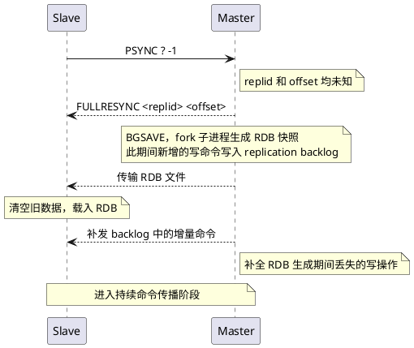

# Redis 主从复制

单台 Redis 实例存在两个明显的短板：**单点故障**和**读性能瓶颈**。一旦主机宕机，整个缓存服务不可用；所有读写请求压在同一个节点上，性能也存在上限。主从复制（Replication）正是为了解决这两个问题而设计的——通过将数据从一台主节点（Master）持续同步到一台或多台从节点（Slave/Replica），实现**数据冗余**与**读写分离**。

## 1. 主从架构模型

主从复制是一主多从的架构：

```
            写请求
    Client ───────→  Master
                       │
           ┌───────────┼───────────┐
           ↓           ↓           ↓
         Slave1      Slave2      Slave3
           ↑           ↑           ↑
           └───────────┴───────────┘
                    读请求
```

- **Master（主节点）**：处理所有写请求，并将写操作异步传播给从节点
- **Slave（从节点）**：只接受读请求，数据完全来自主节点的同步

这种架构带来两个好处：
1. **读写分离**：读请求分散到多个从节点，大幅减轻主节点压力
2. **数据冗余**：即使主节点宕机，从节点仍保有完整数据，可以快速恢复服务

但需要明确的是，**主从复制本身不具备自动故障转移能力**。主节点宕机后，从节点不会自动晋升为新主节点，需要人工干预或借助 Redis Sentinel 来实现。

## 2. 建立主从关系

让一个节点成为从节点，有三种方式：

**方式一：命令行**（临时，重启后失效）
```bash
REPLICAOF <master-ip> <master-port>

# 取消主从关系，重新变回独立节点
REPLICAOF NO ONE
```

**方式二：配置文件**（永久生效，推荐生产环境使用）
```conf
replicaof 192.168.1.100 6379
# 若主节点设置了访问密码
masterauth <password>
```

**方式三：启动参数**
```bash
redis-server --replicaof 192.168.1.100 6379
```

从节点一旦建立连接，就会立即向主节点发起数据同步请求，触发第一次**全量同步**。

## 3. 数据同步机制

Redis 主从同步分为两个阶段：**全量同步**（初次或断线太久）和**增量同步**（短暂断线后重连）。两种同步方式的选择，依赖三个关键概念：

| 概念                               | 说明                           |
| -------------------------------- | ---------------------------- |
| **Replication ID（replid）**       | 主节点的唯一标识，每次重启或被提升为主节点时重新生成   |
| **Replication Offset（偏移量）**      | 主节点已发送的命令总字节数，从节点记录自己已接收到的位置 |
| **Replication Backlog（复制积压缓冲区）** | 主节点维护的一块环形缓冲区，用于暂存最近的写命令序列   |

从节点通过 `PSYNC <replid> <offset>` 命令发起同步请求，主节点根据这两个参数判断执行全量同步还是增量同步。

### 3.1 全量同步（Full Sync）

以下情况会触发全量同步：
- 从节点**首次**连接主节点（replid 为空）
- 从节点的 replid 与主节点不一致（曾连接过不同的主节点）
- 从节点的 offset 已超出 Replication Backlog 的覆盖范围（断线太久，积压区数据已被覆盖）

全量同步的完整流程：



全量同步的代价较重：BGSAVE 占用 CPU 和磁盘 IO，RDB 文件传输消耗网络带宽，从节点载入 RDB 期间会阻塞读请求。因此 Redis 的设计目标是**尽量避免触发全量同步**。

### 3.2 增量同步（Incremental Sync）

当从节点断线后重新连接，且其 offset 仍在 Replication Backlog 的覆盖范围内时，主节点只需补发缺失的那段命令，代价极小。

```
Slave                                   Master
  │                                       │
  │──── PSYNC <replid> <offset> ───────→ │   携带上次断线前记录的 replid 和 offset
  │                                       │
  │                                       │── 验证 replid 是否一致
  │                                       │── 检查 offset 是否在 backlog 范围内
  │                                       │
  │ ←──── CONTINUE ───────────────────── │   满足条件，执行增量同步
  │                                       │
  │ ←──── 补发 offset 之后的命令 ───────  │
  │                                       │
  │── 执行命令，追上主节点进度 ──────────→│
```

增量同步的关键依赖是 **Replication Backlog**（复制积压缓冲区）：
- 默认大小为 **1 MB**，是一块环形缓冲区，旧数据会被新数据覆盖
- 主节点将每条写命令连同其偏移量一起写入 backlog
- 如果从节点断线时间过长，其 offset 对应的命令已被覆盖，只能退回全量同步

> **实践建议**：在主从网络质量不稳定、或从节点可能长时间离线的场景中，适当调大 `repl-backlog-size`（如 10MB~100MB），可显著减少全量同步的触发频率，降低系统抖动。

### 3.3 持续命令传播（Command Propagation）

数据同步完成后，进入稳定运行阶段。主节点每执行一条写命令，都会将该命令**异步**发送给所有从节点，保持数据持续一致。

与此同时，从节点每秒向主节点发送 `REPLCONF ACK <offset>` 心跳，这个机制有两个作用：
1. **存活检测**：主节点若超时未收到 ACK，则认为该从节点已离线
2. **进度核对**：主节点可对比 offset，判断是否需要补发命令给落后的从节点

## 4. 异步复制与数据一致性

主从复制采用的是**异步复制**模型：主节点执行写命令、返回客户端之后，才异步将命令传播给从节点。这带来了两个隐患：

- **复制延迟**：从节点的数据在高写入压力下可能落后主节点若干毫秒，读从节点可能读到旧数据
- **数据丢失**：主节点宕机时，已执行但尚未传播到从节点的写命令会永久丢失。从节点切换为新主节点后，这部分数据便消失了

这正是 [[Redis 及其优缺点]] 中提到的"主机宕机后引发数据不一致"问题的根本原因。

如果业务对一致性有严格要求，可以配置写确认机制：
```conf
# 至少有 N 个从节点回复 ACK，主节点才认为写入成功
min-replicas-to-write 1
# 从节点延迟不得超过 N 秒，否则主节点拒绝写入
min-replicas-max-lag 10
```

这是一种以**可用性**换**一致性**的权衡：满足条件的从节点数量不足时，主节点将拒绝所有写请求。

## 5. 主从复制的局限与边界

主从复制解决了读性能和数据冗余的问题，但有两个本质上无法解决的局限：

1. **无自动故障转移**：主节点宕机后，不会自动选举新主节点，需要人工介入或上层组件（Sentinel）接管
2. **异步复制存在数据丢失风险**：无法做到强一致，只能通过 `min-replicas-*` 配置来缩小窗口

正因如此，在生产环境中，主从复制通常不会单独使用，而是配合 **Redis Sentinel（哨兵）** 一起部署——哨兵负责持续监控主从节点的健康状态，在主节点宕机时自动完成故障转移（选举新主、通知客户端），弥补主从复制在高可用上的缺失。
