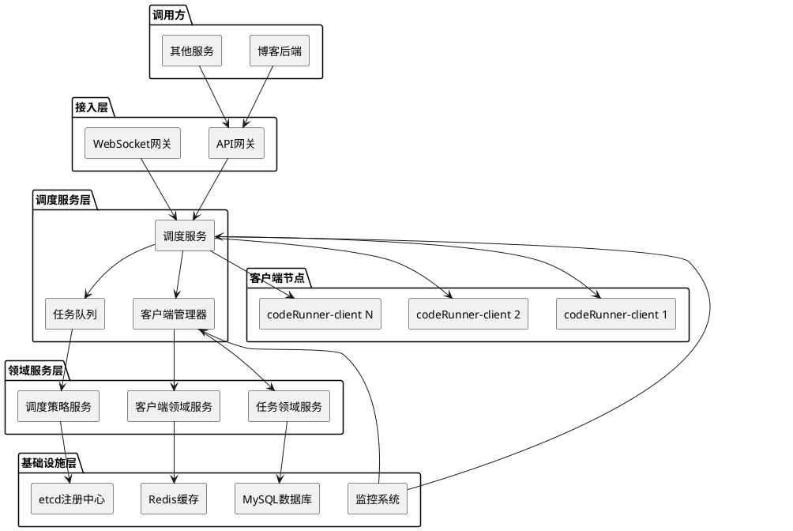
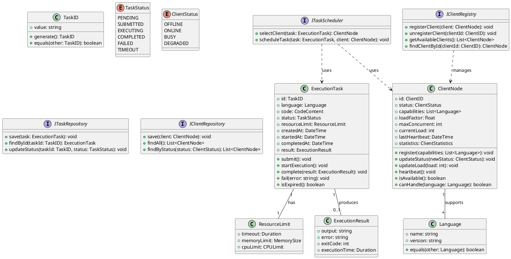
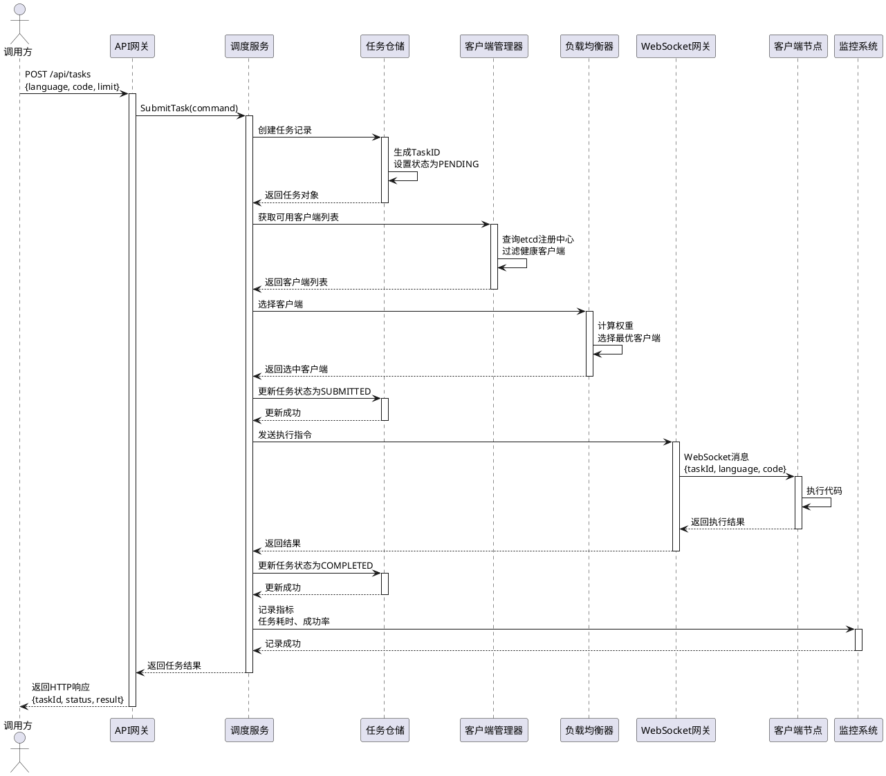
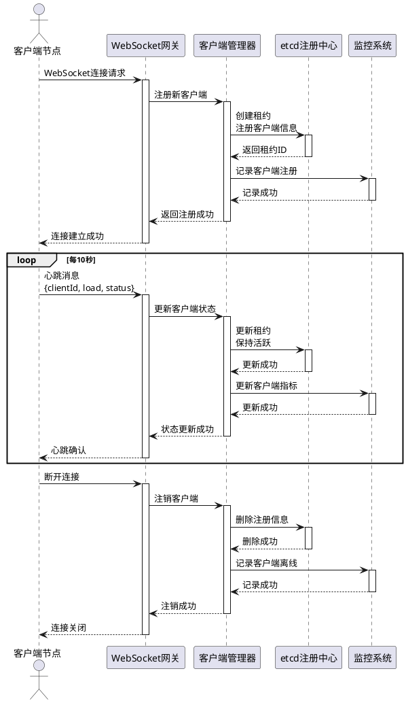
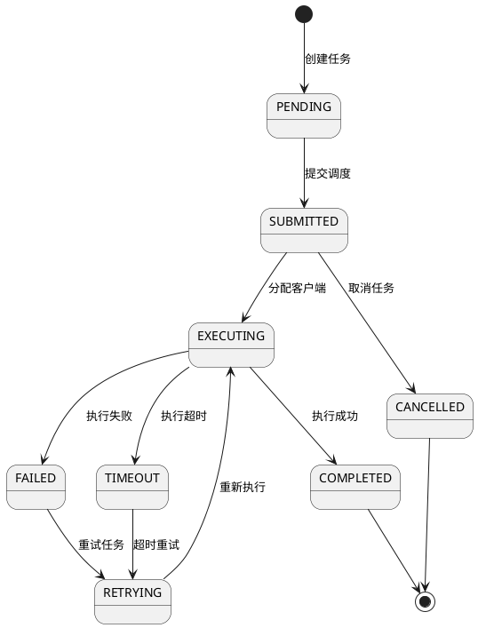
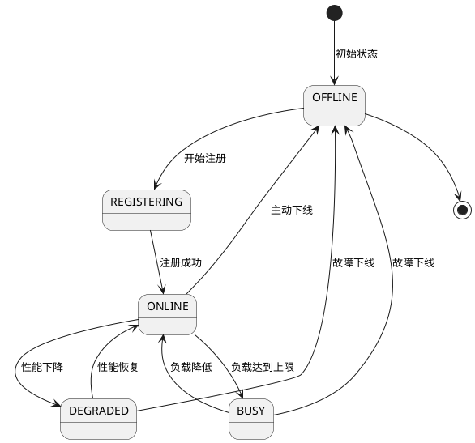

# codeRunner-server 技术方案设计

> 基于结构化技术方案设计方法论，确保设计全面、清晰、可执行
>
> **项目名称**: codeRunner-server 分布式代码执行调度系统
> **重构日期**: 2026-02-21
> **文档版本**: 2.0

---

## ✅ 第一部分：项目概述（当前需求的关键描述）

### 1.1 需求背景

随着灵码云项目的快速发展，现有的代码执行架构面临以下挑战：
1. **单点瓶颈**：原有架构中博客后端直接与codeRunner-client通信，存在单点故障风险
2. **扩展性不足**：无法动态扩展客户端节点，难以应对高并发代码执行请求
3. **缺乏调度策略**：简单的随机选择客户端无法实现负载均衡和资源优化
4. **监控运维困难**：缺乏统一的监控、日志和健康检查机制

### 1.2 核心需求描述

#### 功能需求：
1. **任务调度**：接收代码执行请求，智能调度到合适的客户端节点
2. **客户端管理**：动态注册、发现和管理codeRunner-client节点
3. **负载均衡**：基于客户端负载、历史成功率等因素进行智能调度
4. **状态监控**：实时监控任务状态和客户端健康状态
5. **结果收集**：收集代码执行结果并返回给调用方

#### 非功能需求：
- **性能指标**：单任务调度延迟 < 100ms，支持1000+并发任务
- **可用性**：99.9% SLA，支持客户端节点动态扩缩容
- **可扩展性**：支持水平扩展，新增调度节点无需停机
- **安全性**：任务隔离、资源限制、防DDoS攻击

### 1.3 业务价值

1. **效率提升**：通过智能调度减少任务等待时间，提升代码执行效率
2. **成本优化**：合理分配计算资源，避免资源浪费
3. **可靠性增强**：分布式架构提高系统整体可靠性
4. **运维简化**：统一的管理界面和监控工具简化运维工作

### 1.4 项目目标

#### 短期目标（MVP）：
1. 实现基本的任务调度和客户端管理功能
2. 支持WebSocket通信协议，保持与现有客户端的兼容性
3. 实现简单的负载均衡策略（随机选择）
4. 提供基础的健康检查和监控功能

#### 长期目标：
1. 实现智能负载均衡算法（基于多因素加权）
2. 支持多种通信协议（gRPC、HTTP/2等）
3. 完整的监控告警系统
4. 自动化运维和弹性伸缩能力

---

## ✅ 第二部分：技术架构设计（技术选型与架构设计）

### 2.1 技术选型

| 类别    | 技术选型                 | 版本    | 选型理由                        |
| ----- | -------------------- | ----- | --------------------------- |
| 开发语言  | Go                   | 1.21+ | 高性能、并发能力强、适合分布式系统           |
| 微服务框架 | go-zero              | 最新版   | 生产就绪、代码生成、内置微服务组件           |
| 架构模式  | DDD（领域驱动设计）          | -     | 复杂业务逻辑建模、清晰分层架构             |
| 服务发现  | etcd                 | 3.5+  | 分布式键值存储、go-zero原生支持         |
| 通信协议  | WebSocket + gRPC     | -     | WebSocket保持客户端兼容，gRPC用于内部通信 |
| 数据库   | MySQL                | 8.0+  | 关系型数据存储、任务状态持久化             |
| 缓存    | Redis                | 7.0+  | 高性能缓存、任务队列管理                |
| 监控    | Prometheus + Grafana | -     | 指标收集和可视化                    |
| 日志    | zerolog              | -     | 结构化日志、高性能                   |

### 2.2 系统架构图



### 2.3 架构分层说明

#### 2.3.1 接入层
- **职责**：协议适配、请求路由、认证鉴权
- **组件**：
  - API网关：处理HTTP/RESTful请求
  - WebSocket网关：处理WebSocket连接，保持与现有客户端兼容
- **设计原则**：无状态、水平扩展、请求限流

#### 2.3.2 调度服务层
- **职责**：核心调度逻辑、任务管理、客户端管理
- **组件**：
  - 调度服务：接收任务请求，协调各个组件
  - 客户端管理器：管理客户端注册、发现、状态监控
  - 任务队列：缓冲任务请求，支持优先级调度
- **设计原则**：高可用、最终一致性、容错处理

#### 2.3.3 领域服务层
- **职责**：核心业务逻辑、领域规则、调度策略
- **组件**：
  - 任务领域服务：任务生命周期管理、状态转换
  - 客户端领域服务：客户端能力管理、健康评估
  - 调度策略服务：负载均衡算法、资源分配策略
- **设计原则**：领域驱动设计、业务逻辑与基础设施分离

#### 2.3.4 基础设施层
- **职责**：数据持久化、缓存、服务发现、监控
- **组件**：
  - MySQL：任务状态、执行历史持久化
  - Redis：客户端状态缓存、任务队列缓存
  - etcd：服务注册发现、配置管理
  - 监控系统：指标收集、告警、日志聚合
- **设计原则**：可替换性、高可用、性能优化

### 2.4 核心模块划分

| 模块名称  | 职责描述            | 核心接口                                    | 依赖模块            |
| ----- | --------------- | --------------------------------------- | --------------- |
| 调度引擎  | 任务接收、调度决策、结果收集  | SubmitTask(), GetTaskStatus()           | 客户端管理、任务队列      |
| 客户端管理 | 客户端注册、发现、状态监控   | RegisterClient(), GetAvailableClients() | etcd、Redis      |
| 负载均衡  | 客户端选择算法、权重计算    | SelectClient(), CalculateWeight()       | 客户端管理、监控数据      |
| 任务队列  | 任务缓冲、优先级管理、超时处理 | EnqueueTask(), DequeueTask()            | Redis、MySQL     |
| 监控告警  | 指标收集、健康检查、异常告警  | CollectMetrics(), CheckHealth()         | Prometheus、日志系统 |

---

## ✅ 第三部分：领域模型设计（领域模型划分与类图设计）

### 3.1 领域模型划分

#### 3.1.1 核心领域
- **ExecutionTask（任务聚合根）**
  - **职责**：表示一个代码执行任务，管理任务的生命周期
  - **关键属性**：taskId, language, code, status, createdAt, completedAt
  - **生命周期**：创建 → 提交 → 执行中 → 完成/失败

- **ClientNode（客户端聚合根）**
  - **职责**：表示一个代码执行客户端节点，管理客户端状态和能力
  - **关键属性**：clientId, status, capabilities, loadFactor, lastHeartbeat
  - **生命周期**：注册 → 在线 → 忙碌/空闲 → 离线

#### 3.1.2 支撑领域
- **SchedulingStrategy（调度策略）**
  - **职责**：定义客户端选择算法和权重计算规则
  - **关键属性**：algorithmType, weightFactors, configuration

- **TaskQueue（任务队列）**
  - **职责**：管理待执行任务的排队和优先级
  - **关键属性**：queueType, priorityRules, capacity

#### 3.1.3 通用领域
- **ResourceLimit（资源限制）**
  - **职责**：定义任务执行的资源限制
  - **关键属性**：timeout, memoryLimit, cpuLimit

### 3.2 类图设计



### 3.3 模型关系说明

#### 3.3.1 ExecutionTask 聚合根
- **设计理由**：任务执行是系统的核心业务，需要保证任务状态的一致性
- **一致性边界**：任务的所有状态变更必须在聚合内部完成
- **生命周期管理**：
  - 创建：接收任务请求时创建
  - 提交：验证参数后提交到调度系统
  - 执行：分配给客户端执行
  - 完成：收集执行结果并更新状态

#### 3.3.2 ClientNode 聚合根
- **设计理由**：客户端节点需要独立管理状态和能力
- **一致性边界**：客户端状态、负载信息、能力列表
- **生命周期管理**：
  - 注册：客户端连接时注册到系统
  - 心跳：定期更新状态和负载
  - 状态变更：根据负载和健康状态变更状态
  - 注销：客户端断开连接时注销

#### 3.3.3 领域服务接口
- **ITaskScheduler**：封装调度策略，隔离算法实现
- **IClientRegistry**：管理客户端注册发现，支持多种注册中心

### 3.4 关键方法定义

#### 3.4.1 ExecutionTask 领域方法
```go
/**
 * 提交任务
 * @throws InvalidStateError 任务状态不是PENDING
 * @throws ValidationError 任务参数无效
 */
submit(): void {
  // 1. 验证当前状态
  if (this.status != TaskStatus.PENDING) {
    throw new InvalidStateError("Task already submitted");
  }

  // 2. 验证任务参数
  if (!this.language || !this.code) {
    throw new ValidationError("Task language and code are required");
  }

  // 3. 更新状态
  this.status = TaskStatus.SUBMITTED;
  this.submittedAt = new DateTime();

  // 4. 触发领域事件
  this.addDomainEvent(new TaskSubmittedEvent(this.id));
}

/**
 * 完成任务执行
 * @param result 执行结果
 * @throws InvalidStateError 任务状态不是EXECUTING
 */
complete(result: ExecutionResult): void {
  // 1. 验证当前状态
  if (this.status != TaskStatus.EXECUTING) {
    throw new InvalidStateError("Task is not executing");
  }

  // 2. 更新状态和结果
  this.status = TaskStatus.COMPLETED;
  this.completedAt = new DateTime();
  this.result = result;

  // 3. 触发领域事件
  this.addDomainEvent(new TaskCompletedEvent(this.id, result));
}
```

#### 3.4.2 ClientNode 领域方法
```go
/**
 * 更新客户端负载
 * @param currentLoad 当前负载数
 * @throws ValidationError 负载数无效
 */
updateLoad(currentLoad: int): void {
  // 1. 验证负载数
  if (currentLoad < 0 || currentLoad > this.maxConcurrent) {
    throw new ValidationError(`Invalid load: ${currentLoad}`);
  }

  // 2. 更新负载
  this.currentLoad = currentLoad;

  // 3. 根据负载更新状态
  if (currentLoad >= this.maxConcurrent) {
    this.status = ClientStatus.BUSY;
  } else if (currentLoad > 0) {
    this.status = ClientStatus.ONLINE;
  }

  // 4. 计算负载因子
  this.loadFactor = currentLoad / this.maxConcurrent;
}

/**
 * 检查客户端是否可用
 * @returns 是否可用
 */
isAvailable(): boolean {
  return this.status == ClientStatus.ONLINE &&
         this.currentLoad < this.maxConcurrent &&
         this.isHealthy();
}

/**
 * 检查客户端健康状态
 * @returns 是否健康
 */
isHealthy(): boolean {
  const now = new DateTime();
  const heartbeatTimeout = Duration.ofSeconds(30);

  return now.diff(this.lastHeartbeat).lessThan(heartbeatTimeout);
}
```

---

## ✅ 第四部分：业务流程设计（业务流转过程展示）

### 4.1 核心业务流程时序图

#### 4.1.1 任务提交与调度流程



#### 4.1.2 客户端注册与心跳流程



### 4.2 关键业务场景说明

#### 4.2.1 场景1：代码执行任务提交
- **触发条件**：用户或系统需要执行代码
- **参与方**：调用方、调度服务、客户端节点
- **前置条件**：
  1. 至少有一个可用的客户端节点
  2. 调度服务正常运行
  3. 数据库连接正常
- **处理流程**：
  1. 调用方通过API提交任务请求
  2. 调度服务验证请求参数
  3. 创建任务记录并生成唯一ID
  4. 查询可用客户端列表
  5. 使用负载均衡算法选择最优客户端
  6. 通过WebSocket发送执行指令
  7. 客户端执行代码并返回结果
  8. 更新任务状态和结果
  9. 返回执行结果给调用方
- **后置条件**：任务状态为COMPLETED或FAILED，结果已保存
- **异常处理**：
  - 无可用客户端：返回错误，建议重试
  - 客户端执行超时：标记任务为TIMEOUT，尝试其他客户端
  - 网络中断：重试机制，最多重试3次

#### 4.2.2 场景2：客户端动态扩缩容
- **触发条件**：系统负载变化或运维操作
- **参与方**：客户端节点、客户端管理器、etcd
- **前置条件**：etcd服务正常运行
- **处理流程**：
  1. 新客户端启动并连接WebSocket网关
  2. 客户端管理器注册客户端到etcd
  3. 设置租约和定期心跳
  4. 客户端开始接收任务
  5. 客户端下线时自动注销
- **后置条件**：客户端状态在etcd中正确反映
- **异常处理**：
  - 心跳丢失：标记客户端为不健康，不再分配新任务
  - 租约过期：自动删除客户端注册信息
  - 网络分区：使用本地缓存继续服务，恢复后同步状态

### 4.3 接口交互设计

#### 4.3.1 提交任务接口
```http
POST /api/v1/tasks
Content-Type: application/json
Authorization: Bearer {token}

Request:
{
  "language": "python",
  "code": "print('Hello, World!')",
  "resourceLimit": {
    "timeout": "30s",
    "memory": "256MB",
    "cpu": "1.0"
  },
  "metadata": {
    "userId": "user_123",
    "projectId": "proj_456"
  }
}

Response (Success):
{
  "code": 0,
  "message": "success",
  "data": {
    "taskId": "task_7890123456",
    "status": "submitted",
    "estimatedTime": "2s"
  }
}

Response (Error - 无可用客户端):
{
  "code": 50301,
  "message": "No available client nodes",
  "detail": "All client nodes are busy or offline",
  "retryAfter": 30
}
```

#### 4.3.2 查询任务状态接口
```http
GET /api/v1/tasks/{taskId}

Response:
{
  "code": 0,
  "message": "success",
  "data": {
    "taskId": "task_7890123456",
    "status": "completed",
    "language": "python",
    "result": {
      "output": "Hello, World!\n",
      "error": "",
      "exitCode": 0,
      "executionTime": "1.2s"
    },
    "timestamps": {
      "createdAt": "2026-02-21T10:30:00Z",
      "submittedAt": "2026-02-21T10:30:01Z",
      "startedAt": "2026-02-21T10:30:02Z",
      "completedAt": "2026-02-21T10:30:03Z"
    },
    "assignedClient": "client_abc123"
  }
}
```

#### 4.3.3 WebSocket消息协议
```json
// 客户端 -> 服务端：心跳消息
{
  "type": "heartbeat",
  "clientId": "client_abc123",
  "timestamp": "2026-02-21T10:30:00Z",
  "load": {
    "currentTasks": 3,
    "maxConcurrent": 10,
    "cpuUsage": 0.45,
    "memoryUsage": 0.32
  },
  "capabilities": ["python", "javascript", "go"]
}

// 服务端 -> 客户端：执行任务
{
  "type": "execute",
  "taskId": "task_7890123456",
  "language": "python",
  "code": "print('Hello, World!')",
  "resourceLimit": {
    "timeout": "30s",
    "memory": "256MB"
  }
}

// 客户端 -> 服务端：任务结果
{
  "type": "result",
  "taskId": "task_7890123456",
  "success": true,
  "output": "Hello, World!\n",
  "error": "",
  "exitCode": 0,
  "executionTime": "1.2s"
}
```

### 4.4 状态流转设计

#### 4.4.1 任务状态机


#### 4.4.2 客户端状态机


#### 4.4.3 状态转换规则
1. **任务状态转换**：
   - PENDING → SUBMITTED：参数验证通过，进入调度队列
   - SUBMITTED → EXECUTING：分配到客户端，开始执行
   - EXECUTING → COMPLETED：执行成功，返回结果
   - EXECUTING → FAILED：执行失败，记录错误
   - EXECUTING → TIMEOUT：超过资源限制时间

2. **客户端状态转换**：
   - OFFLINE → ONLINE：成功注册并心跳正常
   - ONLINE → BUSY：当前任务数达到最大并发数
   - ONLINE → DEGRADED：性能指标低于阈值
   - 任何状态 → OFFLINE：心跳丢失或主动下线

---

## 总结

### 设计评审要点

1. **架构合理性**：采用DDD+go-zero的混合架构，既保证了业务逻辑的清晰性，又利用了框架的生产力
2. **可扩展性**：支持客户端动态扩缩容，调度服务可水平扩展
3. **可维护性**：清晰的领域模型和分层架构，便于团队协作和维护
4. **性能指标**：设计目标满足业务需求，支持高并发场景
5. **安全性**：任务隔离、资源限制、认证鉴权等安全机制
6. **成本效益**：利用开源技术栈，避免厂商锁定，降低运维成本

### 后续行动计划

1. **详细设计**：需要进一步设计数据库表结构和API详细规范
2. **技术验证**：验证go-zero与DDD整合的可行性，特别是代码生成与手动代码的协作
3. **风险评估**：识别WebSocket连接管理、状态同步等潜在风险
4. **资源规划**：评估开发、测试、部署所需的人员和时间资源

---

## 附录

### A. 参考资料
- [[项目技术方案]] - 整体项目技术架构和DDD设计
- [[项目里程碑]] - 项目阶段规划和目标
- [go-zero官方文档](https://go-zero.dev/) - 微服务框架文档
- [DDD领域驱动设计](https://domainlanguage.com/ddd/) - 领域驱动设计方法论

### B. 术语表
| 术语 | 解释 |
|------|------|
| DDD | 领域驱动设计，一种软件设计方法论 |
| 聚合根 | DDD中的核心领域对象，负责维护一致性边界 |
| 领域服务 | 封装领域逻辑的服务，不包含状态 |
| 限界上下文 | 领域模型的边界，定义模型的适用范围 |
| 负载均衡 | 将工作负载分配到多个计算资源的技术 |

### C. 版本历史
| 版本 | 日期 | 修改内容 | 修改人 |
|------|------|----------|--------|
| 1.0 | 2026-02-21 | 原始版本 | 系统 |
| 2.0 | 2026-02-21 | 重构版本，按照四个核心部分重新组织 | tech-design技能 |

---

**文档完成度检查清单**：
- [x] 项目概述完整
- [x] 技术架构设计清晰
- [x] 领域模型划分合理
- [x] 业务流程设计完整
- [x] 接口设计规范
- [ ] 数据模型设计合理（待补充）
- [x] 性能优化方案可行
- [x] 错误处理机制完善
- [x] 实施计划可行
- [x] 安全设计考虑周全