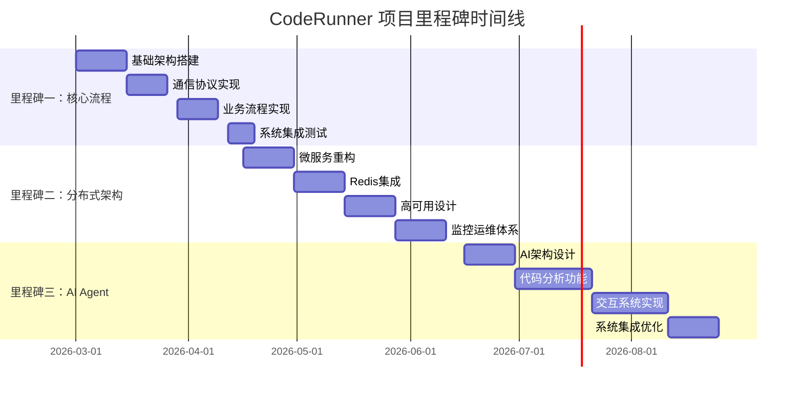

# CodeRunner 分布式代码执行系统 - 项目里程碑

## 项目概述

CodeRunner 是一个基于 DDD（领域驱动设计）架构的分布式代码在线运行系统，旨在为博客平台等在线内容平台提供安全、高效的代码执行能力。本项目将分三个阶段实施，每个阶段都有明确的目标、交付物和验收标准。

**项目目标**：
1. 实现安全、高效的代码执行服务
2. 构建可扩展的分布式架构
3. 集成 AI Agent 提供智能代码分析功能

**技术栈**：
- 后端：Go 1.25.3+，DDD 架构
- 通信：gRPC，WebSocket
- 容器：Docker 24.0+
- 服务发现：ETCD 3.5+
- 数据库：MySQL/PostgreSQL
- 缓存：Redis（第二阶段引入）
- AI 集成：Claude API/Anthropic SDK（第三阶段）

---

## 里程碑一：跑通 CodeRunner 核心流程

### 目标
采用 DDD 架构和 gRPC 等技术实现后端服务，确保 CodeRunner 能够成功运行 Demo 代码并完整跑通业务流程。

### 时间规划
- **预计开始**：2026年3月1日
- **预计完成**：2026年4月15日
- **总时长**：6周

### 核心任务

#### 1. 基础架构搭建 (2周)
- [ ] 项目初始化与模块划分
  - 创建三个核心模块：`codeRunner-server`、`codeRunner-client`、`shared`
  - 建立 DDD 分层架构：领域层、应用层、基础设施层、接口层
  - 配置 Go 模块依赖管理

- [ ] 领域模型设计
  - 设计 `ExecutionTask` 聚合根（任务ID、代码内容、语言、资源限制、状态）
  - 设计 `ClientNode` 聚合根（节点ID、负载信息、健康状态）
  - 定义值对象：`TaskId`、`Code`、`ResourceLimit`、`ExecutionResult`
  - 定义领域服务接口：`ITaskScheduler`、`IClientManager`

- [ ] 基础设施层实现
  - 数据库模型设计（任务表、客户端节点表）
  - 实现 `TaskRepository` 和 `ClientRepository`
  - 配置 MySQL/PostgreSQL 连接池

#### 2. 通信协议实现 (1.5周)
- [ ] gRPC 协议定义与实现
  - 定义 protobuf 消息：`SubmitTaskRequest`、`TaskResultResponse`
  - 实现 gRPC 服务端：`CodeExecutionService`
  - 实现任务提交接口和结果回调机制

- [ ] WebSocket 通信实现
  - 实现 Server-Client 双向通信协议
  - 设计消息格式：任务分配、执行结果、心跳消息
  - 实现连接管理和断线重连机制

- [ ] ETCD 服务发现集成
  - 实现客户端注册与发现机制
  - 设计节点健康检查策略
  - 实现负载信息上报接口

#### 3. 核心业务流程实现 (1.5周)
- [ ] 任务调度系统
  - 实现优先级任务队列
  - 开发负载均衡调度器
  - 实现任务状态机（待执行、执行中、已完成、失败）

- [ ] 代码执行引擎
  - 实现多语言运行时支持（Python、Java、Go、JavaScript、C++）
  - 开发 Docker 容器管理模块
  - 实现容器池预加载机制（饿汉模式）

- [ ] 安全沙箱实现
  - 配置容器资源限制（CPU、内存、执行时间）
  - 实现网络隔离和文件系统隔离
  - 添加基础代码安全检查

#### 4. 系统集成与测试 (1周)
- [ ] 端到端流程测试
  - 模拟博客后端调用 gRPC 接口提交任务
  - 验证任务调度、执行、结果返回完整流程
  - 测试多客户端节点负载均衡

- [ ] 性能基准测试
  - 单节点并发性能测试
  - 容器启动时间优化验证
  - 资源使用监控测试

- [ ] 故障恢复测试
  - 客户端断线重连测试
  - 容器异常恢复测试
  - 数据库连接故障处理测试

### 交付物
1. **代码仓库**：
   - 完整的三个模块源代码
   - 详细的 README 和部署文档
   - 单元测试覆盖率 > 70%

2. **技术文档**：
   - API 接口文档（gRPC proto 定义）
   - 数据库设计文档
   - 部署配置文档

3. **演示系统**：
   - 可运行的 Demo 环境
   - 示例代码执行演示
   - 系统监控面板

### 验收标准
- [ ] 能够通过 gRPC 接口提交代码执行任务
- [ ] 任务能够正确调度到可用客户端节点
- [ ] 代码在 Docker 容器中安全执行并返回结果
- [ ] 支持至少 3 种编程语言（Python、Java、Go）
- [ ] 系统能够处理并发请求（至少 10 QPS）
- [ ] 完整的端到端流程演示通过

---

## 里程碑二：应用分布式架构与技术实践

### 目标
引入分布式微服务架构，将 Redis 等相关的技术点和分布式实践应用到项目中。

### 时间规划
- **预计开始**：2026年4月16日
- **预计完成**：2026年6月15日
- **总时长**：8周

### 核心任务

#### 1. 微服务架构重构 (2周)
- [ ] 服务拆分与重构
  - 将单体应用拆分为微服务：调度服务、执行服务、监控服务
  - 实现服务间通信（gRPC + 消息队列）
  - 设计服务注册与发现机制

- [ ] 配置中心实现
  - 集成配置管理（Consul 或 Apollo）
  - 实现配置热更新机制
  - 添加环境变量管理

- [ ] 分布式追踪集成
  - 集成 OpenTelemetry 实现分布式追踪
  - 添加请求链路追踪
  - 实现性能监控数据收集

#### 2. Redis 缓存与消息队列集成 (2周)
- [ ] Redis 缓存层实现
  - 缓存热点数据：任务状态、客户端负载信息
  - 实现缓存穿透、击穿、雪崩防护
  - 设计缓存更新策略（写穿透、写回）

- [ ] 消息队列集成
  - 集成 RabbitMQ/Kafka 处理异步任务
  - 实现任务结果异步回调
  - 设计消息重试和死信队列

- [ ] 分布式锁实现
  - 基于 Redis 实现分布式锁
  - 防止任务重复执行
  - 实现客户端节点选举机制

#### 3. 高可用与容错设计 (2周)
- [ ] 服务熔断与降级
  - 集成 Hystrix 或 Resilience4j
  - 实现服务熔断机制
  - 设计降级策略（如返回缓存结果）

- [ ] 负载均衡优化
  - 实现动态负载均衡算法
  - 添加健康检查与故障转移
  - 设计灰度发布机制

- [ ] 数据一致性保障
  - 实现分布式事务（Saga 模式）
  - 设计最终一致性方案
  - 添加数据补偿机制

#### 4. 监控与运维体系 (2周)
- [ ] 监控系统集成
  - 集成 Prometheus + Grafana
  - 实现自定义业务指标监控
  - 设计告警规则和通知机制

- [ ] 日志聚合系统
  - 集成 ELK/EFK 栈
  - 实现结构化日志记录
  - 添加日志分析和查询功能

- [ ] 自动化运维
  - 实现 CI/CD 流水线
  - 添加自动化测试和部署
  - 设计蓝绿部署和滚动更新

### 交付物
1. **微服务架构**：
   - 拆分后的微服务代码仓库
   - 服务间通信协议定义
   - 服务治理配置

2. **分布式组件**：
   - Redis 缓存实现代码
   - 消息队列集成代码
   - 分布式锁实现

3. **监控运维体系**：
   - 监控面板配置（Grafana）
   - 告警规则配置
   - 部署脚本和文档

4. **性能测试报告**：
   - 分布式环境性能测试结果
   - 高可用性测试报告
   - 容错恢复测试报告

### 验收标准
- [ ] 系统成功拆分为至少 3 个微服务
- [ ] Redis 缓存有效提升系统性能（响应时间减少 30%）
- [ ] 消息队列正确处理异步任务
- [ ] 系统支持水平扩展（可动态添加节点）
- [ ] 监控系统能够实时展示系统状态
- [ ] 系统在单节点故障时能够自动恢复

---

## 里程碑三：实现 AI Agent 功能

### 目标
开发一个能够对上传代码进行解释的 Agent，支持用户针对代码内容进行提问和交互。

### 时间规划
- **预计开始**：2026年6月16日
- **预计完成**：2026年8月31日
- **总时长**：10周

### 核心任务

#### 1. AI Agent 架构设计 (2周)
- [ ] AI 服务集成
  - 集成 Claude API 或 Anthropic SDK
  - 设计 AI 服务调用接口
  - 实现 API 密钥管理和配额控制

- [ ] Agent 架构设计
  - 设计代码分析 Agent 架构
  - 定义 Agent 能力边界和职责
  - 设计用户交互协议

- [ ] 知识库设计
  - 构建代码分析知识库
  - 设计提示词工程模板
  - 实现上下文管理机制

#### 2. 代码分析功能实现 (3周)
- [ ] 代码理解与解析
  - 实现代码语法分析（支持多语言）
  - 提取代码结构信息（函数、类、变量）
  - 分析代码复杂度和质量指标

- [ ] 智能代码解释
  - 实现代码功能自动解释
  - 生成代码执行流程图
  - 提供代码优化建议

- [ ] 代码问题检测
  - 检测潜在 bug 和安全漏洞
  - 识别代码坏味道和反模式
  - 提供修复建议和最佳实践

#### 3. 交互式问答系统 (3周)
- [ ] 自然语言处理集成
  - 实现用户问题理解
  - 设计意图识别和实体提取
  - 实现上下文感知的对话管理

- [ ] 问答引擎实现
  - 基于代码上下文的问答系统
  - 实现多轮对话支持
  - 设计答案生成和格式化

- [ ] 个性化学习
  - 实现用户偏好学习
  - 设计反馈机制改进回答质量
  - 构建用户交互历史记录

#### 4. 系统集成与优化 (2周)
- [ ] 性能优化
  - AI 调用响应时间优化
  - 实现结果缓存机制
  - 设计异步处理长耗时分析

- [ ] 用户体验优化
  - 设计友好的交互界面
  - 实现实时反馈机制
  - 添加代码示例和帮助文档

- [ ] 安全与隐私
  - 实现代码脱敏处理
  - 设计数据隐私保护机制
  - 添加使用限制和审计日志

### 交付物
1. **AI Agent 服务**：
   - 完整的 AI Agent 代码
   - 提示词工程模板库
   - API 接口文档

2. **代码分析引擎**：
   - 多语言代码分析模块
   - 代码质量评估报告生成器
   - 问题检测和修复建议模块

3. **交互系统**：
   - 自然语言问答接口
   - 对话管理引擎
   - 用户界面组件

4. **演示应用**：
   - 集成了 AI Agent 的 CodeRunner 演示
   - 交互式代码分析演示
   - 用户使用指南和示例

### 验收标准
- [ ] AI Agent 能够正确解析和理解上传的代码
- [ ] 提供准确的代码功能解释和结构分析
- [ ] 能够回答用户关于代码的常见问题
- [ ] 响应时间在可接受范围内（< 5秒）
- [ ] 支持至少 3 种编程语言的代码分析
- [ ] 用户交互界面友好且易于使用

---

## 整体时间规划与风险管理

### 时间线总览

### 关键依赖与风险

#### 技术风险
1. **容器安全风险**
   - **风险**：Docker 容器逃逸可能导致系统安全漏洞
   - **缓解措施**：使用只读文件系统、非 root 用户运行、网络隔离
   - **监控指标**：容器异常行为检测、安全审计日志

2. **分布式系统复杂性**
   - **风险**：微服务拆分增加系统复杂性和调试难度
   - **缓解措施**：逐步重构、充分测试、完善的监控体系
   - **监控指标**：服务间调用成功率、响应时间、错误率

3. **AI 服务稳定性**
   - **风险**：第三方 AI API 服务不稳定或配额限制
   - **缓解措施**：实现降级策略、本地缓存、多服务商备用
   - **监控指标**：API 调用成功率、响应时间、配额使用率

#### 资源风险
1. **开发资源**
   - **风险**：分布式系统和 AI 集成需要较高技术能力
   - **缓解措施**：分阶段实施、技术培训、外部专家咨询
   - **监控指标**：开发进度、代码质量、测试覆盖率

2. **基础设施成本**
   - **风险**：分布式部署和 AI 服务调用增加运营成本
   - **缓解措施**：成本优化设计、资源弹性伸缩、使用免费额度
   - **监控指标**：月度运营成本、资源利用率、成本效益比

### 成功指标

#### 技术指标
- **性能指标**：
  - 代码执行平均响应时间 < 2秒（简单任务）
  - 系统支持并发用户数 > 100
  - 服务可用性 > 99.5%

- **质量指标**：
  - 单元测试覆盖率 > 80%
  - 代码审查通过率 > 95%
  - 生产环境 bug 率 < 0.1%

#### 业务指标
- **用户指标**：
  - 用户满意度评分 > 4.5/5
  - 用户留存率 > 70%
  - 功能使用率 > 60%

- **运营指标**：
  - 系统平均无故障时间 > 720小时
  - 故障恢复时间 < 15分钟
  - 资源利用率 > 70%

### 沟通与报告机制

#### 定期报告
- **周报**：每周五提交项目进度报告
  - 本周完成工作
  - 下周计划
  - 遇到的问题和风险
  - 需要支持的事项

- **里程碑评审**：每个里程碑结束时进行正式评审
  - 演示功能实现
  - 验收交付物
  - 评估下一阶段计划

#### 沟通渠道
- **日常沟通**：Slack/Teams 即时通讯
- **技术讨论**：GitHub Issues/PR 讨论
- **文档管理**：Confluence/Notion 知识库
- **代码管理**：GitHub/GitLab 代码仓库

---

## 附录

### 术语表
| 术语 | 解释 |
|------|------|
| DDD | 领域驱动设计，一种软件设计方法论 |
| gRPC | Google 开发的高性能 RPC 框架 |
| ETCD | 分布式键值存储，用于服务发现 |
| 聚合根 | DDD 中的核心领域对象，负责维护业务一致性 |
| 负载均衡 | 将请求分发到多个服务实例的技术 |
| 容器池 | 预创建的 Docker 容器集合，用于快速执行代码 |
| AI Agent | 能够理解代码并提供智能分析的 AI 助手 |

### 参考文档
1. [[项目技术方案.md]] - CodeRunner 详细技术方案
2. [DDD 官方指南](https://domainlanguage.com/ddd/) - 领域驱动设计参考
3. [Docker 安全最佳实践](https://docs.docker.com/engine/security/) - 容器安全指南
4. [gRPC 官方文档](https://grpc.io/docs/) - gRPC 开发参考
5. [Anthropic Claude API 文档](https://docs.anthropic.com/) - AI 服务集成参考

### 版本历史
| 版本 | 日期 | 修改内容 | 修改人 |
|------|------|----------|--------|
| v1.0 | 2026-02-21 | 初始版本创建 | Claudian |
| v1.1 | 2026-02-21 | 添加详细任务分解和时间规划 | Claudian |

---

**文档维护**：CodeRunner 项目管理团队
**最后更新**：2026-02-21
**下一评审**：里程碑一完成时（预计 2026-04-15）

> 注意：本里程碑文档将根据项目实际进展进行动态调整，重大变更需经过项目管理团队评审批准。