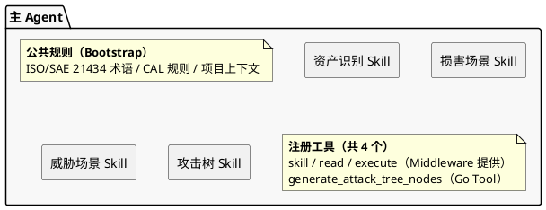
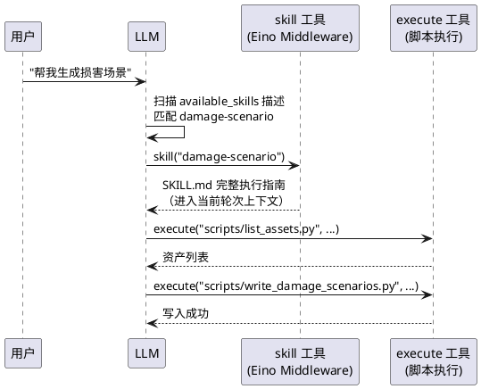
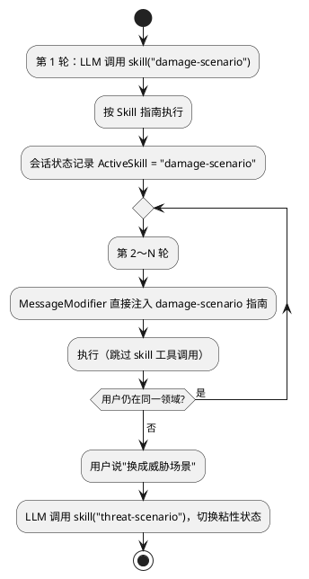
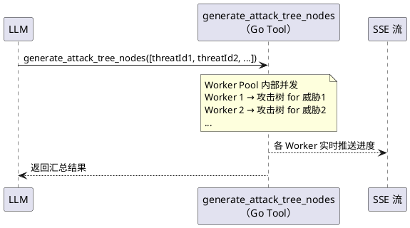

# 主 Agent + Skill 方案设计

---

## 1. 背景与目标

TARA 平台现有四个独立 AI 分析能力，分别由四个孤立的 Agent 承载：

| 能力 | 核心场景 |
| --- | --- |
| 资产识别 | 批量识别组件的 7 种安全属性（C/I/A/NR/Authz/Authn/F）及网络安全相关性 |
| 损害场景 | 生成损害场景、计算 CAL 等级（4×4 影响-攻击向量矩阵） |
| 威胁场景 | 生成威胁场景、UNECE R155 映射、威胁分析咨询 |
| 攻击树 | 为威胁场景批量生成攻击树节点，含五维可行性评估 |

这四个能力在产品层面是一套连贯的分析流程（资产 → 损害 → 威胁 → 攻击树），但用户必须在不同页面切换，对话上下文无法跨步骤传递，四套 Agent 结构重复且难以扩展。

**目标**：用一个主 Agent 统一承载全部能力，通过 Skill 机制按用户意图动态切换领域，实现跨领域的连续分析体验。

---

## 2. 架构概览

本方案借鉴 OpenClaw 的 Skill 系统：**专业能力差异完全由 Skill 承载，而不是由不同的 Agent 类型承载。**



| 维度 | 现有方案 | 主 Agent + Skill |
| --- | --- | --- |
| Agent 数量 | 4 个独立 Agent | 1 个主 Agent |
| 能力路由 | Handler 层按页面分发 | 主 Agent 根据意图自主选 Skill |
| 跨领域对话 | 不支持 | 同一会话内连续切换 |
| 新增能力 | 新建整套 Agent | 新增一个 SKILL.md 文件 |

与 OpenClaw 的关键迁移点：

| OpenClaw 技术点 | 在本项目中的作用 |
| --- | --- |
| SKILL.md 文件格式（YAML Frontmatter + Markdown 正文） | 四个能力各一份 SKILL.md，正文直接来自现有 Agent 的 System Prompt |
| 渐进式展示（Progressive Disclosure） | System Prompt 只注入 Skill 简短描述，按需加载全文，节省 token |
| 描述驱动选择（Use when / NOT for） | LLM 通过描述判断触发哪个 Skill，无需硬编码路由 |
| Bootstrap 公共规则 | 扩展为 ISO/SAE 21434 术语、CAL 规则、项目上下文等领域公共知识 |
| 领域脚本（scripts/ 目录） | DB CRUD 操作做成 Python 脚本，通过 `execute` 工具调用，无需注册业务 Tool |

---

## 3. Skill 设计

### 3.1 SKILL.md 文件结构

每个 Skill 对应一个 SKILL.md 文件：

- **YAML Frontmatter**：`name`（唯一标识）和 `description`（触发描述，含 Use when / NOT for）
- **Markdown 正文**：纯文本执行指南，包含角色定义、任务步骤、调用哪些脚本/工具、输出规范

正文内容直接来自现有各 Agent 的 System Prompt，无需重写。以损害场景为例：

```text
你是一位专业的汽车信息安全损害场景分析专家，精通 ISO/SAE 21434。

当用户请求生成损害场景时，按以下步骤执行：
1. 执行 scripts/list_assets.py 获取当前项目的资产列表
2. 针对每个资产，分析 C/I/A 三个维度上的损害可能性
3. 按严重(S)/重大(M)/可控(Mo)/可忽略(N) 四级评估影响等级
4. 执行 scripts/write_damage_scenarios.py 将结果写入数据库

输出格式：每个场景包含场景描述（[资产]的[属性]被[攻击]，导致[后果]）、影响维度、影响等级
```

### 3.2 四个 Skill 的触发描述

`description` 是 LLM 判断"用哪个 Skill"的唯一依据，必须明确正向触发和反向排除：

```text
asset-identification:
  识别系统组件的安全属性（C/I/A/NR/Authz/Authn/F）和网络安全相关性。
  Use when: 分析/识别资产安全属性、处理失败识别项、咨询资产安全问题。
  NOT for: 生成损害场景、威胁场景、攻击树。

damage-scenario:
  生成损害场景和 CAL 等级分析（ISO/SAE 21434）。
  Use when: 生成损害场景、分析影响等级（严重/重大/可控/可忽略）、计算 CAL 值。
  NOT for: 资产安全属性识别、威胁场景生成、攻击树生成。

threat-scenario:
  生成威胁场景，支持 UNECE R155 威胁分类映射，提供威胁分析咨询。
  Use when: 生成威胁场景、R155 映射、咨询威胁分析相关问题。
  NOT for: 资产识别、损害场景生成、攻击树生成。

attack-tree:
  为威胁场景生成攻击树节点，含五维可行性评估（ET/SE/KoI/WoO/Eq）。
  Use when: 生成攻击树、分析攻击路径和可行性等级。
  NOT for: 资产识别、损害场景、威胁场景生成。
```

---

## 4. 数据操作：脚本 vs Go Tool

Skill 只解决"LLM 知道怎么分析"的问题，实际的数据读写按复杂度分两种方式：

| | 形式 | 典型操作 |
| --- | --- | --- |
| **Skill 脚本** | Skill `scripts/` 目录下的 Python 脚本，通过 `execute` 工具调用 | list_assets、write_damage_scenarios 等 CRUD |
| **Go Tool** | 预注册到主 Agent 的 Go 函数 | `generate_attack_tree_nodes`（Worker Pool + SSE） |

绝大多数操作是 DB CRUD，做成 Python 脚本（从环境变量读取数据库连接信息直接执行），这与 OpenClaw 的模式完全一致。`generate_attack_tree_nodes` 需要 Go 的 goroutine 管理和 SSE 实时推送，是唯一必须作为 Go Tool 保留的操作。

这样**注册到主 Agent 的工具只有 4 个**（`skill`、`read`、`execute` 由 Middleware 提供，加上 `generate_attack_tree_nodes`），彻底消除了工具全量注册带来的 token 膨胀问题。

---

## 5. Skill 激活：渐进式展示（Eino Middleware）

LLM 的行为完全由当前轮次读到的文本决定——System Prompt、对话历史、工具调用返回值，都是输入。利用这一特性，Skill 完整内容不预先注入 System Prompt，而是在需要时通过工具调用动态加载。

**本项目直接使用 Eino ADK 的 Skill Middleware**，它已完整实现此机制：

- **自动注入 System Prompt**：所有 Skill 的 name + description 列表，以及如何使用 `skill` 工具的说明
- **`skill` 工具**：接收 Skill name，返回对应 SKILL.md 完整正文作为工具结果（进入当前轮次上下文，当轮即生效）
- **LocalBackend**：从本地文件系统读取 SKILL.md 文件



---

## 6. Skill 粘性（Skill-Sticky）（优化可选）

Eino Middleware 只实现单次激活。TARA 分析通常在某个领域内连续对话，每轮重新触发 skill 工具既浪费 token 也影响体验。因此在 Middleware 之上额外实现**会话粘性**：

- `skill` 工具被调用后，会话状态记录 `ActiveSkill`
- 后续轮次，服务端通过 Eino 的 **MessageModifier** 直接将该 Skill 的完整执行指南注入 System Prompt，跳过 skill 工具调用
- 用户明确切换领域时，LLM 再次调用 skill 工具更新粘性状态



Bootstrap 中始终保留一条提示，确保粘性模式下 LLM 仍会响应切换意图：

```text
如果用户的请求超出当前分析领域，调用 skill 工具切换。
可用领域：asset-identification / damage-scenario / threat-scenario / attack-tree
```

---

## 7. 上下文与记忆

**对话历史**：主 Agent 维护统一的对话历史，跨 Skill 共享（威胁场景 Skill 可直接引用上一步的损害场景结果）。按**滑动窗口**保留最近 N 轮，切换 Skill 时不重置窗口。

**长期记忆**：复用现有 Memory 系统（SmartMemory / ILongTermMemory），在主 Agent 层统一接入。每轮 Generate 前检索相关历史知识，工具执行成功后将关键结果摘要写入 Memory。Memory 在整个项目会话内跨 Skill 共享。

**会话隔离**：会话 ID 维度为 **项目（Project） × 用户（Account）**，无需按分析阶段隔离。

---

## 8. 攻击树并发执行

PRD 要求批量生成攻击树：多个威胁场景并行执行，单个失败不阻塞其他项。并发逻辑封装在 `generate_attack_tree_nodes` Tool 函数内部，对 LLM 完全透明：



攻击树 Skill 的执行指南只需告知 LLM："批量生成时调用 `generate_attack_tree_nodes`，传入全部威胁场景 ID，等待返回汇总结果。"

---

## 9. 开放问题

| 问题 | 说明 |
| --- | --- |
| 对话历史滑动窗口取多少轮 | 需在上下文连续性和 context window 预算之间取平衡 |
| consultant_agent 是否纳入 Skill | 现有咨询 Agent 是否合并为通用咨询 Skill |
| 攻击树并发任务的 SSE 进度设计 | 多任务并行时前端如何展示各任务的独立进度 |
| Skill-Sticky 的工具过滤 | 粘性模式下是否配合过滤工具列表（仅暴露当前 Skill 声明的工具子集）；需确认 Eino MessageModifier 是否支持动态修改工具列表 |
