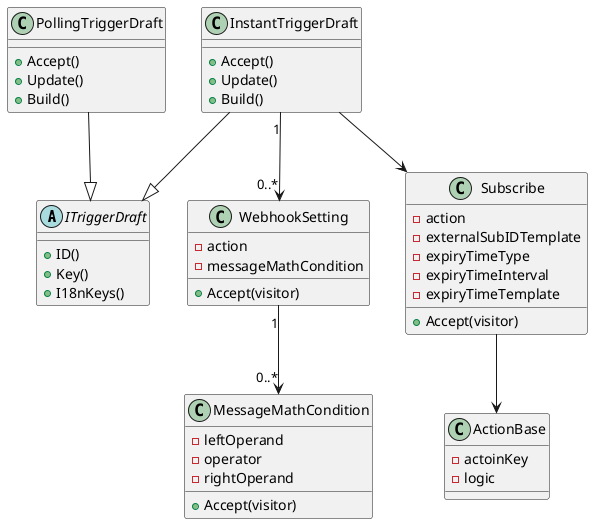

# 需求背景
ipaas 的 `Trigger` 已经完成并支持 Devkit 开发 G2 版本的`PollingTrigger` ，开始进行 G2 版本的 `InstantTrigger` 的开发。

我在其中主要负责 `InstantTrigger` 草稿态模块的开发以及制作 `dynamic webhook` 下的测试物料。
这里侧重讲解在 `InstantTriggerDraft` 模块开发时的代码规范优化。
# 重构设计
## 原始设计

```go
type TriggerDraft struct {
	id types.TriggerDraftID
	...
	extra TriggerDraftExtra
}

type TriggerDraftExtra struct {
	WebhookSettings []WebhookSetting
	Subscribe *SubscribeAtcion
	Unsubscribe *SubscribeAtcion
	Refresh *SubscribeAtcion
}
```

在原始设计中，`InstantTriggerDraft` 所包含的「关联 webhook」、「订阅」等能力被 `extra` 字段所承接。从设计原则上来讲，讲 `extra` 字段作为 `TriggerDraft` 的扩展值对象，是不包含 `Instant`的语义的。同时如果后续的扩展字段都放在 `extra` 字段中，明显违反 *开闭原则* 和 *单一职责原则* 。
在意识到这种设计方式存在的缺陷后，立即开始重新考虑其他更好的设计方案和并执行具体代码实现。
## 重构设计

概念模型：


领域模型代码实现：
```go
// trigger_draft.go

type ITriggerDraft interface {  
    ID() types.TriggerDraftID   
    Key() TriggerKey  
    ... 
}  

type TriggerDraft struct {  
    id                 types.TriggerDraftID  
    ... 
}

func (d *TriggerDraft) ID() types.TriggerDraftID {  
    return d.id  
}

func (d *TriggerDraft) Key() TriggerKey {  
    return d.key  
}
```

```go
// trigger_draft_instant.go

type InstantTriggerDraft struct {  
    *TriggerDraft  
    webhookSettings []WebhookSetting  
    subscribe_      *SubscribeAction  
    unsubscribe     *SubscribeAction  
    refresh         *SubscribeAction  
}
```

```go
// trigger_draft_polling

type PollingTriggerDraft struct {
	*TriggerDraft 
}
```

这里将 `TriggerDraft` 作为抽象类，并对外暴露必要的行为和唯一标识，同时取消 `extra` 字段。
`PollingTrigger` 和 `InstantTrigger` 继承 `TriggerDraft` 的所有属性和方法，同时也实现了 `ITriggerDraft` 抽象接口。