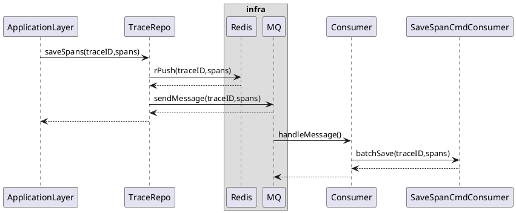

# 背景需求

Action 调用的 QPS 较高，目前链路中上报的观测数据暂时存储在 Redis 中，这里需要考虑观测数据持久化到数据库的方案。

# 解决方案

引入消息队列承接流量，并按可控速率消费，达到流量削峰的效果。具体来说，当正确拿到观测数据后，将其 push 到 MQ 中，消费者按照可控速率进行消费，来存储到 DB 中。

1. ## 存储数据功能

### 简单代码实现

接口层：

```Go
// 消费者配置
const (
    saveTraceSpanToDbConsumerGroup = "save_trace_span_to_db"
    saveTraceSpanCommandTopic = "save_trace_span_command"
)

type TraceSpanCommandConsumer struct { 
    app application.TraceSpanCommandConsumerApp
}

// 实现 consumer 接口
func (t *TraceSpanEventConsumer) HandleMessage() error {
    // 数据转换
    
    // 交给 app 层处理
    t.app.StorageSpan()
}
```

RateLimitQPS 可以在控制台中进行动态配置，方法如下：


基础设施层：

`SaveSpan()` 实现

```Go
func (r *SpanRepo) SaveSpan(span domain.Span) {
    producer := NewProducer()
    
    spanMessage := NewSpanMessage()
    
    p.SendMessage(spanMessage)
}
```

`MustAdd()` 实现

```Go
func (r *SpanMessageRepo) MustAdd(spanMessage SpanMessage) {
    doSpan := NewDoSpan()
    
    r.db.Save(doSpan)
}
```

2. ## 查询数据功能

查询数据的实现将直接在 infra 层进行实现，流程为先查缓存，若未命中缓存，则查数据库。

### 简单代码实现

基础设施层：

`FindByTraceID()` 实现

```Go
func (r *SpanRepo) FindByTraceID(traceID domain.TraceID) []domain.Span {
    // 查询 redis
    spans := r.redisCli.Get()
    
    if len(spans) != 0 {
        return nil
    }
    
    // 查 db
    var spans []do.Span
    r.db.Where("trace_id = ?", traceID.Int64()).Find(&spans)
    
    // 转换为领域对象并返回
    
    return domainSpans
}
```

## 流程走查

存储数据：



说明：

1. **Consumer** :消费 MQ 中的消息为异步操作
    
2. **batchSave()**：将 spans 存储到 db
    

# 存储模型

db：anycross_log

```SQL
CREATE TABLE `connectivity_trace` (
  `id` bigint unsigned NOT NULL COMMENT '唯一标识',
  `trace_id` varchar(64) NOT NULL COMMENT 'trace_id'
  `kind` varchar(16)  NOT NULL COMMENT '类型'
  `body` longtext NOT NULL COMMENT '数据体(加密)'
  `created_at` timestamp NOT NULL DEFAULT CURRENT_TIMESTAMP COMMENT '创建时间',
  PRIMARY KEY (`id`),
  KEY `idx_trace_id` (`trace_id`),
  KEY `idx_created_at` (`created_at`),
) ENGINE=InnoDB DEFAULT CHARSET=utf8mb4 COMMENT='连接器执行链路信息';
```