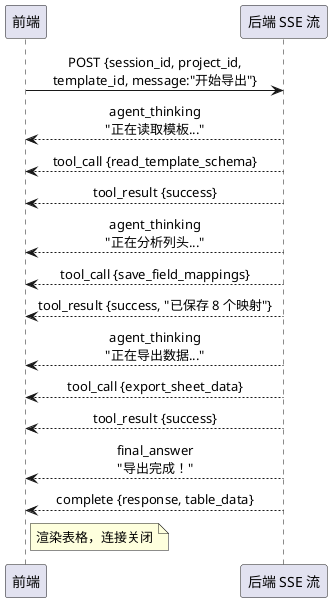
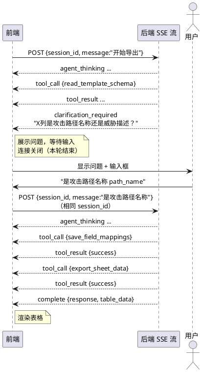

## 一、概览

报告导出 Agent 采用 **SSE（Server-Sent Events）** 流式协议。前端发送一次 HTTP POST 请求后，接收一个持续的事件流，直到收到 `complete` 或 `error` 事件。

**多轮对话（澄清场景）**：收到 `clarification_required` 事件后，前端展示问题并等待用户输入，再次发送 POST 请求（携带相同 `session_id`）即可继续。

---

## 二、HTTP 接口

### 发起对话 / 继续对话

```
POST /api/v1/agent/report-export/stream
Content-Type: application/json
Accept: text/event-stream
Cache-Control: no-cache
```

#### 请求体

```json
{
  "session_id": "string",  // 会话 ID，同一轮导出任务全程使用同一个值
  "project_id": 123,       // TARA 项目 ID（整数）
  "template_id": 456,      // Excel 模板 ID（整数）
  "message": "string"      // 用户消息，首轮可为"请开始导出"，澄清轮为用户回复内容
}
```

| 字段 | 类型 | 必填 | 说明 |
| --- | --- | --- | --- |
| `session_id` | string | 是 | 前端生成的 UUID，标识一次完整的导出会话 |
| `project_id` | int | 是 | TARA 项目 ID |
| `template_id` | int | 是 | 用户上传的 Excel 模板 ID |
| `message` | string | 是 | 首轮传"开始导出"或具体指令，澄清轮传用户回复 |

#### 响应

- **Content-Type**：`text/event-stream`
- **Transfer-Encoding**：`chunked`
- 每条 SSE 事件格式如下：

```
data: <JSON 字符串>\n\n
```

---

## 三、SSE 事件类型

### 通用事件结构

所有事件都是如下结构的 JSON：

```json
{
  "type": "事件类型",
  "session_id": "会话 ID",
  "timestamp": "2026-03-05T10:00:00Z",
  "data": {}
}
```

---

### 3.1 `agent_thinking` — Agent 正在思考

Agent 推理中，前端可展示加载状态。

```json
{
  "type": "agent_thinking",
  "session_id": "abc-123",
  "timestamp": "2026-03-05T10:00:01Z",
  "data": {
    "message": "正在读取模板结构..."
  }
}
```

| 字段 | 类型 | 说明 |
| --- | --- | --- |
| `data.message` | string | 思考过程描述（可选展示给用户） |

---

### 3.2 `tool_call` — Agent 调用工具

Agent 即将调用某个工具，前端可展示"执行中"状态。

```json
{
  "type": "tool_call",
  "session_id": "abc-123",
  "timestamp": "2026-03-05T10:00:02Z",
  "data": {
    "tool_name": "export_sheet_data",
    "display_name": "导出 Sheet 数据",
    "parameters": {
      "project_id": 123,
      "sheet_name": "威胁场景",
      "batch_size": 50,
      "offset": 0
    }
  }
}
```

| 字段 | 类型 | 说明 |
| --- | --- | --- |
| `data.tool_name` | string | 工具内部名称 |
| `data.display_name` | string | 展示给用户的工具名称 |
| `data.parameters` | object | 工具调用参数（可选展示） |

**工具名称对照表：**

| `tool_name` | `display_name` |
| --- | --- |
| `read_template_schema` | 读取模板结构 |
| `save_field_mappings` | 保存字段映射 |
| `get_field_mappings` | 查询字段映射 |
| `export_sheet_data` | 导出 Sheet 数据 |

---

### 3.3 `tool_result` — 工具执行完成

工具执行结束，前端可更新执行状态。

```json
{
  "type": "tool_result",
  "session_id": "abc-123",
  "timestamp": "2026-03-05T10:00:03Z",
  "data": {
    "tool_name": "save_field_mappings",
    "status": "success",
    "summary": "已保存 8 个字段映射"
  }
}
```

| 字段 | 类型 | 说明 |
| --- | --- | --- |
| `data.tool_name` | string | 工具名称 |
| `data.status` | string | `success` / `failed` |
| `data.summary` | string | 结果摘要（可展示给用户） |

---

### 3.4 `clarification_required` — 需要用户澄清

**前端必须处理此事件**：展示问题，等待用户输入，再次发送 POST 请求。

```json
{
  "type": "clarification_required",
  "session_id": "abc-123",
  "timestamp": "2026-03-05T10:00:04Z",
  "data": {
    "message": "模板中的"X 列"含义不明确，请问它对应的是攻击路径名称（path_name）还是威胁描述（threat）？"
  }
}
```

| 字段 | 类型 | 说明 |
| --- | --- | --- |
| `data.message` | string | 向用户展示的问题文本 |

**前端处理流程：**

```
收到 clarification_required
  → 停止 loading 状态
  → 在对话框展示 message
  → 显示输入框，等待用户输入
  → 用户提交后，以相同 session_id 再次 POST
  → 新的 SSE 流继续
```

---

### 3.5 `final_answer` — Agent 最终文字回复

Agent 本轮的文字输出（不含表格数据）。

```json
{
  "type": "final_answer",
  "session_id": "abc-123",
  "timestamp": "2026-03-05T10:00:10Z",
  "data": {
    "content": "我已完成字段映射，即将开始导出数据..."
  }
}
```

---

### 3.6 `complete` — 任务完成

**最重要的事件**，标志本轮对话结束。携带表格数据。

```json
{
  "type": "complete",
  "session_id": "abc-123",
  "timestamp": "2026-03-05T10:00:15Z",
  "data": {
    "response": "导出完成！共生成 47 行数据，6 个字段。",
    "table_data": {
      "sheetName": "威胁场景",
      "data": [
        ["组件名称", "损害场景", "威胁场景", "风险值", "攻击路径", "攻击可行性"],
        ["ECU_GW", "制动失效", "非授权控制制动系统", 5, "CAN 总线注入", "高"],
        ["ECU_GW", "制动失效", "固件篡改", 4, "OBD 接口访问", "中"]
      ],
      "batchInfo": {
        "currentBatch": 1,
        "batchSize": 50,
        "offset": 0,
        "hasMore": false,
        "totalRecords": 47
      },
      "rowCount": 47,
      "columnCount": 6
    },
    "statistics": {
      "rowsGenerated": 47,
      "fieldsProcessed": 6,
      "sheetsProcessed": 1
    }
  }
}
```

| 字段 | 类型 | 必有 | 说明 |
| --- | --- | --- | --- |
| `data.response` | string | 是 | Agent 对本轮任务的文字总结 |
| `data.table_data` | object | 否 | 表格数据，仅在成功导出后存在 |
| `data.table_data.sheetName` | string | — | Sheet 名称 |
| `data.table_data.data` | `string[][]` | — | 2D 数组，第一行为表头 |
| `data.table_data.batchInfo.hasMore` | bool | — | `true` 表示还有更多数据，需继续请求 |
| `data.table_data.batchInfo.totalRecords` | int | — | 总记录数（不含表头行） |
| `data.statistics` | object | 否 | 执行统计，可用于展示摘要 |

> **关于 `hasMore: true`**：通常由 Agent 自动处理分批，前端不需要关心。Agent 会在内部继续调用 `export_sheet_data`（递增 offset）直到 `hasMore: false`，前端只会收到最终的 `complete` 事件。

---

### 3.7 `error` — 错误

```json
{
  "type": "error",
  "session_id": "abc-123",
  "timestamp": "2026-03-05T10:00:05Z",
  "data": {
    "message": "获取模板结构失败：模板 ID 456 不存在",
    "code": "TEMPLATE_NOT_FOUND"
  }
}
```

| 字段 | 类型 | 说明 |
| --- | --- | --- |
| `data.message` | string | 错误描述，可展示给用户 |
| `data.code` | string | 错误码（见下表） |

**错误码：**

| code | 说明 |
| --- | --- |
| `TEMPLATE_NOT_FOUND` | 模板 ID 不存在 |
| `PROJECT_NOT_FOUND` | 项目 ID 不存在 |
| `MAPPING_SAVE_FAILED` | 字段映射保存失败 |
| `EXPORT_FAILED` | 数据导出失败 |
| `AGENT_TIMEOUT` | Agent 超时（超过 MaxStep） |
| `INTERNAL_ERROR` | 服务内部错误 |

---

## 四、完整交互流程

### 场景 A：语义清晰，一次完成



### 场景 B：含模糊列头，需用户澄清



---

## 五、前端实现要点

### 5.1 SSE 连接管理

```javascript
// 推荐使用 fetch + ReadableStream 实现 SSE（兼容性更好）
const response = await fetch('/api/v1/agent/report-export/stream', {
  method: 'POST',
  headers: {
    'Content-Type': 'application/json',
    'Accept': 'text/event-stream',
  },
  body: JSON.stringify({ session_id, project_id, template_id, message }),
})

const reader = response.body.getReader()
const decoder = new TextDecoder()

while (true) {
  const { done, value } = await reader.read()
  if (done) break

  const text = decoder.decode(value)
  // 解析 "data: {...}\n\n" 格式
  const lines = text.split('\n').filter(l => l.startsWith('data: '))
  for (const line of lines) {
    const event = JSON.parse(line.slice(6))
    handleEvent(event)
  }
}
```

### 5.2 事件处理逻辑

```javascript
function handleEvent(event) {
  switch (event.type) {
    case 'agent_thinking':
      showThinking(event.data.message)
      break

    case 'tool_call':
      showToolExecuting(event.data.display_name)
      break

    case 'tool_result':
      updateToolStatus(event.data.tool_name, event.data.status)
      break

    case 'clarification_required':
      // 关键：停止 loading，展示问题，等待用户输入
      stopLoading()
      showQuestion(event.data.message)
      enableUserInput()
      break

    case 'final_answer':
      showAgentMessage(event.data.content)
      break

    case 'complete':
      stopLoading()
      showAgentMessage(event.data.response)
      if (event.data.table_data) {
        renderTable(event.data.table_data)
      }
      break

    case 'error':
      stopLoading()
      showError(event.data.message)
      break
  }
}
```

### 5.3 `session_id` 管理

- 首次进入导出页面时生成一个 UUID，整个导出会话复用
- 用户主动"重新开始"时生成新的 UUID
- 同一 `session_id` 可跨多次 POST 请求

### 5.4 `table_data.data` 渲染

`data` 是一个二维字符串数组，第一行为表头：

```javascript
function renderTable(tableData) {
  const [headers, ...rows] = tableData.data
  // headers: ["组件名称", "损害场景", "威胁场景", ...]
  // rows:    [["ECU_GW", "制动失效", "非授权控制..."], ...]
}
```

---

## 六、注意事项

| 事项 | 说明 |
| --- | --- |
| 超时处理 | SSE 连接建议设置 5 分钟超时，Agent 正常运行在 30 步以内 |
| 断线重连 | `clarification_required` 后用户长时间不回复，连接会关闭；前端无需重连，等用户输入后直接发新请求 |
| 错误重试 | `error` 事件后，建议提示用户后由用户手动触发重试，不自动重连 |
| 事件顺序 | `complete` 一定是本轮最后一个事件，收到后可关闭连接 |
| 并发请求 | 同一 `session_id` 不要并发发送多个请求，上一轮完成（`complete` 或 `clarification_required`）后再发下一轮 |
