# 报告导出 Agent Go 侧重构 — MVP 排期

> [!info] 文档信息
> - **状态**：草案
> - **日期**：2026-03-06
> - **关联**：[[报告导出 MVP 实现文档]]

---

## 整体节奏

```plantuml
@startgantt
printscale daily
Project starts 2026-03-06
saturday are closed
sunday are closed

[Phase 1: Agent 骨架] lasts 1 day
[Phase 1: Agent 骨架] is colored in #AED6F1

[Phase 2: 工具层] lasts 2 days
[Phase 2: 工具层] starts at [Phase 1: Agent 骨架]'s end
[Phase 2: 工具层] is colored in #A9DFBF

[Phase 3: 集成] lasts 2 days
[Phase 3: 集成] starts at [Phase 2: 工具层]'s end
[Phase 3: 集成] is colored in #FAD7A0

[MVP 可 E2E 测试] happens at [Phase 3: 集成]'s end

@endgantt
```

> [!abstract] 总体工期
> **MVP 可端到端测试：约 1 周**（Phase 1 + 2 + 3 串行，共 5 个工作日）

> [!warning] 主要风险
> Phase 2 中 `export_sheet_data` Skill 逻辑最复杂，是主要不确定因素；如评审发现额外边界 case，Phase 2 可能延伸 1～2 天，Phase 3 相应顺延。

---

## Phase 1：Agent 骨架（~1 天）

**交付物**：Agent 主体可编译，接口契约确定，后续各方可并行开发

| 内容 | 预估 |
| --- | --- |
| 领域类型 & Repository 接口定义（各方契约） | 0.25 天 |
| Agent 主体骨架（构造函数、入参校验） | 0.25 天 |
| 系统提示词初稿 + `Generate` / `Stream` 方法签名 | 0.25 天 |
| 构造函数参数校验单测 | 0.25 天 |

> [!tip] 并行触发点
> Repository 接口定义完成（约 Day 1 上午）后，Phase 2 即可提前启动。

---

## Phase 2：工具层（~2 天，与 Phase 1 尾段并行）

**交付物**：4 个工具实现完毕、单测通过，可独立验证

| 内容 | 预估 | 说明 |
| --- | --- | --- |
| `read_template_schema` | 0.25 天 | 简单，单一 API 调用 |
| `save_field_mappings` | 0.25 天 | 简单，单一 API 调用 |
| `get_field_mappings` | 0.25 天 | 简单，单一 API 调用 |
| 字段别名表 + 枚举翻译表（从 Python 侧移植） | 0.25 天 | 逐一对照 Python 代码移植 |
| `export_sheet_data` Skill 核心逻辑 | 0.75 天 | 路由判断 + 多层嵌套展开 + 2D 转换 |
| `export_sheet_data` 完整单测 | 0.25 天 | 覆盖 4 条路由 + 空值边界 |

> [!danger] 风险项
> `export_sheet_data` 的威胁场景路由涉及 3 层嵌套展开 + 空值占位，逻辑最复杂，可能对其单独一天进行开发。

---

## Phase 3：集成（~2 天）

**交付物**：端到端跑通，前端可通过 SSE 接收到表格数据 → **MVP 可 E2E 测试**

| 内容                              | 预估     | 说明         |
| ------------------------------- | ------ | ---------- |
| 工具注册 + SSE 流式输出（复用现有基础设施）       | 0.25 天 |            |
| Repository 真实实现（对接 7 个 Go 后端接口） | 0.5 天  | 可与上一条并行    |
| HTTP Handler 新增路由               | 0.25 天 |            |
| 前后端联调（3 个场景验证）                  | 1 天    |            |

---
