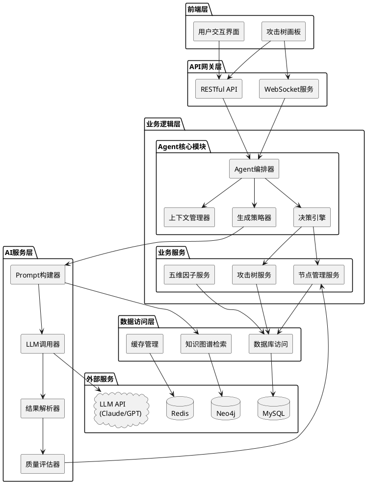
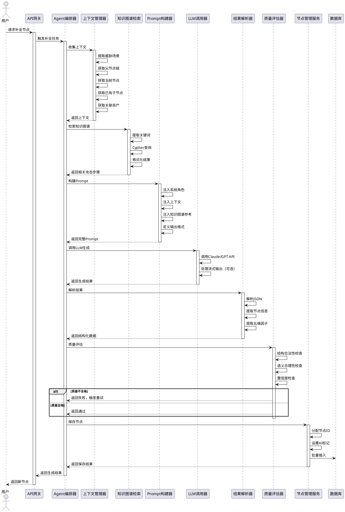
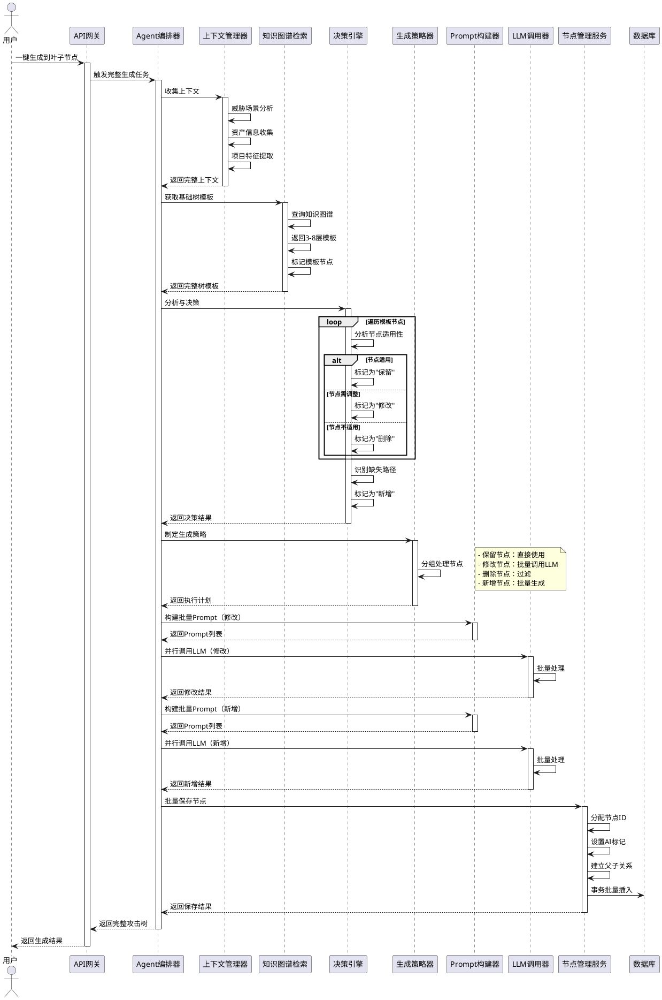
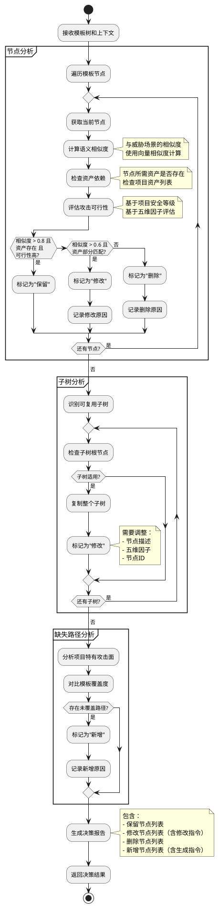
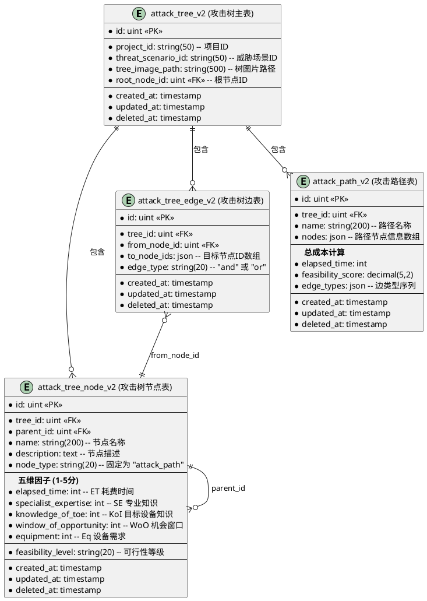
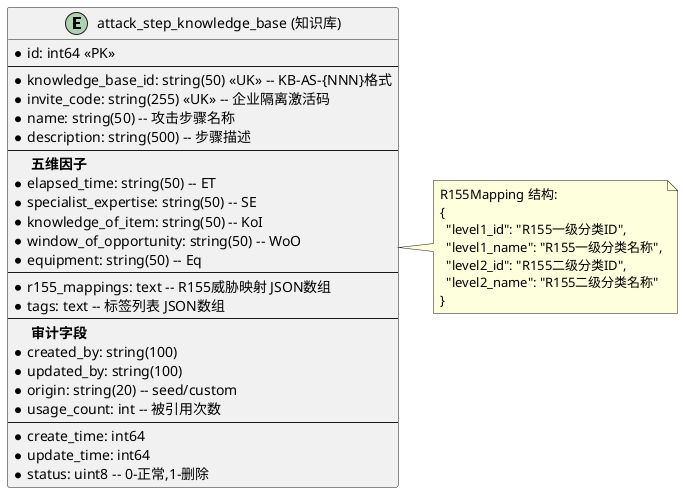
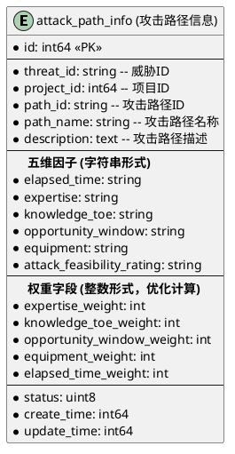
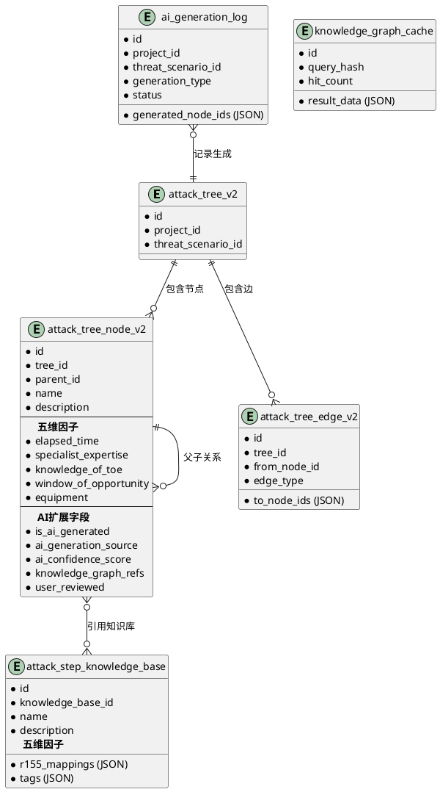
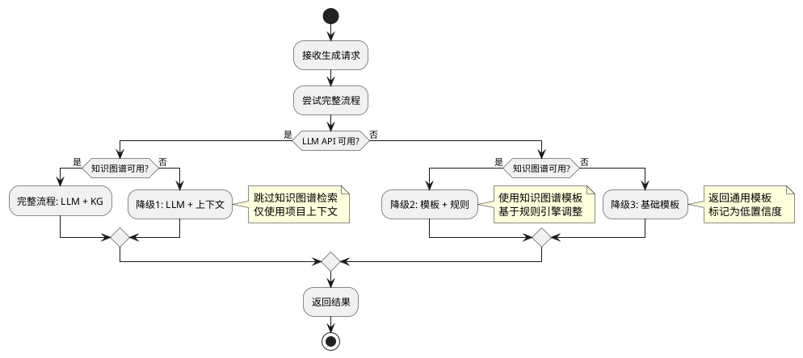
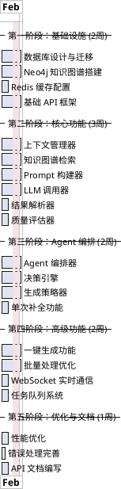

# 攻击树 Agent 后端技术设计方案

## 1. 系统架构设计

### 1.1 整体架构图



### 1.2 架构说明

#### 1.2.1 分层职责

- **前端层**：用户交互界面，攻击树可视化画板
- **API网关层**：提供RESTful API和WebSocket实时通信
- **业务逻辑层**：核心业务逻辑，包括Agent编排和业务服务
- **AI服务层**：LLM调用、Prompt工程、结果处理
- **数据访问层**：统一的数据访问接口
- **外部服务**：MySQL、Neo4j、LLM API、Redis

#### 1.2.2 核心模块说明

**Agent核心模块**：
- **Agent编排器**：协调整个生成流程，管理任务状态
- **上下文管理器**：收集和管理生成所需的上下文信息
- **决策引擎**：基于模板和上下文做出保留/修改/删除/新增决策
- **生成策略器**：制定生成策略（单次补全/一键生成）

**AI服务层**：
- **Prompt构建器**：构建结构化的Prompt
- **LLM调用器**：封装LLM API调用，支持重试和流式输出
- **结果解析器**：解析LLM返回的JSON结果
- **质量评估器**：评估生成结果的质量和置信度


## 2. 核心流程设计

### 2.1 单次补全流程



### 2.2 一键生成完整攻击树流程




### 2.3 决策引擎流程




## 3. 数据模型设计

### 3.1 现有数据库表结构

基于现有的 Go 模型定义，系统使用以下核心表：

#### 3.1.1 攻击树表 (attack_tree_v2)



#### 3.1.2 攻击步骤知识库表 (attack_step_knowledge_base)



#### 3.1.3 攻击路径信息表 (attack_path_info)



### 3.2 AI生成相关扩展字段设计

为支持 AI Agent 功能，需要在现有表基础上扩展以下字段：

#### 3.2.1 attack_tree_node_v2 表扩展

```sql
-- 在 attack_tree_node_v2 表中新增字段
ALTER TABLE attack_tree_node_v2 ADD COLUMN is_ai_generated BOOLEAN DEFAULT FALSE COMMENT '是否由AI生成';
ALTER TABLE attack_tree_node_v2 ADD COLUMN ai_generation_source VARCHAR(50) DEFAULT '' COMMENT '生成来源: canvas_completion/full_generation/agent_chat';
ALTER TABLE attack_tree_node_v2 ADD COLUMN ai_confidence_score DECIMAL(3,2) DEFAULT 0.00 COMMENT 'AI生成置信度(0-1)';
ALTER TABLE attack_tree_node_v2 ADD COLUMN knowledge_graph_refs JSON COMMENT '引用的知识图谱节点ID列表';
ALTER TABLE attack_tree_node_v2 ADD COLUMN user_reviewed BOOLEAN DEFAULT FALSE COMMENT '用户是否已审查';
ALTER TABLE attack_tree_node_v2 ADD COLUMN generation_timestamp TIMESTAMP NULL COMMENT '生成时间';
```

#### 3.2.2 AI生成日志表 (新增)

```sql
CREATE TABLE ai_generation_log (
  id BIGINT PRIMARY KEY AUTO_INCREMENT,
  project_id VARCHAR(50) NOT NULL,
  threat_scenario_id VARCHAR(50) NOT NULL,
  generation_type VARCHAR(20) NOT NULL COMMENT 'single/full',
  trigger_node_id INT UNSIGNED COMMENT '触发节点ID',
  generated_node_ids JSON COMMENT '生成的节点ID列表',
  prompt_hash VARCHAR(64) COMMENT 'Prompt哈希',
  llm_model VARCHAR(50) COMMENT '使用的模型',
  llm_tokens INT COMMENT '消耗的token数',
  generation_duration INT COMMENT '生成耗时(ms)',
  status VARCHAR(20) NOT NULL COMMENT 'pending/success/failed',
  error_message TEXT,
  created_at TIMESTAMP DEFAULT CURRENT_TIMESTAMP,
  INDEX idx_project_threat (project_id, threat_scenario_id),
  INDEX idx_status (status)
) COMMENT 'AI生成日志表';
```

#### 3.2.3 知识图谱缓存表 (新增)

```sql
CREATE TABLE knowledge_graph_cache (
  id BIGINT PRIMARY KEY AUTO_INCREMENT,
  query_hash VARCHAR(64) UNIQUE NOT NULL COMMENT '查询哈希',
  query_keywords VARCHAR(255) COMMENT '查询关键词',
  result_data JSON COMMENT '查询结果数据',
  hit_count INT DEFAULT 0 COMMENT '命中次数',
  last_hit_at TIMESTAMP NULL COMMENT '最后命中时间',
  created_at TIMESTAMP DEFAULT CURRENT_TIMESTAMP,
  expires_at TIMESTAMP NULL COMMENT '过期时间',
  INDEX idx_query_hash (query_hash),
  INDEX idx_expires_at (expires_at)
) COMMENT '知识图谱查询缓存表';
```

### 3.3 Go 模型扩展定义

```go
// AttackTreeNodeV2 扩展 - AI生成相关字段
type AttackTreeNodeV2Extended struct {
    AttackTreeNodeV2
    
    // AI生成相关字段
    IsAIGenerated       bool    `gorm:"default:false" json:"is_ai_generated"`
    AIGenerationSource  string  `gorm:"size:50" json:"ai_generation_source"`
    AIConfidenceScore   float64 `gorm:"type:decimal(3,2)" json:"ai_confidence_score"`
    KnowledgeGraphRefs  string  `gorm:"type:json" json:"knowledge_graph_refs"`
    UserReviewed        bool    `gorm:"default:false" json:"user_reviewed"`
    GenerationTimestamp *time.Time `json:"generation_timestamp"`
}

// AIGenerationLog AI生成日志
type AIGenerationLog struct {
    ID                 uint      `gorm:"primarykey" json:"id"`
    ProjectID          string    `gorm:"size:50;not null" json:"project_id"`
    ThreatScenarioID   string    `gorm:"size:50;not null" json:"threat_scenario_id"`
    GenerationType     string    `gorm:"size:20;not null" json:"generation_type"`
    TriggerNodeID      *uint     `json:"trigger_node_id"`
    GeneratedNodeIDs   string    `gorm:"type:json" json:"generated_node_ids"`
    PromptHash         string    `gorm:"size:64" json:"prompt_hash"`
    LLMModel           string    `gorm:"size:50" json:"llm_model"`
    LLMTokens          int       `json:"llm_tokens"`
    GenerationDuration int       `json:"generation_duration"`
    Status             string    `gorm:"size:20;not null" json:"status"`
    ErrorMessage       string    `gorm:"type:text" json:"error_message"`
    CreatedAt          time.Time `json:"created_at"`
}

func (AIGenerationLog) TableName() string {
    return "ai_generation_log"
}

// KnowledgeGraphCache 知识图谱缓存
type KnowledgeGraphCache struct {
    ID            uint       `gorm:"primarykey" json:"id"`
    QueryHash     string     `gorm:"size:64;uniqueIndex;not null" json:"query_hash"`
    QueryKeywords string     `gorm:"size:255" json:"query_keywords"`
    ResultData    string     `gorm:"type:json" json:"result_data"`
    HitCount      int        `gorm:"default:0" json:"hit_count"`
    LastHitAt     *time.Time `json:"last_hit_at"`
    CreatedAt     time.Time  `json:"created_at"`
    ExpiresAt     *time.Time `json:"expires_at"`
}

func (KnowledgeGraphCache) TableName() string {
    return "knowledge_graph_cache"
}
```

### 3.4 数据模型关系图




## 4. API 设计

### 4.1 RESTful API

#### 4.1.1 单次补全节点

```http
POST /api/v1/attack-tree/nodes/complete
Content-Type: application/json

Request:
{
  "project_id": "proj_123",
  "threat_scenario_id": "threat_456",
  "current_node_id": 10,
  "generation_count": 5,
  "include_factors": true
}

Response:
{
  "code": 0,
  "message": "success",
  "data": {
    "generation_id": "gen_123456",
    "nodes": [
      {
        "id": 20,
        "tree_id": 1,
        "parent_id": 10,
        "name": "物理接入T-Box",
        "description": "通过物理接触获取T-Box访问权限",
        "node_type": "attack_path",
        "elapsed_time": 3,
        "specialist_expertise": 4,
        "knowledge_of_toe": 3,
        "window_of_opportunity": 2,
        "equipment": 3,
        "feasibility_level": "中",
        "is_ai_generated": true,
        "ai_generation_source": "canvas_completion",
        "ai_confidence_score": 0.85,
        "knowledge_graph_refs": "[\"KB-AS-001\", \"KB-AS-002\"]"
      }
    ],
    "metadata": {
      "total_generated": 5,
      "avg_confidence": 0.82,
      "generation_duration_ms": 2500
    }
  }
}
```

#### 4.1.2 一键生成完整攻击树

```http
POST /api/v1/attack-tree/generate-full
Content-Type: application/json

Request:
{
  "project_id": "proj_123",
  "threat_scenario_id": "threat_456",
  "generation_mode": "standard",
  "max_depth": 8
}

Response:
{
  "code": 0,
  "message": "success",
  "data": {
    "generation_id": "gen_789012",
    "task_id": "task_345678",
    "status": "processing",
    "estimated_nodes": 50
  }
}
```

#### 4.1.3 查询生成任务状态

```http
GET /api/v1/attack-tree/generation/{task_id}

Response:
{
  "code": 0,
  "message": "success",
  "data": {
    "task_id": "task_345678",
    "status": "success",
    "progress": 100,
    "nodes": [...],
    "metadata": {
      "total_generated": 48,
      "kept_from_template": 20,
      "modified_from_template": 15,
      "newly_created": 13,
      "avg_confidence": 0.83,
      "generation_duration_ms": 8500
    }
  }
}
```

### 4.2 WebSocket 实时通信

```typescript
// 客户端订阅生成任务
ws.send({
  type: 'subscribe',
  task_id: 'task_345678'
});

// 服务端推送进度更新
{
  type: 'progress',
  task_id: 'task_345678',
  progress: 45,
  current_step: '正在生成新增节点...',
  nodes_generated: 22
}

// 服务端推送完成通知
{
  type: 'completed',
  task_id: 'task_345678',
  nodes: [...],
  metadata: {...}
}
```


## 5. 核心模块设计

### 5.1 Agent 编排器

**职责**：
- 协调整个生成流程
- 管理任务状态和进度
- 处理单次补全和一键生成两种模式
- 支持异步任务执行

**核心方法**：
- `CompleteNode()`: 单次补全节点
- `GenerateFullTree()`: 一键生成完整攻击树
- `ExecuteFullGeneration()`: 执行完整生成流程（异步）
- `BatchModifyNodes()`: 批量修改节点
- `BatchCreateNodes()`: 批量创建新节点

**流程控制**：
1. 收集上下文信息
2. 检索知识图谱
3. 决策引擎分析
4. 制定生成策略
5. 批量处理节点（保留/修改/新增）
6. 保存到数据库
7. 推送进度和结果

### 5.2 上下文管理器

**职责**：
- 收集生成所需的完整上下文
- 提取威胁场景信息
- 获取父节点链和已有子节点
- 收集项目资产信息
- 提取关键词用于知识图谱检索

**核心方法**：
- `CollectContext()`: 收集完整上下文
- `GetThreatScenario()`: 获取威胁场景
- `GetParentChain()`: 获取父节点链
- `GetExistingChildren()`: 获取已有子节点
- `GetProjectAssets()`: 获取项目资产
- `ExtractKeywords()`: 提取关键词

**上下文数据结构**：
```
GenerationContext {
  threatScenario: {
    id, name, description, keywords
  },
  parentChain: NodeInfo[],
  currentNode: NodeInfo,
  existingChildren: NodeInfo[],
  projectAssets: AssetInfo[],
  projectHistory: HistoricalTree[]
}
```

### 5.3 知识图谱检索器

**职责**：
- 从 Neo4j 检索相关攻击步骤
- 获取完整攻击树模板
- 缓存查询结果
- 格式化返回数据

**核心方法**：
- `Retrieve()`: 检索相关攻击步骤
- `RetrieveFullTemplate()`: 检索完整攻击树模板
- `BuildCypherQuery()`: 构建 Cypher 查询
- `FormatResult()`: 格式化查询结果

**Cypher 查询示例**：
```cypher
-- 检索相关攻击步骤
MATCH (ts:ThreatScenario)-[:caused_by*1..8]->(step:AttackStep)
WHERE ANY(keyword IN $keywords WHERE 
  ts.name CONTAINS keyword OR 
  ts.description CONTAINS keyword OR
  step.name CONTAINS keyword
)
RETURN step.id, step.name, step.description, step.confidence
ORDER BY step.confidence DESC
LIMIT 50

-- 检索完整攻击树模板
MATCH path = (ts:ThreatScenario)-[:caused_by*1..8]->(step:AttackStep)
WHERE ANY(keyword IN $keywords WHERE 
  ts.name CONTAINS keyword OR 
  ts.description CONTAINS keyword
)
WITH ts, collect(path) as paths
UNWIND paths as path
WITH ts, nodes(path) as pathNodes, relationships(path) as pathRels
RETURN ts, pathNodes, pathRels
ORDER BY length(pathNodes) DESC
LIMIT 1
```

**缓存策略**：
- 使用查询参数的 MD5 哈希作为缓存键
- 缓存时间：1小时
- 多层缓存：内存缓存 + Redis 缓存

### 5.4 决策引擎

**职责**：
- 分析模板树节点的适用性
- 做出保留/修改/删除/新增决策
- 识别项目特有的攻击路径
- 生成决策报告

**核心方法**：
- `Analyze()`: 分析模板树并做出决策
- `AnalyzeNode()`: 分析单个节点
- `CalculateSemanticSimilarity()`: 计算语义相似度
- `CheckAssetDependency()`: 检查资产依赖
- `EvaluateFeasibility()`: 评估攻击可行性
- `IdentifyMissingPaths()`: 识别缺失路径

**决策逻辑**：

1. **保留节点判断**：
   - 语义相似度 > 0.8
   - 资产完全匹配
   - 攻击可行性高

2. **修改节点判断**：
   - 语义相似度 > 0.6
   - 资产部分匹配
   - 需要调整描述或五维因子

3. **删除节点判断**：
   - 语义相似度 < 0.6
   - 资产不匹配
   - 不适用于当前项目

4. **新增节点判断**：
   - 项目特有资产未覆盖
   - 模板中缺失的攻击路径
   - 基于项目特征的定制化路径

**决策结果结构**：
```
DecisionResult {
  keepNodes: TemplateNode[],
  modifyNodes: ModifyInstruction[],
  deleteNodes: TemplateNode[],
  createNodes: CreateInstruction[],
  summary: {
    total, kept, modified, deleted, created
  }
}
```

### 5.5 Prompt 构建器

**职责**：
- 构建结构化的 Prompt
- 注入上下文信息
- 注入知识图谱参考
- 定义输出格式约束

**核心方法**：
- `BuildSingleCompletionPrompt()`: 构建单次补全 Prompt
- `BuildModifyNodePrompt()`: 构建修改节点 Prompt
- `BuildCreateNodePrompt()`: 构建新增节点 Prompt

**Prompt 结构**：

1. **系统角色定义**：
   - "你是一个网络安全专家，专门负责构建攻击树"

2. **上下文注入**：
   - 威胁场景信息
   - 当前攻击路径
   - 已有子节点
   - 项目资产信息

3. **知识图谱参考**：
   - 相关攻击步骤列表
   - 置信度信息

4. **任务要求**：
   - 避免重复
   - 判断 AND/OR 逻辑关系
   - 评估五维因子
   - 提供置信度

5. **输出格式约束**：
   - 严格的 JSON 格式
   - 必需字段定义
   - 数据类型约束

### 5.6 LLM 调用器

**职责**：
- 封装 LLM API 调用
- 支持重试机制
- 支持流式输出
- 处理 API 错误

**核心方法**：
- `Call()`: 调用 LLM API
- `HandleStreamResponse()`: 处理流式响应
- `WithRetry()`: 重试机制
- `ShouldRetry()`: 判断是否应该重试

**重试策略**：
- 最大重试次数：3次
- 指数退避：baseDelay * 2^attempt
- 可重试错误：429限流、500+服务器错误、网络超时

**支持的模型**：
- Claude 3.5 Sonnet
- Claude 3 Opus
- GPT-4
- GPT-3.5 Turbo

### 5.7 结果解析器

**职责**：
- 解析 LLM 返回的 JSON 结果
- 验证结构合法性
- 提取节点信息和五维因子

**核心方法**：
- `Parse()`: 解析 LLM 响应
- `ValidateStructure()`: 验证结构合法性

**验证规则**：
- 必须包含 nodes 数组
- 每个节点必须有 name 和 description
- 五维因子必须是 1-5 的整数
- 置信度必须是 0-1 的浮点数

### 5.8 质量评估器

**职责**：
- 评估生成结果的质量
- 检查结构合法性
- 检查语义合理性
- 检查置信度阈值
- 检查重复性

**核心方法**：
- `Check()`: 综合质量评估
- `CheckStructure()`: 结构合法性检查
- `CheckSemantics()`: 语义合理性检查
- `CheckConfidence()`: 置信度检查
- `CheckDuplication()`: 重复性检查

**质量标准**：
- 平均置信度 >= 0.6
- 节点名称长度 >= 3
- 节点描述长度 >= 10
- 与威胁场景相关度 >= 0.3
- 与已有节点相似度 < 0.8

**质量报告结构**：
```
QualityReport {
  passed: boolean,
  issues: string[],
  avgConfidence: number,
  recommendation: 'accept' | 'retry'
}
```

### 5.9 生成策略器

**职责**：
- 制定生成策略
- 分组处理节点
- 优化批量处理顺序

**核心方法**：
- `Plan()`: 制定生成策略
- `GroupNodes()`: 分组节点

**策略类型**：
- **快速模式** (quick): 生成 3-5 层，优先使用模板
- **标准模式** (standard): 生成 5-8 层，平衡模板和定制
- **深度模式** (deep): 生成 8+ 层，更多定制化路径

**批量处理策略**：
1. 保留节点：直接使用，无需 LLM 调用
2. 修改节点：批量调用 LLM（每批 10 个）
3. 删除节点：过滤掉
4. 新增节点：批量生成（每批 10 个）


## 6. 性能优化策略

### 6.1 性能目标

| 操作 | 目标耗时 (P95) | 优化策略 |
|------|---------------|----------|
| 单次补全 | < 5s | 并行查询、缓存、Prompt优化 |
| 一键生成 | < 10s | 批量处理、并行LLM调用、流式输出 |
| Neo4j查询 | < 500ms | 索引优化、查询深度限制 |
| 数据库保存 | < 1s | 批量插入、事务优化 |

### 6.2 优化措施

#### 6.2.1 知识图谱查询优化

**索引创建**：
```cypher
-- 创建索引
CREATE INDEX threat_scenario_name IF NOT EXISTS 
FOR (ts:ThreatScenario) ON (ts.name);

CREATE INDEX attack_step_name IF NOT EXISTS 
FOR (as:AttackStep) ON (as.name);

CREATE INDEX attack_step_confidence IF NOT EXISTS 
FOR (as:AttackStep) ON (as.confidence);
```

**查询优化**：
- 限制查询深度：1-8层
- 限制结果数量：最多50条
- 使用置信度排序
- 避免全图扫描

#### 6.2.2 缓存策略

**多层缓存架构**：
1. **内存缓存**（最快）：
   - 使用 LRU 缓存
   - 容量限制：1000条
   - 适用于热点数据

2. **Redis 缓存**（中等速度）：
   - 分布式缓存
   - 支持集群部署
   - TTL 自动过期

**缓存策略表**：

| 数据类型 | TTL | 缓存层级 |
|---------|-----|---------|
| 知识图谱查询结果 | 1小时 | 内存 + Redis |
| 威胁场景上下文 | 10分钟 | 内存 + Redis |
| LLM Prompt | 5分钟 | Redis |
| 项目资产信息 | 30分钟 | Redis |

#### 6.2.3 批量处理优化

**批量大小**：
- LLM 调用：每批 10 个节点
- 数据库插入：每批 50 条记录
- 并行度：根据 CPU 核心数动态调整

**批量处理流程**：
```
items = [1, 2, 3, ..., 100]
batchSize = 10

for i = 0; i < items.length; i += batchSize:
  batch = items[i : i+batchSize]
  results = await Promise.all(
    batch.map(item => processor(item))
  )
  allResults.push(...results)
```

#### 6.2.4 数据库批量插入优化

**事务批量插入**：
```sql
-- 使用单个 INSERT 语句插入多条记录
INSERT INTO attack_tree_node_v2 
  (tree_id, parent_id, name, description, ...)
VALUES
  (1, 10, 'Node1', 'Desc1', ...),
  (1, 10, 'Node2', 'Desc2', ...),
  (1, 10, 'Node3', 'Desc3', ...);
```

**优化措施**：
- 使用事务包裹批量操作
- 禁用自动提交
- 使用预编译语句
- 合理设置批量大小（50-100条）

#### 6.2.5 并行处理优化

**并行策略**：
1. **知识图谱检索 + 上下文收集**：并行执行
2. **批量 LLM 调用**：每批内部并行
3. **数据库查询**：使用连接池并行查询

**并发控制**：
- 限制并发数：避免资源耗尽
- 使用信号量控制并发度
- 错误隔离：单个失败不影响整体

### 6.3 性能监控指标

**关键指标**：
- 请求响应时间（P50, P95, P99）
- LLM API 调用耗时
- Neo4j 查询耗时
- 数据库操作耗时
- 缓存命中率
- 并发请求数
- 错误率

**性能基准**：
```
单次补全性能分解：
- 上下文收集：< 200ms
- 知识图谱检索：< 500ms
- Prompt 构建：< 100ms
- LLM 调用：< 3s
- 结果解析：< 100ms
- 质量评估：< 200ms
- 数据库保存：< 500ms
总计：< 5s
```


## 7. 错误处理与容错

### 7.1 错误分类

**错误类型定义**：

| 错误类型 | 说明 | 重试 | 降级策略 |
|---------|------|------|---------|
| INVALID_INPUT | 用户输入错误 | 否 | 返回错误提示 |
| NEO4J_ERROR | Neo4j 连接/查询错误 | 是 | 跳过知识图谱 |
| LLM_API_ERROR | LLM API 调用失败 | 是 | 使用模板 |
| DATABASE_ERROR | 数据库操作失败 | 是 | 事务回滚 |
| CONTEXT_INCOMPLETE | 上下文信息不完整 | 否 | 使用默认值 |
| GENERATION_FAILED | 生成失败 | 是 | 重新生成 |
| QUALITY_CHECK_FAILED | 质量检查失败 | 是 | 重新生成 |
| TIMEOUT | 操作超时 | 是 | 降级处理 |
| INTERNAL_ERROR | 系统内部错误 | 否 | 记录日志并告警 |

### 7.2 重试机制

**重试策略**：

```
错误类型 -> 重试配置
LLM_API_ERROR:
  - maxRetries: 3
  - baseDelay: 1000ms
  - backoff: exponential (2^attempt)
  - fallback: use_template

NEO4J_ERROR:
  - maxRetries: 2
  - baseDelay: 500ms
  - backoff: exponential
  - fallback: skip_kg

QUALITY_CHECK_FAILED:
  - maxRetries: 2
  - baseDelay: 0ms
  - backoff: none
  - fallback: manual_review
```

**重试流程**：
```
for attempt = 0 to maxRetries:
  try:
    result = operation()
    return result
  catch error:
    if not shouldRetry(error):
      throw error
    
    if attempt < maxRetries - 1:
      delay = baseDelay * (2 ^ attempt)
      sleep(delay)
      continue
    else:
      return executeFallback(error)
```

### 7.3 降级策略

**降级决策树**：



**降级策略说明**：

1. **完整流程**（最佳）：
   - LLM 生成 + 知识图谱参考
   - 置信度：0.8-1.0
   - 质量：最高

2. **降级1**（LLM + 上下文）：
   - 跳过知识图谱检索
   - 仅使用项目上下文和历史数据
   - 置信度：0.6-0.8
   - 质量：良好

3. **降级2**（模板 + 规则）：
   - 使用知识图谱模板
   - 基于规则引擎调整
   - 置信度：0.4-0.6
   - 质量：中等

4. **降级3**（基础模板）：
   - 返回通用模板
   - 标记为低置信度
   - 置信度：0.2-0.4
   - 质量：基础

### 7.4 错误日志记录

**日志级别**：
- **ERROR**：系统错误，需要立即处理
- **WARN**：警告信息，可能影响功能
- **INFO**：关键操作信息
- **DEBUG**：调试信息

**日志内容**：
```json
{
  "level": "error",
  "timestamp": "2026-02-03T10:30:00Z",
  "error_type": "LLM_API_ERROR",
  "operation": "complete_node",
  "attempt": 2,
  "error_message": "API rate limit exceeded",
  "context": {
    "project_id": "proj_123",
    "threat_scenario_id": "threat_456",
    "node_id": 10
  },
  "stack_trace": "..."
}
```

**错误告警**：
- 严重错误（DATABASE_ERROR, INTERNAL_ERROR）：立即告警
- 高频错误（5分钟内超过10次）：告警
- 降级触发：记录并通知

### 7.5 用户友好的错误提示

**错误码设计**：

| 错误码 | 说明 | 用户提示 |
|-------|------|---------|
| 40001 | 输入参数无效 | "请检查输入参数是否正确" |
| 50001 | LLM API 不可用 | "AI 服务暂时不可用，正在重试..." |
| 50002 | 知识图谱查询失败 | "知识库查询失败，将使用基础模板" |
| 50003 | 生成质量不达标 | "生成结果质量不佳，正在重新生成..." |
| 50004 | 生成超时 | "生成时间过长，请稍后重试" |
| 50099 | 系统内部错误 | "系统错误，请联系管理员" |

**错误响应格式**：
```json
{
  "code": 50001,
  "message": "AI 服务暂时不可用",
  "detail": "LLM API rate limit exceeded",
  "retry_after": 60,
  "fallback_available": true
}
```


## 8. 实施计划

### 8.1 开发阶段



### 8.2 里程碑

| 里程碑 | 时间 | 交付物 |
|--------|------|--------|
| M1: 基础设施完成 | 第2周 | 数据库、Neo4j、Redis、基础API |
| M2: 核心功能完成 | 第5周 | 上下文管理、知识图谱检索、LLM调用 |
| M3: Agent编排完成 | 第7周 | 决策引擎、单次补全功能 |
| M4: 高级功能完成 | 第9周 | 一键生成、批量处理、实时通信 |
| M5: 优化完成 | 第10周 | 性能优化、错误处理、文档 |

### 8.3 技术栈

**后端技术栈**：

| 类别 | 技术选型 | 说明 |
|------|---------|------|
| 运行时 | Node.js 20+ / Go 1.21+ | 根据团队技术栈选择 |
| 框架 | Express.js / Gin | Web 框架 |
| 语言 | TypeScript 5+ / Go | 类型安全 |
| 数据库 | MySQL 8.0 | 关系型数据库 |
| 图数据库 | Neo4j 5.0 | 知识图谱存储 |
| 缓存 | Redis 7.0 | 分布式缓存 |
| ORM | TypeORM / GORM | 对象关系映射 |
| LLM SDK | Anthropic SDK / OpenAI SDK | LLM API 调用 |
| 任务队列 | Bull / BullMQ | 异步任务处理 |
| WebSocket | Socket.io / Gorilla WebSocket | 实时通信 |

### 8.4 团队配置

| 角色 | 人数 | 职责 |
|------|------|------|
| 后端工程师 | 2-3人 | 核心功能开发、API设计 |
| AI工程师 | 1人 | Prompt工程、LLM调优、质量评估 |
| 数据工程师 | 1人 | Neo4j知识图谱、数据建模 |

## 9. 总结

### 9.1 核心优势

1. **智能决策**：基于语义相似度和资产匹配的智能决策引擎
2. **高效生成**：批量处理和并行调用，实现快速生成
3. **质量保证**：多层质量检查，确保生成结果可用性
4. **可扩展性**：模块化设计，易于扩展和维护
5. **容错能力**：完善的错误处理和降级策略

### 9.2 关键指标

| 指标 | 目标值 | 说明 |
|------|--------|------|
| 单次补全耗时 (P95) | < 5s | 用户体验关键指标 |
| 一键生成耗时 (P95) | < 10s | 批量生成性能指标 |
| 采纳率 | > 70% | 生成质量核心指标 |
| 修改率 | < 30% | 生成准确度指标 |
| 平均置信度 | > 0.8 | AI生成可信度指标 |

### 9.3 后续优化方向

1. **模型微调**：基于用户反馈数据微调专用模型
2. **知识图谱增强**：持续补充和优化知识图谱
3. **多模型支持**：支持多个LLM模型，智能选择
4. **用户个性化**：基于用户历史数据个性化生成
5. **协同编辑**：支持多人协同编辑攻击树

---

## 附录

### A. 数据结构定义

**生成上下文**：
```
GenerationContext {
  threatScenario: {
    id: string
    name: string
    description: string
    keywords: string[]
  }
  parentChain: NodeInfo[]
  currentNode: NodeInfo | null
  existingChildren: NodeInfo[]
  projectAssets: AssetInfo[]
  projectHistory: HistoricalTree[]
}
```

**节点信息**：
```
NodeInfo {
  id: uint
  name: string
  description: string
  node_type: string
  elapsed_time: int
  specialist_expertise: int
  knowledge_of_toe: int
  window_of_opportunity: int
  equipment: int
}
```

**资产信息**：
```
AssetInfo {
  name: string
  type: string
  description: string
}
```

**模板树**：
```
TemplateTree {
  root: string
  nodes: TemplateNode[]
  relationships: Relationship[]
}
```

**模板节点**：
```
TemplateNode {
  id: string
  name: string
  description: string
  node_type: string
  parent_id: string | null
  is_template: boolean
  confidence: float
  elapsed_time: int
  specialist_expertise: int
  knowledge_of_toe: int
  window_of_opportunity: int
  equipment: int
}
```

**决策结果**：
```
DecisionResult {
  keepNodes: TemplateNode[]
  modifyNodes: ModifyInstruction[]
  deleteNodes: TemplateNode[]
  createNodes: CreateInstruction[]
  summary: {
    total: int
    kept: int
    modified: int
    deleted: int
    created: int
  }
}
```

**修改指令**：
```
ModifyInstruction {
  templateNode: TemplateNode
  reason: string
  modifications: {
    adjustDescription: boolean
    adjustFactors: boolean
    specificAssets: AssetInfo[]
  }
}
```

**创建指令**：
```
CreateInstruction {
  parentNode: NodeInfo
  reason: string
  hints: {
    assetName?: string
    assetType?: string
    assetDescription?: string
  }
}
```

### B. 参考文档

- [AI攻击树补全调研 0203](./攻击树和攻击路径%20AI%20补全调研.md)
- [Neo4j Cypher 查询优化指南](https://neo4j.com/docs/cypher-manual/current/query-tuning/)
- [Claude API 文档](https://docs.anthropic.com/claude/reference)

---

**文档版本**: v2.0  
**创建日期**: 2026-02-03  
**最后更新**: 2026-02-03  
**作者**: AI Agent Team

