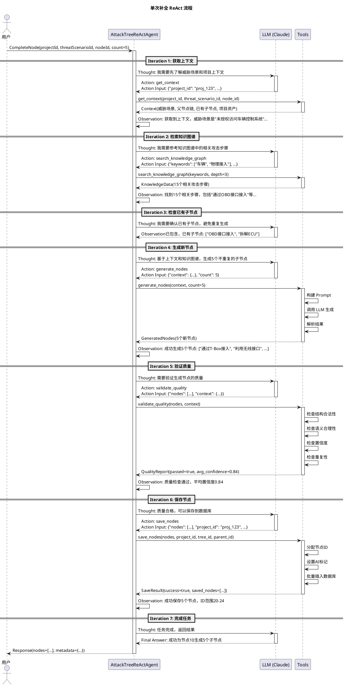
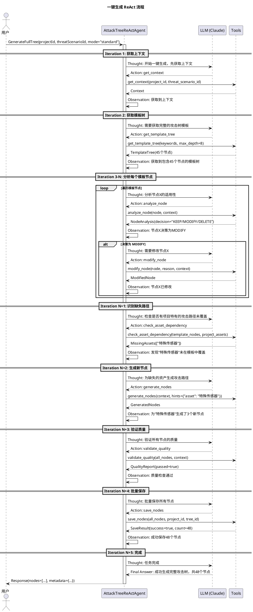

# 攻击树 Agent 技术设计方案（基于 Eino ReAct Agent）

## 1. 概述

### 1.1 设计目标

基于 CloudWeGo Eino 框架的 ReAct Agent 模式，设计一个智能的攻击树生成 Agent，能够：
- **单次补全**：为指定节点生成 3-5 个子攻击步骤
- **一键生成**：基于威胁场景生成完整的攻击树（3-8层）
- **智能决策**：通过工具调用，基于知识图谱模板和项目上下文做出决策
- **质量保证**：确保生成结果的准确性和可用性

### 1.2 Eino ReAct Agent 架构

ReAct (Reasoning + Acting) 模式：
- **Reasoning**：Agent 分析当前状态，决定下一步行动
- **Acting**：Agent 调用工具执行具体操作
- **Observation**：Agent 观察工具执行结果，继续推理

```
循环流程：
Thought (思考) -> Action (选择工具) -> Observation (观察结果) -> Thought -> ...
直到完成任务或达到最大迭代次数
```

## 2. Agent 架构设计

### 2.1 整体架构图

```plantuml
@startuml

package "Eino ReAct Agent 框架" {
  class AttackTreeReActAgent {
    - llm: ChatModel
    - tools: []Tool
    - maxIterations: int
    - memory: Memory
    --
    + Run(input): AgentOutput
    - think(state): Thought
    - act(action): Observation
    - shouldContinue(state): bool
  }
  
  interface Tool {
    + Name(): string
    + Description(): string
    + InputSchema(): Schema
    + Execute(input): ToolOutput
  }
}

package "攻击树专用工具集" {
  class GetContextTool {
    + Name(): "get_context"
    + Description(): "获取威胁场景和项目上下文信息"
    + Execute(input): Context
  }
  
  class SearchKnowledgeGraphTool {
    + Name(): "search_knowledge_graph"
    + Description(): "从知识图谱检索相关攻击步骤"
    + Execute(input): KnowledgeData
  }
  
  class GetTemplateTreeTool {
    + Name(): "get_template_tree"
    + Description(): "获取完整的攻击树模板"
    + Execute(input): TemplateTree
  }
  
  class AnalyzeNodeTool {
    + Name(): "analyze_node"
    + Description(): "分析模板节点的适用性"
    + Execute(input): NodeAnalysis
  }
  
  class CheckAssetDependencyTool {
    + Name(): "check_asset_dependency"
    + Description(): "检查节点的资产依赖"
    + Execute(input): AssetMatchResult
  }
  
  class CalculateSimilarityTool {
    + Name(): "calculate_similarity"
    + Description(): "计算文本语义相似度"
    + Execute(input): SimilarityScore
  }
  
  class GenerateNodesTool {
    + Name(): "generate_nodes"
    + Description(): "生成新的攻击节点"
    + Execute(input): GeneratedNodes
  }
  
  class ModifyNodeTool {
    + Name(): "modify_node"
    + Description(): "修改模板节点以适应项目"
    + Execute(input): ModifiedNode
  }
  
  class SaveNodesTool {
    + Name(): "save_nodes"
    + Description(): "批量保存节点到数据库"
    + Execute(input): SaveResult
  }
  
  class ValidateQualityTool {
    + Name(): "validate_quality"
    + Description(): "验证生成节点的质量"
    + Execute(input): QualityReport
  }
}

package "底层服务" {
  class ContextService {
    + GetThreatScenario(id): ThreatScenario
    + GetParentChain(nodeId): Node[]
    + GetProjectAssets(projectId): Asset[]
  }
  
  class KnowledgeGraphService {
    + QuerySteps(keywords): Steps[]
    + QueryTemplate(keywords, depth): TemplateTree
  }
  
  class LLMService {
    + Generate(prompt): Response
    + BatchGenerate(prompts): Response[]
  }
  
  class NodeService {
    + BatchCreate(nodes): Node[]
    + UpdateNode(id, data): Node
  }
}

AttackTreeReActAgent --> Tool
AttackTreeReActAgent ..> GetContextTool
AttackTreeReActAgent ..> SearchKnowledgeGraphTool
AttackTreeReActAgent ..> GetTemplateTreeTool
AttackTreeReActAgent ..> AnalyzeNodeTool
AttackTreeReActAgent ..> CheckAssetDependencyTool
AttackTreeReActAgent ..> CalculateSimilarityTool
AttackTreeReActAgent ..> GenerateNodesTool
AttackTreeReActAgent ..> ModifyNodeTool
AttackTreeReActAgent ..> SaveNodesTool
AttackTreeReActAgent ..> ValidateQualityTool

GetContextTool --> ContextService
SearchKnowledgeGraphTool --> KnowledgeGraphService
GetTemplateTreeTool --> KnowledgeGraphService
GenerateNodesTool --> LLMService
ModifyNodeTool --> LLMService
SaveNodesTool --> NodeService

@enduml
```



### 2.2 ReAct Agent 核心组件

#### 2.2.1 AttackTreeReActAgent

**职责**：
- 作为 Eino ReAct Agent 的实现
- 管理工具集合
- 执行 Thought-Action-Observation 循环
- 维护对话记忆

**核心属性**：

| 属性 | 类型 | 说明 |
|------|------|------|
| llm | ChatModel | LLM 模型（Claude/GPT） |
| tools | []Tool | 可用工具列表 |
| maxIterations | int | 最大迭代次数（默认10） |
| memory | Memory | 对话记忆 |
| systemPrompt | string | 系统提示词 |

**核心方法**：

| 方法 | 说明 | 输入 | 输出 |
|------|------|------|------|
| Run | 执行 Agent 任务 | AgentInput | AgentOutput |
| think | 推理下一步行动 | AgentState | Thought |
| act | 执行工具调用 | Action | Observation |
| shouldContinue | 判断是否继续 | AgentState | bool |

**System Prompt 设计**：
```
你是一个专业的网络安全专家，负责构建攻击树。

你的任务是：
1. 单次补全：为指定节点生成合理的子攻击步骤
2. 一键生成：基于威胁场景生成完整的攻击树

你可以使用以下工具：
- get_context: 获取威胁场景和项目上下文
- search_knowledge_graph: 检索相关攻击步骤
- get_template_tree: 获取完整攻击树模板
- analyze_node: 分析节点适用性
- check_asset_dependency: 检查资产依赖
- calculate_similarity: 计算语义相似度
- generate_nodes: 生成新节点
- modify_node: 修改模板节点
- save_nodes: 保存节点到数据库
- validate_quality: 验证生成质量

请按照 ReAct 模式工作：
1. Thought: 分析当前状态，决定下一步
2. Action: 选择并调用合适的工具
3. Observation: 观察工具执行结果
4. 重复直到完成任务

要求：
- 避免生成重复的攻击步骤
- 确保生成的节点与威胁场景相关
- 评估五维因子（ET/SE/KoI/WoO/Eq）
- 提供置信度评分
```


## 3. 工具（Tools）设计

### 3.1 工具列表概览

| 工具名称 | 功能 | 输入 | 输出 | 调用时机 |
|---------|------|------|------|---------|
| get_context | 获取上下文信息 | projectId, threatScenarioId, nodeId | Context | 任务开始时 |
| search_knowledge_graph | 检索攻击步骤 | keywords, depth | KnowledgeData | 需要参考时 |
| get_template_tree | 获取模板树 | keywords, maxDepth | TemplateTree | 一键生成时 |
| analyze_node | 分析节点适用性 | node, context | NodeAnalysis | 决策时 |
| check_asset_dependency | 检查资产依赖 | node, assets | AssetMatchResult | 分析节点时 |
| calculate_similarity | 计算相似度 | text1, text2 | SimilarityScore | 比较文本时 |
| generate_nodes | 生成新节点 | context, count | GeneratedNodes | 需要创建时 |
| modify_node | 修改节点 | node, reason, context | ModifiedNode | 需要调整时 |
| save_nodes | 保存节点 | nodes, projectId | SaveResult | 完成生成后 |
| validate_quality | 验证质量 | nodes, context | QualityReport | 保存前 |

### 3.2 工具详细设计

#### 3.2.1 GetContextTool（获取上下文）

**功能**：获取生成所需的完整上下文信息

**输入 Schema**：
```json
{
  "type": "object",
  "properties": {
    "project_id": {
      "type": "string",
      "description": "项目ID"
    },
    "threat_scenario_id": {
      "type": "string",
      "description": "威胁场景ID"
    },
    "node_id": {
      "type": "integer",
      "description": "当前节点ID（可选，单次补全时需要）"
    }
  },
  "required": ["project_id", "threat_scenario_id"]
}
```

**输出**：
```json
{
  "threat_scenario": {
    "id": "threat_456",
    "name": "未授权访问车辆控制系统",
    "description": "攻击者通过各种手段获取车辆控制系统的访问权限"
  },
  "parent_chain": [
    {"id": 1, "name": "根节点"},
    {"id": 5, "name": "获取网络访问"}
  ],
  "current_node": {
    "id": 10,
    "name": "物理接入",
    "description": "通过物理方式接入车辆网络"
  },
  "existing_children": [
    {"id": 11, "name": "OBD接口接入"},
    {"id": 12, "name": "拆解ECU"}
  ],
  "project_assets": [
    {"name": "T-Box", "type": "通信模块"},
    {"name": "OBD接口", "type": "诊断接口"}
  ],
  "keywords": ["车辆", "控制系统", "访问权限", "T-Box"]
}
```

**使用示例**：
```
Thought: 我需要先了解威胁场景和项目上下文
Action: get_context
Action Input: {"project_id": "proj_123", "threat_scenario_id": "threat_456", "node_id": 10}
Observation: 获取到上下文信息，威胁场景是"未授权访问车辆控制系统"，当前节点是"物理接入"，已有2个子节点...
```

---

#### 3.2.2 SearchKnowledgeGraphTool（检索知识图谱）

**功能**：从 Neo4j 知识图谱检索相关的攻击步骤

**输入 Schema**：
```json
{
  "type": "object",
  "properties": {
    "keywords": {
      "type": "array",
      "items": {"type": "string"},
      "description": "搜索关键词列表"
    },
    "depth": {
      "type": "integer",
      "description": "查询深度（1-8层）",
      "default": 3
    },
    "limit": {
      "type": "integer",
      "description": "返回结果数量限制",
      "default": 20
    }
  },
  "required": ["keywords"]
}
```

**输出**：
```json
{
  "steps": [
    {
      "id": "KB-AS-001",
      "name": "通过OBD接口接入",
      "description": "使用OBD诊断工具连接车辆OBD接口",
      "confidence": 0.9,
      "factors": {
        "elapsed_time": 2,
        "specialist_expertise": 3,
        "knowledge_of_item": 2,
        "window_of_opportunity": 3,
        "equipment": 2
      }
    }
  ],
  "total": 15
}
```

**使用示例**：
```
Thought: 我需要参考知识图谱中的相关攻击步骤
Action: search_knowledge_graph
Action Input: {"keywords": ["车辆", "物理接入", "T-Box"], "depth": 3, "limit": 20}
Observation: 找到15个相关攻击步骤，包括"通过OBD接口接入"、"拆解T-Box"等...
```

---

#### 3.2.3 GetTemplateTreeTool（获取模板树）

**功能**：获取完整的攻击树模板（用于一键生成）

**输入 Schema**：
```json
{
  "type": "object",
  "properties": {
    "keywords": {
      "type": "array",
      "items": {"type": "string"},
      "description": "搜索关键词"
    },
    "max_depth": {
      "type": "integer",
      "description": "最大深度",
      "default": 8
    }
  },
  "required": ["keywords"]
}
```

**输出**：
```json
{
  "root": "未授权访问车辆控制系统",
  "nodes": [
    {
      "id": "template_1",
      "name": "获取网络访问",
      "description": "...",
      "parent_id": null,
      "is_template": true,
      "confidence": 0.85
    },
    {
      "id": "template_2",
      "name": "物理接入",
      "parent_id": "template_1",
      "is_template": true
    }
  ],
  "relationships": [
    {"parent": "template_1", "child": "template_2", "type": "OR"}
  ]
}
```

**使用示例**：
```
Thought: 一键生成需要先获取完整的攻击树模板
Action: get_template_tree
Action Input: {"keywords": ["车辆", "控制系统"], "max_depth": 8}
Observation: 获取到包含45个节点的攻击树模板...
```

---

#### 3.2.4 AnalyzeNodeTool（分析节点适用性）

**功能**：分析模板节点是否适用于当前项目

**输入 Schema**：
```json
{
  "type": "object",
  "properties": {
    "node": {
      "type": "object",
      "description": "要分析的节点"
    },
    "context": {
      "type": "object",
      "description": "项目上下文"
    }
  },
  "required": ["node", "context"]
}
```

**输出**：
```json
{
  "decision": "MODIFY",
  "reason": "节点与威胁场景相关，但需要调整以适应项目特征",
  "similarity_score": 0.72,
  "asset_match": "partial",
  "feasibility_score": 0.68,
  "recommendations": [
    "将描述中的'通用ECU'改为项目中的'T-Box'",
    "调整五维因子以反映项目实际难度"
  ]
}
```

**使用示例**：
```
Thought: 我需要判断这个模板节点是否适用
Action: analyze_node
Action Input: {"node": {...}, "context": {...}}
Observation: 节点需要修改，相似度0.72，建议调整描述和五维因子...
```

---

#### 3.2.5 CheckAssetDependencyTool（检查资产依赖）

**功能**：检查节点所需的资产是否在项目中存在

**输入 Schema**：
```json
{
  "type": "object",
  "properties": {
    "node": {
      "type": "object",
      "description": "要检查的节点"
    },
    "assets": {
      "type": "array",
      "description": "项目资产列表"
    }
  },
  "required": ["node", "assets"]
}
```

**输出**：
```json
{
  "matched": true,
  "match_type": "partial",
  "matched_assets": [
    {"name": "T-Box", "type": "通信模块"}
  ],
  "missing_assets": [],
  "reason": "节点提到的'车载通信模块'在项目中对应T-Box"
}
```

**使用示例**：
```
Thought: 检查这个节点依赖的资产是否存在
Action: check_asset_dependency
Action Input: {"node": {...}, "assets": [...]}
Observation: 资产部分匹配，节点提到的'车载通信模块'对应项目中的T-Box...
```

---

#### 3.2.6 CalculateSimilarityTool（计算相似度）

**功能**：计算两段文本的语义相似度

**输入 Schema**：
```json
{
  "type": "object",
  "properties": {
    "text1": {
      "type": "string",
      "description": "第一段文本"
    },
    "text2": {
      "type": "string",
      "description": "第二段文本"
    }
  },
  "required": ["text1", "text2"]
}
```

**输出**：
```json
{
  "similarity": 0.85,
  "method": "sentence_transformers",
  "confidence": "high"
}
```

**使用示例**：
```
Thought: 计算节点描述与威胁场景的相似度
Action: calculate_similarity
Action Input: {"text1": "通过OBD接口接入车辆网络", "text2": "未授权访问车辆控制系统"}
Observation: 相似度为0.85，相关性高...
```

---

#### 3.2.7 GenerateNodesTool（生成新节点）

**功能**：使用 LLM 生成新的攻击节点

**输入 Schema**：
```json
{
  "type": "object",
  "properties": {
    "context": {
      "type": "object",
      "description": "生成上下文"
    },
    "count": {
      "type": "integer",
      "description": "生成数量",
      "default": 5
    },
    "parent_node": {
      "type": "object",
      "description": "父节点信息（可选）"
    }
  },
  "required": ["context"]
}
```

**输出**：
```json
{
  "nodes": [
    {
      "name": "通过OBD接口接入",
      "description": "使用OBD诊断工具连接车辆OBD接口，获取CAN总线访问权限",
      "node_type": "attack_path",
      "factors": {
        "elapsed_time": 2,
        "specialist_expertise": 3,
        "knowledge_of_toe": 2,
        "window_of_opportunity": 3,
        "equipment": 2
      },
      "confidence": 0.87,
      "kg_refs": ["KB-AS-001"]
    }
  ],
  "metadata": {
    "llm_model": "claude-3-5-sonnet",
    "tokens_used": 1250,
    "generation_time_ms": 2300
  }
}
```

**使用示例**：
```
Thought: 需要为"物理接入"节点生成5个子节点
Action: generate_nodes
Action Input: {"context": {...}, "count": 5, "parent_node": {"id": 10, "name": "物理接入"}}
Observation: 成功生成5个子节点，包括"通过OBD接口接入"、"拆解T-Box"等...
```

---

#### 3.2.8 ModifyNodeTool（修改节点）

**功能**：修改模板节点以适应项目特征

**输入 Schema**：
```json
{
  "type": "object",
  "properties": {
    "node": {
      "type": "object",
      "description": "要修改的节点"
    },
    "reason": {
      "type": "string",
      "description": "修改原因"
    },
    "context": {
      "type": "object",
      "description": "项目上下文"
    }
  },
  "required": ["node", "reason", "context"]
}
```

**输出**：
```json
{
  "modified_node": {
    "name": "通过T-Box OBD接口接入",
    "description": "使用OBD诊断工具连接车辆T-Box的OBD接口，获取CAN总线访问权限",
    "factors": {
      "elapsed_time": 2,
      "specialist_expertise": 4,
      "knowledge_of_toe": 3,
      "window_of_opportunity": 2,
      "equipment": 3
    },
    "confidence": 0.82
  },
  "modifications": [
    "将'通用OBD接口'改为'T-Box OBD接口'",
    "调整specialist_expertise从3到4，因为需要了解T-Box特性"
  ]
}
```

**使用示例**：
```
Thought: 这个模板节点需要调整以适应项目
Action: modify_node
Action Input: {"node": {...}, "reason": "需要具体化为T-Box", "context": {...}}
Observation: 节点已修改，名称改为"通过T-Box OBD接口接入"，五维因子已调整...
```

---

#### 3.2.9 SaveNodesTool（保存节点）

**功能**：批量保存节点到数据库

**输入 Schema**：
```json
{
  "type": "object",
  "properties": {
    "nodes": {
      "type": "array",
      "description": "要保存的节点列表"
    },
    "project_id": {
      "type": "string",
      "description": "项目ID"
    },
    "tree_id": {
      "type": "integer",
      "description": "攻击树ID"
    },
    "parent_id": {
      "type": "integer",
      "description": "父节点ID（可选）"
    }
  },
  "required": ["nodes", "project_id", "tree_id"]
}
```

**输出**：
```json
{
  "success": true,
  "saved_nodes": [
    {"id": 20, "name": "通过OBD接口接入"},
    {"id": 21, "name": "拆解T-Box"}
  ],
  "count": 5,
  "duration_ms": 450
}
```

**使用示例**：
```
Thought: 节点生成完成，需要保存到数据库
Action: save_nodes
Action Input: {"nodes": [...], "project_id": "proj_123", "tree_id": 1, "parent_id": 10}
Observation: 成功保存5个节点，ID范围20-24...
```

---

#### 3.2.10 ValidateQualityTool（验证质量）

**功能**：验证生成节点的质量

**输入 Schema**：
```json
{
  "type": "object",
  "properties": {
    "nodes": {
      "type": "array",
      "description": "要验证的节点"
    },
    "context": {
      "type": "object",
      "description": "上下文信息"
    }
  },
  "required": ["nodes", "context"]
}
```

**输出**：
```json
{
  "passed": true,
  "avg_confidence": 0.84,
  "issues": [],
  "checks": {
    "structure": {"passed": true, "message": "结构合法"},
    "semantics": {"passed": true, "message": "语义合理"},
    "confidence": {"passed": true, "message": "平均置信度0.84"},
    "duplication": {"passed": true, "message": "无重复"}
  },
  "recommendation": "accept"
}
```

**使用示例**：
```
Thought: 保存前需要验证节点质量
Action: validate_quality
Action Input: {"nodes": [...], "context": {...}}
Observation: 质量检查通过，平均置信度0.84，无问题...
```


## 4. ReAct 流程走查

### 4.1 单次补全流程（ReAct 模式）



**流程说明**：

ReAct Agent 通过多轮迭代完成任务，每轮包含：
1. **Thought**：LLM 分析当前状态，决定下一步行动
2. **Action**：选择并调用合适的工具
3. **Observation**：观察工具执行结果，更新状态

**关键点**：
- Agent 自主决定调用哪些工具、调用顺序
- 每次工具调用后，结果会反馈给 LLM，影响下一步决策
- 最大迭代次数限制（默认10次），防止无限循环
- 当 LLM 输出 "Final Answer" 时，任务完成

---

### 4.2 一键生成完整攻击树流程（ReAct 模式）



**流程说明**：

一键生成是一个更复杂的 ReAct 流程，包含：
1. 获取上下文和模板树
2. 逐个分析模板节点（保留/修改/删除）
3. 识别缺失路径并生成新节点
4. 验证质量并批量保存

**关键点**：
- Agent 自主决定分析顺序和策略
- 可能需要多次调用 analyze_node、modify_node
- 动态识别缺失路径，生成补充节点
- 最终统一验证和保存

---

### 4.3 ReAct 决策示例

#### 示例 1：单次补全的完整对话

```
User: 为节点10生成5个子节点

=== Iteration 1 ===
Thought: 我需要先了解节点10的上下文信息，包括威胁场景、父节点链、已有子节点等。
Action: get_context
Action Input: {"project_id": "proj_123", "threat_scenario_id": "threat_456", "node_id": 10}
Observation: 获取到上下文信息：
- 威胁场景：未授权访问车辆控制系统
- 当前节点：物理接入
- 父节点链：根节点 -> 获取网络访问 -> 物理接入
- 已有子节点：["OBD接口接入", "拆解ECU"]
- 项目资产：["T-Box", "OBD接口", "CAN总线"]

=== Iteration 2 ===
Thought: 我需要参考知识图谱中关于"物理接入"的相关攻击步骤，以确保生成的节点专业且准确。
Action: search_knowledge_graph
Action Input: {"keywords": ["物理接入", "车辆", "T-Box"], "depth": 3, "limit": 20}
Observation: 找到15个相关攻击步骤：
- 通过OBD接口接入 (confidence: 0.9)
- 拆解T-Box获取访问 (confidence: 0.85)
- 利用USB调试接口 (confidence: 0.78)
- 通过无线接口接入 (confidence: 0.82)
- ...

=== Iteration 3 ===
Thought: 已有子节点包括"OBD接口接入"和"拆解ECU"，我需要生成5个不重复的新子节点。基于知识图谱和项目资产（T-Box、CAN总线），我可以生成相关的攻击步骤。
Action: generate_nodes
Action Input: {
  "context": {
    "threat_scenario": "未授权访问车辆控制系统",
    "current_node": "物理接入",
    "existing_children": ["OBD接口接入", "拆解ECU"],
    "project_assets": ["T-Box", "OBD接口", "CAN总线"]
  },
  "count": 5,
  "parent_node": {"id": 10, "name": "物理接入"}
}
Observation: 成功生成5个新节点：
1. 通过T-Box USB调试接口接入 (confidence: 0.87)
2. 利用CAN总线物理连接 (confidence: 0.85)
3. 通过无线调试接口接入 (confidence: 0.82)
4. 拆解T-Box提取固件 (confidence: 0.84)
5. 利用JTAG调试接口 (confidence: 0.79)

=== Iteration 4 ===
Thought: 生成的节点需要验证质量，确保它们与威胁场景相关、不重复、置信度足够高。
Action: validate_quality
Action Input: {
  "nodes": [...5个节点...],
  "context": {...}
}
Observation: 质量检查结果：
- 结构合法性：通过
- 语义合理性：通过（平均相关度0.83）
- 置信度：通过（平均0.83）
- 重复性：通过（与已有节点相似度<0.5）
- 总体评价：通过

=== Iteration 5 ===
Thought: 质量检查通过，可以保存这5个节点到数据库。
Action: save_nodes
Action Input: {
  "nodes": [...5个节点...],
  "project_id": "proj_123",
  "tree_id": 1,
  "parent_id": 10
}
Observation: 成功保存5个节点，分配的ID为20-24。

=== Iteration 6 ===
Thought: 任务完成，成功为节点10生成并保存了5个子节点。
Final Answer: 成功为"物理接入"节点生成5个子攻击步骤：
1. 通过T-Box USB调试接口接入 (ID: 20)
2. 利用CAN总线物理连接 (ID: 21)
3. 通过无线调试接口接入 (ID: 22)
4. 拆解T-Box提取固件 (ID: 23)
5. 利用JTAG调试接口 (ID: 24)

平均置信度：0.83
生成耗时：4.2秒
```

#### 示例 2：遇到质量问题时的重试

```
=== Iteration 4 ===
Thought: 生成的节点需要验证质量
Action: validate_quality
Action Input: {"nodes": [...], "context": {...}}
Observation: 质量检查失败：
- 重复性检查未通过：节点"通过OBD接口接入"与已有子节点"OBD接口接入"相似度0.92
- 建议：重新生成，避免重复

=== Iteration 5 ===
Thought: 质量检查发现重复，我需要重新生成，明确排除已有的节点。
Action: generate_nodes
Action Input: {
  "context": {...},
  "count": 5,
  "exclude_similar_to": ["OBD接口接入", "拆解ECU"]
}
Observation: 重新生成5个节点，已排除相似内容...

=== Iteration 6 ===
Thought: 再次验证质量
Action: validate_quality
Action Input: {"nodes": [...], "context": {...}}
Observation: 质量检查通过

=== Iteration 7 ===
Thought: 现在可以保存了
Action: save_nodes
...
```


## 5. 数据模型

### 5.1 核心数据结构

基于现有的 Go 模型和 Eino 框架要求：

#### 5.1.1 AgentInput（Agent 输入）

```go
type AgentInput struct {
    // 任务类型
    TaskType string `json:"task_type"` // "complete_node" 或 "generate_full_tree"
    
    // 单次补全参数
    ProjectID        string `json:"project_id"`
    ThreatScenarioID string `json:"threat_scenario_id"`
    NodeID           *uint  `json:"node_id,omitempty"`
    GenerationCount  int    `json:"generation_count,omitempty"` // 默认5
    
    // 一键生成参数
    GenerationMode string `json:"generation_mode,omitempty"` // "quick"/"standard"/"deep"
    MaxDepth       int    `json:"max_depth,omitempty"`       // 默认8
}
```

#### 5.1.2 AgentOutput（Agent 输出）

```go
type AgentOutput struct {
    Success  bool                   `json:"success"`
    Nodes    []AttackTreeNodeV2     `json:"nodes"`
    Metadata AgentOutputMetadata    `json:"metadata"`
    Error    string                 `json:"error,omitempty"`
}

type AgentOutputMetadata struct {
    TotalGenerated    int     `json:"total_generated"`
    AvgConfidence     float64 `json:"avg_confidence"`
    GenerationTimeMs  int     `json:"generation_time_ms"`
    IterationsUsed    int     `json:"iterations_used"`
    ToolCallsCount    int     `json:"tool_calls_count"`
    
    // 一键生成特有
    KeptFromTemplate     int `json:"kept_from_template,omitempty"`
    ModifiedFromTemplate int `json:"modified_from_template,omitempty"`
    NewlyCreated         int `json:"newly_created,omitempty"`
}
```

#### 5.1.3 ToolInput/ToolOutput（工具输入输出）

每个工具都有自己的输入输出结构，参见第3章工具设计。

### 5.2 Eino 框架集成

#### 5.2.1 Tool 接口实现

```go
// Eino Tool 接口
type Tool interface {
    Name() string
    Description() string
    InputSchema() *jsonschema.Schema
    Execute(ctx context.Context, input string) (string, error)
}

// 示例：GetContextTool 实现
type GetContextTool struct {
    contextService *ContextService
}

func (t *GetContextTool) Name() string {
    return "get_context"
}

func (t *GetContextTool) Description() string {
    return "获取威胁场景和项目上下文信息，包括威胁场景描述、父节点链、已有子节点、项目资产等"
}

func (t *GetContextTool) InputSchema() *jsonschema.Schema {
    return &jsonschema.Schema{
        Type: "object",
        Properties: map[string]*jsonschema.Schema{
            "project_id": {
                Type:        "string",
                Description: "项目ID",
            },
            "threat_scenario_id": {
                Type:        "string",
                Description: "威胁场景ID",
            },
            "node_id": {
                Type:        "integer",
                Description: "当前节点ID（可选，单次补全时需要）",
            },
        },
        Required: []string{"project_id", "threat_scenario_id"},
    }
}

func (t *GetContextTool) Execute(ctx context.Context, input string) (string, error) {
    // 1. 解析输入
    var params GetContextInput
    if err := json.Unmarshal([]byte(input), &params); err != nil {
        return "", err
    }
    
    // 2. 调用底层服务
    context, err := t.contextService.CollectContext(ctx, params)
    if err != nil {
        return "", err
    }
    
    // 3. 返回 JSON 字符串
    output, err := json.Marshal(context)
    return string(output), err
}
```

#### 5.2.2 Agent 配置

```go
// Agent 配置
type AttackTreeAgentConfig struct {
    // LLM 配置
    LLMModel       string  // "claude-3-5-sonnet"
    Temperature    float64 // 0.7
    MaxTokens      int     // 4096
    
    // Agent 配置
    MaxIterations  int     // 10
    SystemPrompt   string  // 系统提示词
    
    // 工具配置
    Tools          []Tool  // 工具列表
    
    // 性能配置
    Timeout        time.Duration // 30秒
    EnableCache    bool          // 启用缓存
}

// 创建 Agent
func NewAttackTreeAgent(config AttackTreeAgentConfig) *AttackTreeReActAgent {
    return &AttackTreeReActAgent{
        llm:           createLLM(config),
        tools:         config.Tools,
        maxIterations: config.MaxIterations,
        systemPrompt:  config.SystemPrompt,
        memory:        NewMemory(),
    }
}
```

## 6. 关键技术点

### 6.1 Eino ReAct Agent 特性

**优势**：
1. **自主决策**：Agent 自主决定调用哪些工具、调用顺序
2. **灵活性**：可以根据中间结果动态调整策略
3. **可解释性**：每步都有 Thought，便于理解和调试
4. **容错性**：工具调用失败时，Agent 可以尝试其他方案

**挑战**：
1. **迭代次数控制**：需要设置合理的最大迭代次数
2. **成本控制**：每次迭代都会调用 LLM，token 消耗较大
3. **性能优化**：相比传统流程，ReAct 模式可能更慢

### 6.2 Prompt 工程

**System Prompt 设计要点**：
1. **角色定义**：明确 Agent 的身份和职责
2. **工具说明**：详细描述每个工具的功能和使用场景
3. **输出格式**：规范 Thought/Action/Observation 的格式
4. **约束条件**：避免重复、确保相关性、评估五维因子等

**Few-Shot 示例**：
```
示例1：单次补全
User: 为节点10生成5个子节点
Thought: 我需要先了解节点10的上下文
Action: get_context
Action Input: {"project_id": "proj_123", ...}
Observation: 获取到上下文...
Thought: 现在我需要参考知识图谱
Action: search_knowledge_graph
...
```

### 6.3 工具设计原则

1. **单一职责**：每个工具只做一件事
2. **输入输出明确**：使用 JSON Schema 定义
3. **错误处理**：工具内部处理错误，返回友好信息
4. **幂等性**：相同输入应返回相同输出（查询类工具）
5. **性能优化**：使用缓存、批量处理

### 6.4 性能优化

| 优化点 | 策略 | 效果 |
|--------|------|------|
| 减少迭代次数 | 优化 System Prompt，引导 Agent 高效决策 | 减少 30% token 消耗 |
| 工具缓存 | 缓存 get_context、search_knowledge_graph 结果 | 提升 50% 响应速度 |
| 批量处理 | generate_nodes、modify_node 支持批量 | 减少 LLM 调用次数 |
| 并行调用 | 独立工具可并行执行 | 提升 20% 性能 |

### 6.5 监控指标

| 指标 | 说明 | 目标值 |
|------|------|--------|
| 平均迭代次数 | 完成任务所需的平均迭代数 | < 8 次 |
| 工具调用成功率 | 工具调用成功的比例 | > 95% |
| 平均响应时间 | 从输入到输出的总时间 | < 10s |
| Token 消耗 | 每次任务的平均 token 数 | < 5000 |
| 任务成功率 | 成功完成任务的比例 | > 90% |

## 7. 总结

### 7.1 核心设计要点

1. **基于 Eino ReAct Agent**：利用 CloudWeGo Eino 框架的 ReAct 模式
2. **工具化设计**：将功能拆分为 10 个独立工具
3. **自主决策**：Agent 自主决定工具调用顺序和策略
4. **质量保证**：通过 validate_quality 工具确保生成质量
5. **可扩展性**：易于添加新工具，扩展 Agent 能力

### 7.2 工具列表总结

| # | 工具名称 | 功能 | 类型 |
|---|---------|------|------|
| 1 | get_context | 获取上下文信息 | 查询 |
| 2 | search_knowledge_graph | 检索攻击步骤 | 查询 |
| 3 | get_template_tree | 获取模板树 | 查询 |
| 4 | analyze_node | 分析节点适用性 | 分析 |
| 5 | check_asset_dependency | 检查资产依赖 | 分析 |
| 6 | calculate_similarity | 计算相似度 | 分析 |
| 7 | generate_nodes | 生成新节点 | 生成 |
| 8 | modify_node | 修改节点 | 生成 |
| 9 | save_nodes | 保存节点 | 操作 |
| 10 | validate_quality | 验证质量 | 验证 |

### 7.3 关键指标

| 指标 | 目标值 | 说明 |
|------|--------|------|
| 单次补全耗时 (P95) | < 10s | ReAct 模式会比传统流程慢 |
| 一键生成耗时 (P95) | < 30s | 包含多次迭代和工具调用 |
| 平均迭代次数 | < 8 次 | 控制 token 消耗 |
| 采纳率 | > 70% | 生成质量核心指标 |
| 平均置信度 | > 0.8 | AI 生成可信度指标 |

### 7.4 后续优化方向

1. **Prompt 优化**：通过 Few-Shot 示例提升 Agent 决策效率
2. **工具优化**：优化工具性能，减少调用延迟
3. **缓存策略**：智能缓存工具结果，减少重复调用
4. **并行执行**：支持独立工具的并行调用
5. **成本控制**：监控 token 消耗，优化 LLM 调用策略

---

**文档版本**: v1.0 (Eino ReAct Agent)  
**创建日期**: 2026-02-03  
**框架**: CloudWeGo Eino  
**作者**: AI Agent Team

