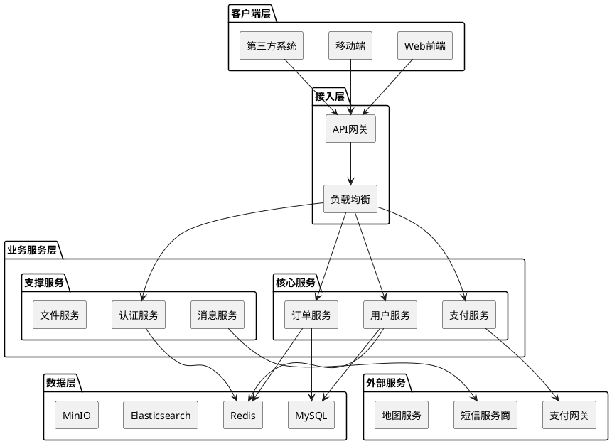
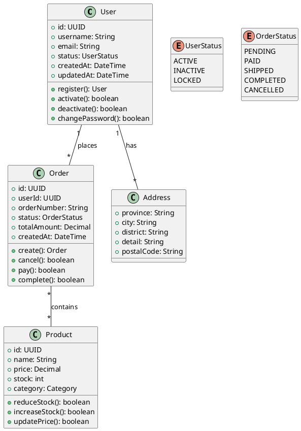
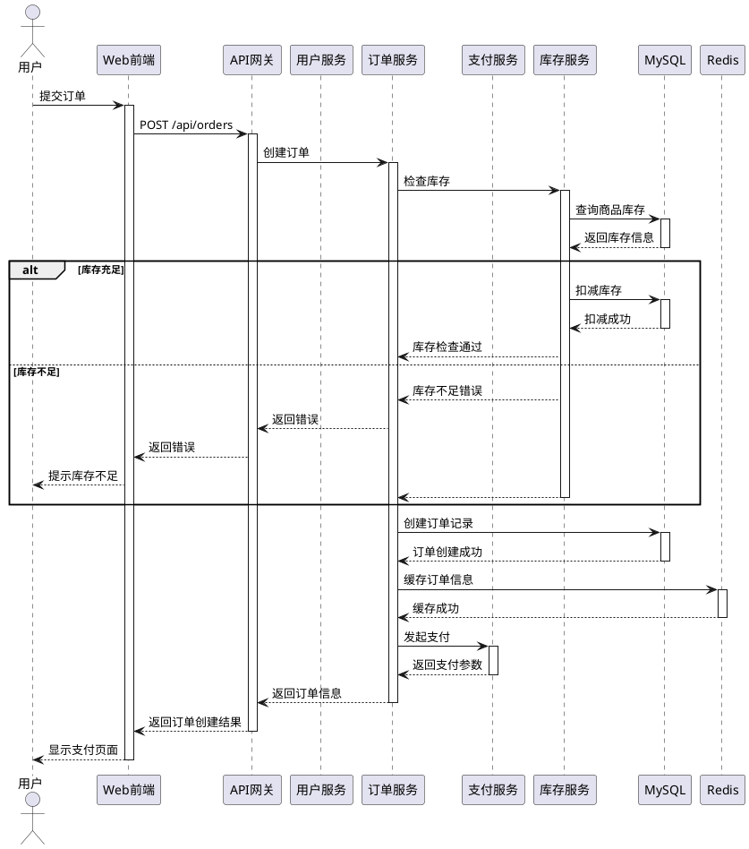
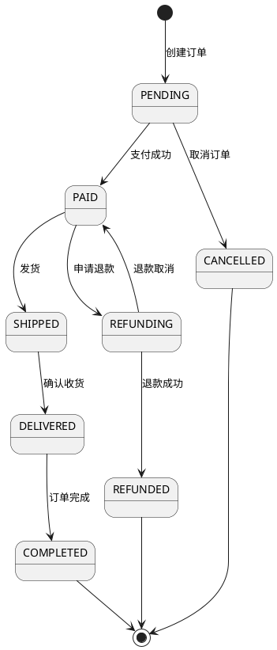
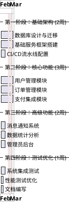

# 技术方案设计模板

> 基于结构化技术方案设计方法论，确保设计全面、清晰、可执行
>
> **模板版本**: 1.0
> **创建日期**: 2026-02-21
> **最后更新**: 2026-02-21
> **适用场景**: 后端系统设计、微服务架构设计、复杂业务系统设计

---

## 文档说明

### 模板使用指南

1. **填写说明**：
   - 每个章节都有详细的填写说明和示例
   - 删除所有示例文本，替换为实际内容
   - 保留章节结构，确保设计完整性

2. **章节标记**：
   - ✅ **必需章节**：核心设计内容，必须填写
   - 📋 **可选章节**：根据项目复杂度选择填写
   - 🔧 **技术细节**：实现层面的详细设计

3. **图表规范**：
   - 架构图：使用 PlantUML、Mermaid 或 draw.io
   - 类图：使用 PlantUML，遵循 UML 规范
   - 时序图：使用 PlantUML，展示核心流程
   - 数据模型图：使用 PlantUML 或 ER 图

---

## ✅ 第一部分：项目概述（当前需求的关键描述）

### 1.1 需求背景

**填写说明**：简要描述需求的来源、业务背景、解决的问题。

**示例**：
> 随着业务快速发展，现有的用户认证系统无法支持多租户架构和第三方登录集成。需要设计一个新的统一认证授权中心，支持 OAuth 2.0、OpenID Connect 协议，满足未来3-5年的业务扩展需求。

### 1.2 核心需求描述

**填写说明**：用简洁的语言描述核心需求，避免技术细节。

**模板**：
- **功能需求**：
  1. [需求点1：明确的功能描述]
  2. [需求点2：明确的功能描述]
  3. [需求点3：明确的功能描述]

- **非功能需求**：
  - 性能指标：[例如：接口响应时间 P95 < 200ms]
  - 可用性：[例如：99.9% SLA]
  - 安全性：[例如：支持 RBAC、数据加密]
  - 扩展性：[例如：支持水平扩展]

### 1.3 业务价值

**填写说明**：说明项目对业务的实际价值。

**模板**：
- **效率提升**：[描述如何提升效率]
- **成本降低**：[描述如何降低成本]
- **体验优化**：[描述如何优化用户体验]
- **风险控制**：[描述如何控制业务风险]

### 1.4 项目目标

**填写说明**：设定明确、可衡量的项目目标。

**模板**：
- **短期目标**（MVP）：
  1. [目标1：可衡量的指标]
  2. [目标2：可衡量的指标]

- **长期目标**：
  1. [目标1：可衡量的指标]
  2. [目标2：可衡量的指标]

---

## ✅ 第二部分：技术架构设计（技术选型与架构设计）

### 2.1 技术选型

**填写说明**：列出主要技术栈，并说明选型理由。

**模板**：

| 类别 | 技术选型 | 版本 | 选型理由 |
|------|----------|------|----------|
| 开发语言 | [例如：Go] | [例如：1.21+] | [说明：高性能、并发能力强、生态完善] |
| Web框架 | [例如：Gin] | [例如：v1.9] | [说明：轻量级、高性能、中间件丰富] |
| 数据库 | [例如：MySQL] | [例如：8.0] | [说明：关系型数据存储、事务支持] |
| 缓存 | [例如：Redis] | [例如：7.0] | [说明：高性能缓存、数据结构丰富] |
| 消息队列 | [例如：Kafka] | [例如：3.5] | [说明：高吞吐、分布式、持久化] |
| 容器化 | [例如：Docker] | [例如：24.0] | [说明：环境一致性、快速部署] |
| 编排工具 | [例如：Kubernetes] | [例如：1.28] | [说明：自动化部署、扩缩容] |

### 2.2 系统架构图

**填写说明**：绘制整体架构图，展示系统分层和组件关系。

**PlantUML 模板**：


### 2.3 架构分层说明

**填写说明**：详细说明各层的职责和设计原则。

**模板**：

#### 2.3.1 客户端层
- **职责**：[描述客户端层的职责]
- **设计原则**：[例如：响应式设计、渐进增强]
- **技术栈**：[例如：Vue 3 + TypeScript]

#### 2.3.2 接入层
- **职责**：[描述接入层的职责]
- **设计原则**：[例如：无状态、水平扩展]
- **关键组件**：[例如：Nginx、API Gateway]

#### 2.3.3 业务服务层
- **职责**：[描述业务服务层的职责]
- **设计原则**：[例如：单一职责、微服务架构]
- **服务划分原则**：[例如：按业务域划分]

#### 2.3.4 数据层
- **职责**：[描述数据层的职责]
- **设计原则**：[例如：读写分离、数据分片]
- **存储选型策略**：[例如：关系型数据用MySQL，缓存用Redis]

#### 2.3.5 外部服务层
- **职责**：[描述外部服务层的职责]
- **集成方式**：[例如：HTTP API、SDK]
- **容错策略**：[例如：降级、熔断]

### 2.4 核心模块划分

**填写说明**：列出核心业务模块，说明模块职责和依赖关系。

**模板**：

| 模块名称 | 职责描述 | 核心接口 | 依赖模块 |
|----------|----------|----------|----------|
| [模块1] | [职责描述] | [接口1, 接口2] | [依赖模块] |
| [模块2] | [职责描述] | [接口1, 接口2] | [依赖模块] |
| [模块3] | [职责描述] | [接口1, 接口2] | [依赖模块] |

---

## ✅ 第三部分：领域模型设计（领域模型划分与类图设计）

### 3.1 领域模型划分

**填写说明**：基于业务需求划分领域模型，明确边界上下文。

**模板**：

#### 3.1.1 核心领域
- **模型1**：[模型名称]
  - **职责**：[职责描述]
  - **关键属性**：[关键属性列表]
  - **生命周期**：[创建、更新、销毁的触发条件]

- **模型2**：[模型名称]
  - **职责**：[职责描述]
  - **关键属性**：[关键属性列表]
  - **生命周期**：[创建、更新、销毁的触发条件]

#### 3.1.2 支撑领域
- **模型1**：[模型名称]
  - **职责**：[职责描述]
  - **关键属性**：[关键属性列表]

#### 3.1.3 通用领域
- **模型1**：[模型名称]
  - **职责**：[职责描述]
  - **关键属性**：[关键属性列表]

### 3.2 类图设计

**填写说明**：使用 PlantUML 绘制类图，展示模型之间的关系。

**PlantUML 模板**：


### 3.3 模型关系说明

**填写说明**：解释类图中的模型关系和设计考虑。

**模板**：

#### 3.3.1 核心关系说明
- **User-Order 关系**：[说明关系类型、设计考虑、业务含义]
- **Order-Product 关系**：[说明关系类型、设计考虑、业务含义]
- **User-Address 关系**：[说明关系类型、设计考虑、业务含义]

#### 3.3.2 聚合根设计
- **聚合根1**：[模型名称]
  - **设计理由**：[为什么选择该模型作为聚合根]
  - **一致性边界**：[聚合内的一致性保证]
  - **生命周期管理**：[如何管理聚合的生命周期]

#### 3.3.3 值对象设计
- **值对象1**：[模型名称]
  - **设计理由**：[为什么设计为值对象]
  - **不变性保证**：[如何保证值对象的不变性]
  - **相等性判断**：[如何判断两个值对象相等]

### 3.4 关键方法定义

**填写说明**：定义领域模型的关键方法，包括参数、返回值和业务逻辑。

**模板**：

#### 3.4.1 User 领域方法
```typescript
/**
 * 用户注册
 * @param username 用户名
 * @param email 邮箱
 * @param password 密码
 * @returns 注册后的用户对象
 * @throws ValidationError 参数验证失败
 * @throws DuplicateUserError 用户已存在
 */
register(username: string, email: string, password: string): User {
  // 1. 参数验证
  // 2. 检查用户是否已存在
  // 3. 密码加密
  // 4. 创建用户记录
  // 5. 发送激活邮件
  // 6. 返回用户对象
}

/**
 * 用户激活
 * @param activationToken 激活令牌
 * @returns 是否激活成功
 * @throws InvalidTokenError 令牌无效
 * @throws ExpiredTokenError 令牌已过期
 */
activate(activationToken: string): boolean {
  // 1. 验证令牌
  // 2. 更新用户状态
  // 3. 记录激活时间
  // 4. 返回激活结果
}
```

---

## ✅ 第四部分：业务流程设计（业务流转过程展示）

### 4.1 核心业务流程时序图

**填写说明**：绘制核心业务的时序图，展示系统间交互。

**PlantUML 模板**：


### 4.2 关键业务场景说明

**填写说明**：详细描述关键业务场景的处理逻辑。

**模板**：

#### 4.2.1 场景1：[场景名称，例如：用户下单]
- **触发条件**：[什么情况下触发该场景]
- **参与方**：[哪些系统或角色参与]
- **前置条件**：[执行前必须满足的条件]
- **处理流程**：
  1. [步骤1：详细描述]
  2. [步骤2：详细描述]
  3. [步骤3：详细描述]
- **后置条件**：[执行后系统的状态]
- **异常处理**：
  - [异常1]：[如何处理]
  - [异常2]：[如何处理]

#### 4.2.2 场景2：[场景名称，例如：订单支付]
- **触发条件**：[什么情况下触发该场景]
- **参与方**：[哪些系统或角色参与]
- **前置条件**：[执行前必须满足的条件]
- **处理流程**：
  1. [步骤1：详细描述]
  2. [步骤2：详细描述]
  3. [步骤3：详细描述]
- **后置条件**：[执行后系统的状态]
- **异常处理**：
  - [异常1]：[如何处理]
  - [异常2]：[如何处理]

### 4.3 接口交互设计

**填写说明**：定义关键接口的请求响应格式。

**模板**：

#### 4.3.1 创建订单接口
```http
POST /api/v1/orders
Content-Type: application/json
Authorization: Bearer {token}

Request:
{
  "userId": "user_123",
  "items": [
    {
      "productId": "prod_456",
      "quantity": 2,
      "price": 99.99
    }
  ],
  "shippingAddress": {
    "province": "北京市",
    "city": "北京市",
    "district": "朝阳区",
    "detail": "建国门外大街1号"
  }
}

Response (Success):
{
  "code": 0,
  "message": "success",
  "data": {
    "orderId": "order_789",
    "orderNumber": "20250221123456",
    "totalAmount": 199.98,
    "status": "pending",
    "payUrl": "https://pay.example.com/order_789"
  }
}

Response (Error):
{
  "code": 40001,
  "message": "库存不足",
  "detail": "商品 prod_456 库存不足，当前库存：1",
  "timestamp": "2026-02-21T10:30:00Z"
}
```

#### 4.3.2 支付回调接口
```http
POST /api/v1/payments/callback
Content-Type: application/json

Request:
{
  "orderId": "order_789",
  "paymentId": "pay_123",
  "amount": 199.98,
  "status": "success",
  "timestamp": "2026-02-21T10:32:00Z",
  "signature": "加密签名"
}

Response:
{
  "code": 0,
  "message": "success"
}
```

### 4.4 状态流转设计

**填写说明**：定义核心业务对象的状态机。

**PlantUML 模板**：


---

## 📋 第五部分：详细设计（可选扩展）

### 5.1 数据模型设计

**填写说明**：详细设计数据库表结构。

**模板**：

#### 5.1.1 用户表 (users)
```sql
CREATE TABLE users (
  id BIGINT PRIMARY KEY AUTO_INCREMENT,
  username VARCHAR(50) NOT NULL UNIQUE COMMENT '用户名',
  email VARCHAR(100) NOT NULL UNIQUE COMMENT '邮箱',
  password_hash VARCHAR(255) NOT NULL COMMENT '密码哈希',
  status TINYINT NOT NULL DEFAULT 1 COMMENT '状态：1-激活，0-禁用',
  last_login_at DATETIME COMMENT '最后登录时间',
  created_at DATETIME NOT NULL DEFAULT CURRENT_TIMESTAMP,
  updated_at DATETIME NOT NULL DEFAULT CURRENT_TIMESTAMP ON UPDATE CURRENT_TIMESTAMP,

  INDEX idx_email (email),
  INDEX idx_status (status)
) COMMENT='用户表';
```

#### 5.1.2 订单表 (orders)
```sql
CREATE TABLE orders (
  id BIGINT PRIMARY KEY AUTO_INCREMENT,
  order_number VARCHAR(32) NOT NULL UNIQUE COMMENT '订单号',
  user_id BIGINT NOT NULL COMMENT '用户ID',
  total_amount DECIMAL(10,2) NOT NULL COMMENT '订单总金额',
  status VARCHAR(20) NOT NULL DEFAULT 'pending' COMMENT '订单状态',
  shipping_address JSON COMMENT '收货地址',
  payment_id VARCHAR(50) COMMENT '支付ID',
  paid_at DATETIME COMMENT '支付时间',
  created_at DATETIME NOT NULL DEFAULT CURRENT_TIMESTAMP,
  updated_at DATETIME NOT NULL DEFAULT CURRENT_TIMESTAMP ON UPDATE CURRENT_TIMESTAMP,

  INDEX idx_user_id (user_id),
  INDEX idx_order_number (order_number),
  INDEX idx_status (status),
  INDEX idx_created_at (created_at),
  FOREIGN KEY (user_id) REFERENCES users(id) ON DELETE CASCADE
) COMMENT='订单表';
```

### 5.2 API设计规范

**填写说明**：定义API设计规范。

**模板**：

#### 5.2.1 接口规范
- **URL格式**：`/api/{版本}/{资源}/{操作}`
- **HTTP方法**：GET（查询）、POST（创建）、PUT（更新）、DELETE（删除）
- **响应格式**：统一JSON格式
- **错误处理**：HTTP状态码 + 业务错误码
- **版本管理**：URL路径版本控制

#### 5.2.2 分页查询接口示例
```http
GET /api/v1/users?page=1&size=20&sort=created_at,desc&status=active
Authorization: Bearer {token}

Response:
{
  "code": 0,
  "message": "success",
  "data": {
    "items": [
      {
        "id": 1,
        "username": "user1",
        "email": "user1@example.com"
      }
    ],
    "pagination": {
      "page": 1,
      "size": 20,
      "total": 150,
      "pages": 8
    }
  }
}
```

### 5.3 性能优化策略

**填写说明**：设计性能优化方案。

**模板**：

#### 5.3.1 数据库优化
- **索引策略**：[索引设计原则]
- **查询优化**：[避免N+1查询、使用连接查询]
- **分库分表**：[分片策略、路由规则]

#### 5.3.2 缓存策略
- **缓存层级**：[本地缓存、分布式缓存]
- **缓存策略**：[读写策略、失效策略]
- **缓存击穿**：[解决方案：互斥锁、布隆过滤器]

#### 5.3.3 异步处理
- **异步任务**：[使用消息队列解耦]
- **批量处理**：[批量操作减少IO]
- **并发控制**：[连接池、限流]

### 5.4 错误处理与容错

**填写说明**：设计错误处理和容错机制。

**模板**：

#### 5.4.1 错误分类
- **业务错误**：[参数错误、权限不足]
- **系统错误**：[数据库异常、服务不可用]
- **第三方错误**：[外部API调用失败]

#### 5.4.2 容错策略
- **重试机制**：[指数退避、最大重试次数]
- **降级方案**：[功能降级、数据降级]
- **熔断机制**：[熔断器模式、恢复策略]

#### 5.4.3 监控告警
- **监控指标**：[成功率、响应时间、错误率]
- **告警策略**：[阈值告警、趋势告警]
- **日志规范**：[结构化日志、日志级别]

### 5.5 实施计划

**填写说明**：制定项目开发计划。

**PlantUML 甘特图模板**：


---

## 🔧 第六部分：技术细节（按需补充）

### 6.1 安全设计

**填写说明**：详细设计安全机制。

**模板**：
- **身份认证**：[JWT、OAuth 2.0、多因素认证]
- **权限控制**：[RBAC、ABAC、数据权限]
- **数据安全**：[加密传输、数据脱敏、审计日志]
- **API安全**：[限流、防重放、签名验证]

### 6.2 部署架构

**填写说明**：设计部署方案。

**模板**：
- **环境划分**：[开发、测试、预发、生产]
- **部署方式**：[容器化部署、滚动更新]
- **配置管理**：[环境变量、配置中心]
- **监控体系**：[应用监控、业务监控、链路追踪]

### 6.3 测试策略

**填写说明**：设计测试方案。

**模板**：
- **单元测试**：[覆盖率目标、Mock策略]
- **集成测试**：[测试环境、数据准备]
- **性能测试**：[压测场景、性能基准]
- **安全测试**：[漏洞扫描、渗透测试]

---

## 总结

### 设计评审要点

1. **架构合理性**：是否符合业务需求和技术趋势
2. **可扩展性**：是否支持业务增长和技术演进
3. **可维护性**：代码结构是否清晰，文档是否完善
4. **性能指标**：是否满足性能要求
5. **安全性**：是否有完善的安全机制
6. **成本效益**：技术选型是否成本合理

### 后续行动计划

1. **详细设计**：[需要进一步细化的设计点]
2. **技术验证**：[需要验证的技术方案]
3. **风险评估**：[识别和评估技术风险]
4. **资源规划**：[人员、时间、硬件资源]

---

## 附录

### A. 参考资料
- [项目需求文档](链接)
- [竞品分析报告](链接)
- [技术调研报告](链接)

### B. 术语表
| 术语 | 解释 |
|------|------|
| [术语1] | [解释] |
| [术语2] | [解释] |
| [术语3] | [解释] |

### C. 版本历史
| 版本 | 日期 | 修改内容 | 修改人 |
|------|------|----------|--------|
| 1.0 | 2026-02-21 | 初始版本 | [姓名] |

---

**文档完成度检查清单**：
- [ ] 项目概述完整
- [ ] 技术架构设计清晰
- [ ] 领域模型划分合理
- [ ] 业务流程设计完整
- [ ] 接口设计规范
- [ ] 数据模型设计合理
- [ ] 性能优化方案可行
- [ ] 错误处理机制完善
- [ ] 实施计划可行
- [ ] 安全设计考虑周全